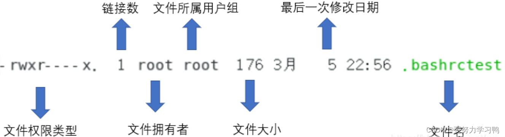

# version1

## 一、Linux的[文件权限](https://so.csdn.net/so/search?q=%E6%96%87%E4%BB%B6%E6%9D%83%E9%99%90&spm=1001.2101.3001.7020)

Linux的多人多任务环境，一般将文件可读写的身份分为三类：**owner、group、others**，还有具有任意权限的**root**。

/etc/passwd 记录账号、一般用户以及root相关信息

/etc/[shadow](https://so.csdn.net/so/search?q=shadow&spm=1001.2101.3001.7020) 账户密码管理文件

/etc/group 所有的group名

```
$ su -     #由当前用户切换到root
 
$ exit     #由root切换回用户
```

___

## 二、文件属性

```
$ ls -l   #列出所有文件的详细权限与属性(包含隐藏文件，也就是文件名以 . 开头的文件)
```



若一个文件类型与权限数据为【-rwxr----x】，那么

\[-\] 第一个字符为-表示为文件，若为d则是目录。（l为链接文件；b为存储设备；c为读取设备等）

\[rwx\] user的权限，可读可写可执行

\[r--\] group的权限，仅可读

\[--x\] others的权限，仅可执行

**r(read) ; w(write) ; x(execute)**  

\*如果在某目录下不具有x的权限，那么就无法切换到该目录下，也就无法执行该目录下的任何命令，即使拥有该目录的r或w的权限。**所以通常要开放的目录至少会具备rx两个权限**。

\*Windows中能被执行的文件扩展名通常为exe、com等，但在linux下面，**只要该文件权限中有x就代表这个文件具有可以被执行的能力**。

一些常用的文件操作指令可以看[Linux常用指令三：文件的增删改查操作](https://blog.csdn.net/qq_54444533/article/details/135429120?spm=1001.2014.3001.5502 "Linux常用指令三：文件的增删改查操作")

___

## 三、更改文件属性和权限

```
$ chgrp     #修改文件所属group
 
$ chown     #修改文件owner
 
$ chmod     #修改文件权限
```

___

## 四、[Linux目录](https://so.csdn.net/so/search?q=Linux%E7%9B%AE%E5%BD%95&spm=1001.2101.3001.7020)配置的依据——FHS

文件系统层次结构（Filesystem Hierarchy Standard，FHS）。FHS 是为了让用户了解到已安装软件通常放置于哪个目录下。这个标准定义了在 Linux 系统中各个目录的用途和应存放的内容。

/(root,根目录) ：与启动系统有关

/usr(unix software resource) ：与软件安装/执行有关

/var(variable) ：与系统运行过程有关

**目录树**：Linux中的目录配置方式，从根目录开始分支下来像是树枝状。

**绝对路径和相对路径**：从根目录开始写的文件/目录名称为绝对路径，否则为相对路径。

. **与 ..** ：  .代表当前目录(./)        ..代表上一层目录(../)

___

## 五、简答题部分

**1.早期的UNIX系统文件名最多允许14个字符，而新的UNIX与Linux系统中，文件名最多可以使用几个字符？**

单一文件或目录的最大文件名允许255个字符。

**2.当一个一般文件权限为-rwxrwxrwx 则表示这个文件的意义是什么？**

代表所有用户都可对该文件进行 读 写 执行 操作。

**3.我需要将一个文件的权限改为-rwxr-xr--，请问该如何执行命令？**

$ chmod 754 filename

**4.若我需要更改一个文件的拥有者与用户组，该用什么命令？**

分别用chown与chgrp

**5.请问下面的目录主要放置什么数据？**

/etc/、配置文件(如账号密码文件、各种服务的配置文件)

/boot、系统启动时用到的文件

/usr/bin、一般用户能够使用的命令

/bin、在单人维护模式下还能被使用的命令，如cat、chmod、mkdir等

/usr/sbin、非系统正常运行所需要的系统命令，如网络服务器软件中的服务命令daemon

/sbin、启动、修复、还原系统所需要的命令

/dev、任何设备与接口设备都是以文件的形式存在于这个目录当中

/var/log、放置日志文件

/run、临时运行时文件，系统重启会清空

**6.若一个文件的文件名开头为 .  例如.bashrc这个文件，代表什么呢？另外，如何显示这个文件名与它的相关属性？**

文件名以 . 开头表示该文件为隐藏文件。如果需要显示这个文件名以及相关属性：

$ ls -l


# version2

- **早期的 Unix 系统文件名最多允许 14 个字符，而新的 Unix 与 Linux 系统中，文件名最多可以容许几个字符？**

  由于使用Ext2/Ext3/Ext4/xfs 文件系统，单一文件名可达 255 字符

- **当一个一般文件权限为 -rwxrwxrwx 则表示这个文件的意义为？**

  任何人皆可读取、修改或编辑、可以执行，但不一定能删除。

- **我需要将一个文件的权限改为 -rwxr-xr-- 请问该如何下达指令？**

  chmod 754 filename 或 chmod u=rwx,g=rx,o=r filename

- **若我需要更改一个文件的拥有者与群组，该用什么指令？**

  chown, chgrp

- **请问下面的目录与主要放置什么数据： /etc/, /boot, /usr/bin, /bin, /usr/sbin, /sbin, /dev, /var/log, /run**
  
  - /etc/：几乎系统的所有设置文件均在此，尤其 passwd,shadow
  - /boot：开机配置文件，也是默认摆放核心 vmlinuz 的地方
  - /usr/bin, /bin：一般可执行文件摆放的地方
  - /usr/sbin, /sbin：系统管理员常用指令集
  - /dev：摆放所有系统设备文件的目录
  - /var/log：摆放系统登录文件的地方
  - /run：CentOS 7 以后才有，将经常变动的项目（每次开机都不同，如程序的PID）移动到内存暂存，所以 /run 并不占实际磁盘容量
  
- **若一个文件的文件名开头为“ . ”，例如 .bashrc 这个文件，代表什么？另外，如何显示出这个文件名与他的相关属性？**

  有“ . ”为开头的为隐藏文件，需要使用 ls -a 这个 -a 的选项才能显示出隐藏文件的内容，而使用 ls -al 才能显示出属性。