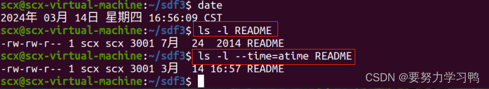
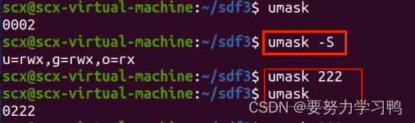
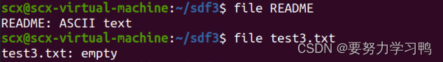

# version1

## 一、 简介

  本章介绍了一些常用的文件与目录指令，包括新建/删除/复制/移动/查看文件或者目录等。

一个注意点：当使用**cp(复制)**命令时，应该要考虑：①是否需要完整的保留源文件的信息(如是否保留[文件权限](https://so.csdn.net/so/search?q=%E6%96%87%E4%BB%B6%E6%9D%83%E9%99%90&spm=1001.2101.3001.7020)等属性) ②源文件是否为特殊文件 ③源文件是否是目录

这一章对常用的文件与[目录管理](https://so.csdn.net/so/search?q=%E7%9B%AE%E5%BD%95%E7%AE%A1%E7%90%86&spm=1001.2101.3001.7020)的命令都有很详细的介绍，一些参数也都有给出使用实例，很适合用来**全面了解相关指令**。 

* * *

## 二、一些新了解的指令

### 1.touch- 修改文件时间或创建新文件

一开始我以为touch指令是专门创建新文件用的，实际上还常用来更改文件的时间：

**修改时间(modification time，mtime)**

**状态时间(status time，ctime)**

**读取时间(access time，atime)**

\# 举例：如何查看文件README的时间(ls指令 默认显示是该文件的mtime，也就是修改时间)



### 2.umask-新建文件/目录的默认权限

当建立一个新文件或者目录，它的默认权限会是什么？说实话我真没思考过这个问题哈哈哈。

umask就是指定用户在建立文件或者目录时候的**权限默认值**(后三个数字)。后三位是一般权限有关的属性，首位是特殊权限用的。



(r,w,x分别为4，2，1). 数字002是指**默认值需要拿掉的权限**

\[0\] user的权限，可读可写可执行(不拿掉任何权限)

\[0\] group的权限，可读可写可执行

\[2\] others的权限，拿掉2，也就是w(可写)，则其他用户不可写

### 3.文件隐藏属性

文件隐藏属性在系统安全方面十分重要：

①chattr(配置文件隐藏属性)  通过参数可以让一个文件\[不能被删除、改名、修改\]，只有root能设置此属性。

②lsattr(显示文件隐藏属性)

### 4.文件特殊权限

SUID

SGID

SBIT

### 5.file-观察[文件类型](https://so.csdn.net/so/search?q=%E6%96%87%E4%BB%B6%E7%B1%BB%E5%9E%8B&spm=1001.2101.3001.7020)



* * *

## 三、简答题部分

**1.什么是绝对路径与相对路径。**

绝对路径：从根目录/写起

相对路径：不是由根目录写起

**2.如何更改一个目录的名称？例如从 /home/test 变为 /home/test2。**

$ mv /home/test /home/test2

**3.PATH这个环境变量的意义？**

PATH这个变量是由一堆目录组成，每个目录中间用（:）隔开，有顺序之分。

主要作用是使系统能够在任何目录下执行命令。

**4.umask有什么用处与优点？**

umask用来指定用户在建立文件或目录时候的权限默认值。通过限制文件的默认权限，umask可以增加系统的安全性

**5.当一个用户的umask分别为033与044，它所建立的文件与目录的权限是什么？**

文件默认权限为666(-rw-rw-rw-)，目录默认权限为777(drwxrwxrwx)

033：-rw-r--r--         drwxr--r--

044：-rw--w--w-      drwx-wx-wx

**6.什么是SUID**

一种特殊权限标志，全称为Set User ID。当设置了SUID权限时，它在运行时将以文件所有者的权限而不是运行用户的权限来执行。

**7.当我要查询 /usr/bin/passwd 这个文件的一些属性时(1)传统权限 (2)文件类型 (3)文件的隐藏属性，可以用什么命令来查询？**

(1)传统权限  $ la -l /usr/bin/passwd

(2)文件类型  $ file /usr/bin/passwd

(3)文件的隐藏属性  $ lsattr /usr/bin/passwd

**8.尝试用find找出目前Linux系统中，所有具有SUID的文件有哪些？**

$ find / -perm /4000

**9.找出/etc下面，文件大小介于50kb到60kb之间的文件，并将权限完整的列出(ls -l)。**

$ find /etc -size +50k -size -60k -exec ls -l {}  \\;

**10.找出/etc下面，文件容量大于50kb且文件所属人不是root的文件名，并将权限完整的列出(ls -l)。**

$ find /etc -size +50k ! -user root -exec ls -l {}  \\;

11.找出/etc下面，容量大于1500kb以及容量等于0的文件。

    $ find /etc -type f \(-size +1500k -o -size 0 \)

**\-type f**  指查找文件类型为一般文件(f)，其它如设备文件(b,c)，目录文件(d)等。

* * *

**\*注：**

\-exec ls -l {}  \\;解释

**{}** 代表的是**find找到的内容；**

**\-exec** 一直到 **\\;** 是关键词，代表find**额外操作**的**开始** 一直到 **结束；**

**ls -l {}** 就是find**额外操作；**

；在bash环境中有特殊意义，所以用反斜杠 \\ 来转义。


# version2

情境仿真题一：假设系统中有两个帐号，分别是 alex 与 arod ，这两个人除了自己群组之外还共同支持一个名为 project 的群组。假设这两个用户需要共同拥有 /srv/ahome/ 目录的开发权，且该目录不许其他人进入查阅。 请问该目录的权限设置应为何？请先以传统权限说明，再以 SGID 的功能解析。

- 目标：了解到为何专案开发时，目录最好需要设置 SGID 的权限！
- 前提：多个帐号支持同一群组，且共同拥有目录的使用权！
- 需求：需要使用 root 的身份来进行 chmod, chgrp 等帮用户设置好他们的开发环境才行！ 这也是管理员的重要任务之一！

首先我们得要先制作出这两个帐号的相关数据，帐号/群组的管理在后续我们会介绍， 您这里先照着下面的指令来制作即可：

```
[root@study ~]# groupadd project        &lt;==增加新的群组
[root@study ~]# useradd -G project alex &lt;==创建 alex 帐号，且支持 project
[root@study ~]# useradd -G project arod &lt;==创建 arod 帐号，且支持 project
[root@study ~]# id alex                 &lt;==查阅 alex 帐号的属性
uid=1001（alex） gid=1002（alex） groups=1002（alex）,1001（project） &lt;==确实有支持！
[root@study ~]# id arod
uid=1002（arod） gid=1003（arod） groups=1003（arod）,1001（project） &lt;==确实有支持！
```

然后开始来解决我们所需要的环境吧！

1. 首先创建所需要开发的专案目录：

   ```
   [root@study ~]# mkdir /srv/ahome
   [root@study ~]# ll -d /srv/ahome
   drwxr-xr-x. 2 root root 6 Jun 17 00:22 /srv/ahome
   ```

2. 从上面的输出结果可发现 alex 与 arod 都不能在该目录内创建文件，因此需要进行权限与属性的修改。 由于其他人均不可进入此目录，因此该目录的群组应为project，权限应为770才合理。

   ```
   [root@study ~]# chgrp project /srv/ahome
   [root@study ~]# chmod 770 /srv/ahome
   [root@study ~]# ll -d /srv/ahome
   drwxrwx---. 2 root project 6 Jun 17 00:22 /srv/ahome
   # 从上面的权限结果来看，由于 alex/arod 均支持 project，因此似乎没问题了！
   ```

3. 实际分别以两个使用者来测试看看，情况会是如何？先用 alex 创建文件，然后用 arod 去处理看看。

   ```
   [root@study ~]# su - alex       &lt;==先切换身份成为 alex 来处理
   [alex@www ~]$ cd /srv/ahome   &lt;==切换到群组的工作目录去
   [alex@www ahome]$ touch abcd  &lt;==创建一个空的文件出来！
   [alex@www ahome]$ exit        &lt;==离开 alex 的身份
   
   [root@study ~]# su - arod
   [arod@www ~]$ cd /srv/ahome
   [arod@www ahome]$ ll abcd
   -rw-rw-r--. 1 alex alex 0 Jun 17 00:23 abcd
   # 仔细看一下上面的文件，由于群组是 alex ，arod并不支持！
   # 因此对于 abcd 这个文件来说， arod 应该只是其他人，只有 r 的权限而已啊！
   [arod@www ahome]$ exit
   ```

   由上面的结果我们可以知道，若单纯使用传统的 rwx 而已，则对刚刚 alex 创建的 abcd 这个文件来说， arod 可以删除他，但是却不能编辑他！这不是我们要的样子啊！赶紧来重新规划一下。

4. 加入 SGID 的权限在里面，并进行测试看看：

   ```
   [root@study ~]# chmod 2770 /srv/ahome
   [root@study ~]# ll -d /srv/ahome
   drwxrws---. 2 root project 17 Jun 17 00:23 /srv/ahome
   
   测试：使用 alex 去创建一个文件，并且查阅文件权限看看：
   [root@study ~]# su - alex
   [alex@www ~]$ cd /srv/ahome
   [alex@www ahome]$ touch 1234
   [alex@www ahome]$ ll 1234
   -rw-rw-r--. 1 alex project 0 Jun 17 00:25 1234
   # 没错！这才是我们要的样子！现在 alex, arod 创建的新文件所属群组都是 project，
   # 由于两人均属于此群组，加上 umask 都是 002，这样两人才可以互相修改对方的文件！
   ```

   所以最终的结果显示，此目录的权限最好是“2770”，所属文件拥有者属于root即可，至于群组必须要为两人共同支持的project 这个群组才行！

------

简答题部分：

- 什么是绝对路径与相对路径绝对路径的写法为由 / 开始写，至于相对路径则不由 / 开始写！此外，相对路径为相对于目前工作目录的路径！
- 如何更改一个目录的名称？例如由 /home/test 变为 /home/test2mv /home/test /home/test2
- PATH 这个环境变量的意义？这个是用来指定可执行文件执行的时候，指令搜寻的目录路径。
- umask 有什么用处与优点？umask 可以拿掉一些权限，因此，适当的定义 umask 有助于系统的安全， 因为他可以用来创建默认的目录或文件的权限。
- 当一个使用者的 umask 分别为 033 与 044 他所创建的文件与目录的权限为何？在 umask 为 033 时，则默认是拿掉 group 与 other 的 w（2）x（1） 权限，因此权限就成为“文件 -rw-r--r-- ， 目录 drwxr--r-- ”而当 umask 044 时，则拿掉 r 的属性，因此就成为“文件 -rw--w--w-，目录 drwx-wx-wx”
- 什么是 SUID ？当一个指令具有 SUID 的功能时，则：
  - SUID 权限仅对二进制程序（binary program）有效；
  - 执行者对于该程序需要具有 x 的可执行权限；
  - 本权限仅在执行该程序的过程中有效 （run-time）；
  - 执行者将具有该程序拥有者 （owner） 的权限。
- 当我要查询 /usr/bin/passwd 这个文件的一些属性时（1）传统权限；（2）文件类型与（3）文件的隐藏属性，可以使用什么指令来查询？ls -al file lsattr
- 尝试用 find 找出目前 linux 系统中，所有具有 SUID 的文件有哪些？find / -perm +4000 -print
- 找出 /etc 下面，文件大小介于 50K 到 60K 之间的文件，并且将权限完整的列出 （ls -l）：find /etc -size +50k -a -size -60k -exec ls -l {} \; 注意到 -a ，那个 -a 是 and 的意思，为符合两者才算成功
- 找出 /etc 下面，文件大小大于 50K 且文件所属人不是 root 的文件名，且将权限完整的列出 （ls -l）；find /etc -size +50k -a ! -user root -exec ls -ld {} \; find /etc -size +50k -a ! -user root -type f -exec ls -l {} \; 上面两式均可！注意到 ! ，那个 ! 代表的是反向选择，亦即“不是后面的项目”之意！
- 找出 /etc 下面，容量大于 1500K 以及容量等于 0 的文件：find /etc -size +1500k -o -size 0 相对于 -a ，那个 -o 就是或 （or） 的意思啰！