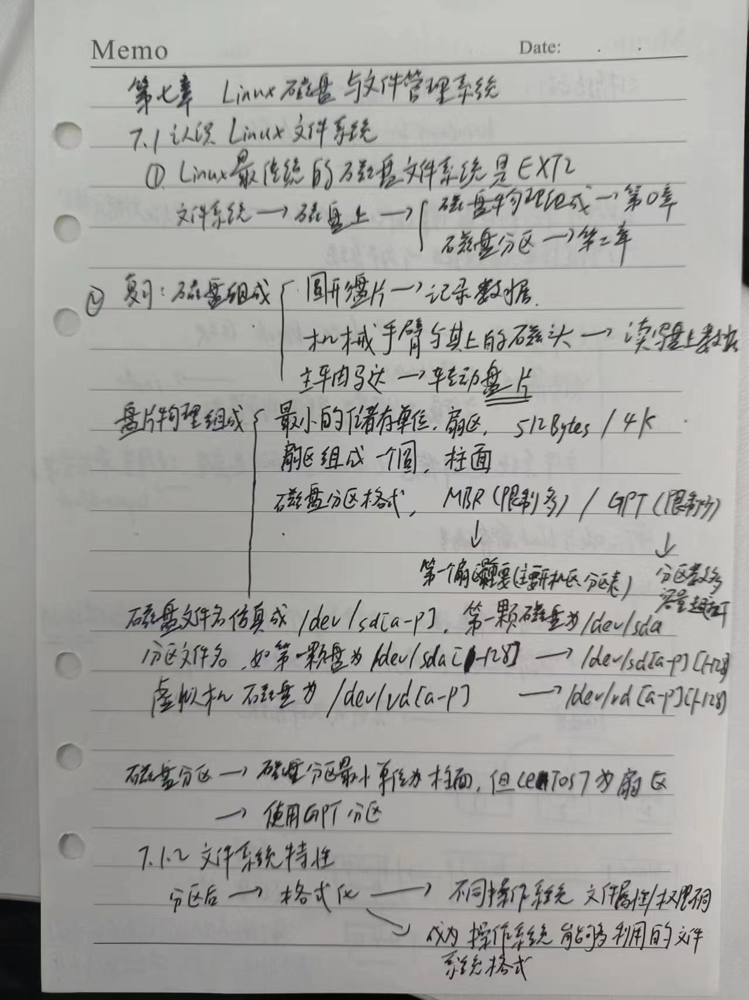
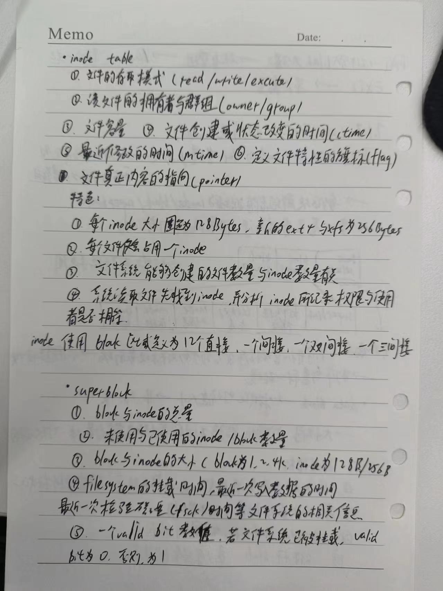
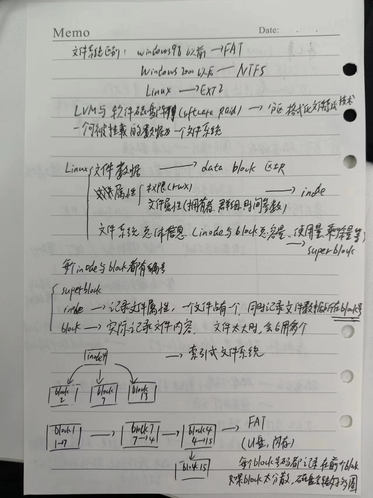
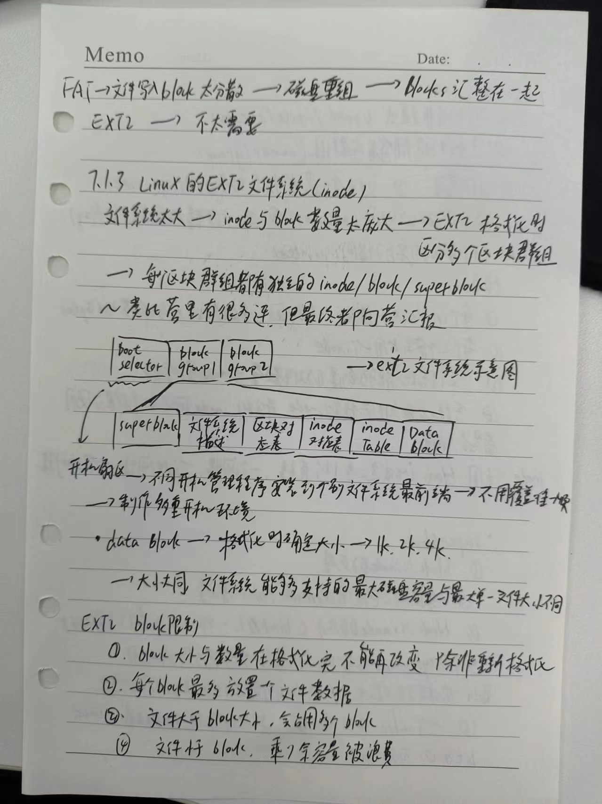
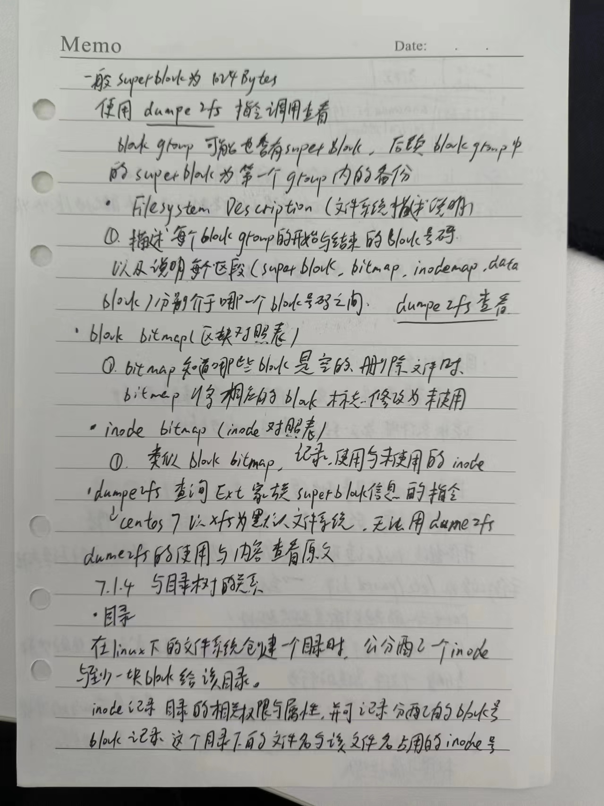
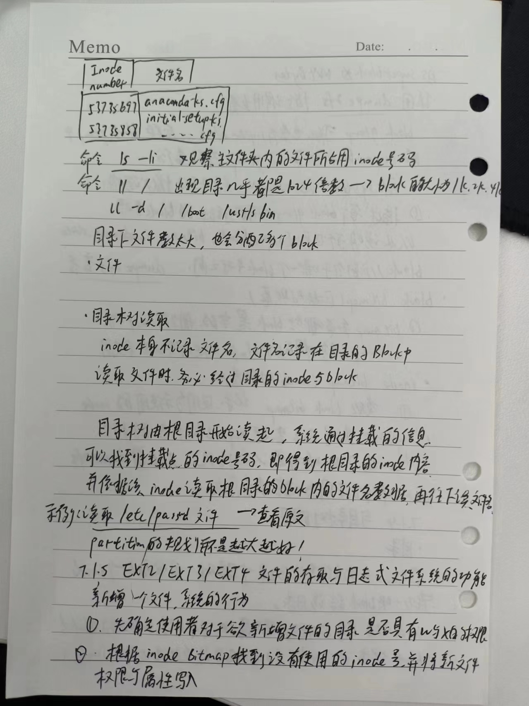
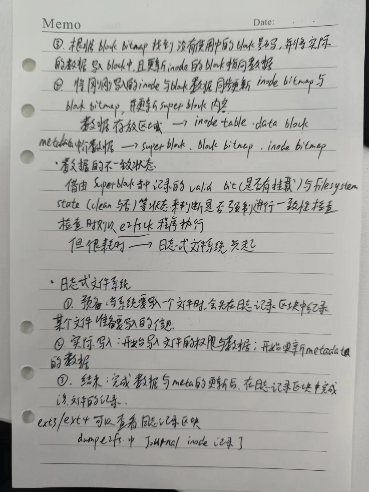

## 7.1认识Linux文件系统















### 7.1.6 Linux文件系统的运行

如果编辑一个很大的文件，所有的数据都得要载入到内存后CPU才能对该数据进行处理，但是编辑过程中又频繁的要写入磁盘中，但是磁盘写入的速度比内存慢很多，效率很低。→非同步处理（asynchronously）


**非同步处理：**当系统载入一个文件到内存后，如果该文件没有被更动过，则在内存区段的文件数据会被设置为干净（clean）。但如果内存中的文件数据被更动过了（比如使用nano去编辑过这个文件），此时该内存中的数据会被设置为脏的（Dirty）。此时所有的动作都还在内存中执行，并没有写入到磁盘中！系统会不定时的将内存中设置为Dirty的数据写回磁盘，以保持磁盘与内存数据的一致性。 可以使用第四章sync指令来手动强迫写入磁盘。


- 系统会将常用的文件数据放置到内存的缓冲区，以加速文件系统的读写；
- 承上，因此Linux的实体内存最后会被用光，这是正常的情况！以加速系统性能
- 可以手动使用sync来强迫内存中设置为Dirty的文件写回磁盘中
- 若正常关机时，关机指令会主动调用sync来将内存的数据写回磁盘内
- 但不正常关机（如跳电，死机或其他不明原因），由于数据尚未写回到磁盘内，因此重新开机可能会话很多时间进行磁盘检验，甚至可能导致文件系统的损毁（非磁盘损毁）。

### 7.1.7 挂载点的意义（mount point）

**将文件系统与目录树结合的动作，称为“挂载”。**

重点：

挂载点一定是目录，该目录为进入该文件系统的入口，因此并不是你有任何文件系统都能使用，必须“挂载”到目录树的某个目录后，才能使用该文件系统。


举例：

安装CentOS7.x，挂载点分别是/,/boot,/home三个，鸟哥系统上对应的设备文件名为LVM,LVM,/dev/vda2

通过ls -lid / /boot /home命令发现XFS filesystem最顶层的目录之inode一般为128号，且/,/boot,/home为三个不同的filesystem，且三个目录的挂载点也不同


而ls -ild / /. /..

由于根目录下的. , ..是相同的东西，以上命令可以发现三个文件均在同一个filesystem内，三个文件的inode均为128,因此三个文件名都指向同一个inode号码，当然这三个文件的内容也是一样的


### 7.1.8 其他Linux支持的文件系统与VFS（==补原文内容==）

Linux支持文件系统有：

- 传统文件系统
- 日志式文件系统
- 网络文件系统


Linux VFS(Virtual Filesystem Switch)

Linux系统通过VFS的核心功能去读取filesystem。


### 7.1.9 XFS文件系统简介

由于EXT家族 虽然支持度最广，但格式化超慢，如今磁盘容量都很大，EXT采用的预先规划出所有的inode/block/meta data等数据，格式化消耗太长时间

xfs较适合大容量磁盘与巨型文件性能较佳的文件系统。 文件系统的复原速度、创建速度更好


- xfs是一个日志式文件系统。

- xfs文件系统在数据的分布上，主要规划为三个部分，一个数据区（data section），一个文件系统活动登录区（log section）以及一个实时运行区（realtime section）。

  **数据区**

包括inode/data block/superblock等数据，与ext的block group类似，也是分为多个储存区群组（allocation groups）来分别放置文件系统所需要的数据

每个储存区群组都包含了（1）整个文件系统的superblock（2）剩余空间的管理机制（3）inode的分配与追踪。

**inode与block都是系统需要用到时，这才动态配置产生，所以格式化动作超快。**

**区别：**

- xfs的block与inode有多种不同的容量可供配置，512Bytes~64K调配，但是Linux下由于内存控制的关系（分页档pagesize的容量之故），最高可使用的block大小为4K。
- inode容量可由256Bytes到2M，不过默认值256Bytes足够

​	**文件系统活动登录区**

- 类似于日志区，纪录文件系统的变化，直到该变化完整的写入到数据区后，该笔记录才会被终结
- 系统所有动作都在这个区块做记录，可以指定外部的磁盘来作为xfs文件系统的日志区块。比如SSD磁盘作为xfs的登录区

​	**实时运行区**

- 当有文件要被创建时，xfs会在这区段里面找一个到数个的extent区块，将文件放置在这个区块内，等到分配完毕后，再写入到data section的inode与block去
- extent区块大小在格式化的时候就先指定，最小值为4K，最大为1G。一般非磁盘阵列的磁盘默认为64K容量，而就有类似磁盘阵列的stripe情况下，则建议extent设置为stripe一样大较佳。
- extent最好不要动，可能影响实体磁盘的性能

​	XFS**文件系统的描述观察**

- 使用xfs_info 挂载点

```
df -T /boot
xfs_info /dev/vda2
```

==查看原文==

## 7.2 文件系统的简单操作

如何查询整体文件系统的总容量与每个目录所占用的容量

### 7.2.1 磁盘与目录的容量

​	**df**==查看原文==

```

```

- df主要读取的数据几乎都是针对一整个文件系统，因此读取的范围主要是在Superblock内的信息，所以这个指令显示结果的速度非常的快速！在显示的结果中特别留意根目录的剩余容量，因为我们所有的数据都是根目录衍生出来的。

- 需要注意的是，如果使用-a参数，系统会出现/proc这个挂载点，但是里面的东西都是0，不要紧张！/proc的东西都是Linux系统所需要载入的系统数据，而且是挂载到“内存当中”，所以当然没有占任何的磁盘空间
- /dev/shm/目录，是利用内存虚拟出来的磁盘空间，通常是实体内存的一半。由于是通过内存仿真出来的，因此这个文件系统的大小在每部主机上都不一样，而且创建的东西在下次开机就消失了，因为在内存中。


​	**du**==查看原文==

```
du [-ahskm] 文件或目录名称
```

- 与df不一样的是，du这个指令其实会直接到文件系统内搜寻所有的文件数据，所以上述第三个范例指令会执行一小段时间
- 在默认的情况下，容量的输出是以KB来设计的，如果你想知道目录占了多少MB，那么就使用-m这个参数即可，如果想知道该目录占了多少容量的话，可以使用-s
- 由于du默认会将所有文件的大小均列出，因此假设在/etc下面使用du时，所有的文件大小，包括/etc下面的次目录容量也会被计算一次。然后最终的容量（/etc）也会加总一次，所以可以加上-S 选项，减少次目录的加总

### 7.2.2 实体链接与符号链接：ln

​	**Hard Link(实体链接，硬式链接或实际链接)**

- 前一节内容中，每个文件都会占用一个inode，文件内容由inode的记录来指向；

- 想要读取该文件，必须要经过目录的文件名来指向到正确的inode号码才能读取。

  也就是，文件名只与目录有关，但是文件内容则与inode有关，**实现多个文件名对应到同一个inode号码**：hard link

  - hard link只是在某个目录下新增一笔文件名链接到某inode号码的关联记录而已。

==参考原文==


## 7.3 磁盘的分区、格式化、检验与挂载

增加一个磁盘，需要哪些动作：

1. 对磁盘进行分区，以创建可用的 partition ；
2. 对该 partition 进行格式化 （format），以创建系统可用的 filesystem；
3. 若想要仔细一点，则可对刚刚创建好的 filesystem 进行检验；
4. 在 Linux 系统上，需要创建挂载点 （亦即是目录），并将他挂载上来；

### 7.3.1 观察磁盘分区状态

- lsblk 列出系统上的所有磁盘列表

```
[root@study ~]# lsblk [-dfimpt] [device]
选项与参数：
-d  ：仅列出磁盘本身，并不会列出该磁盘的分区数据
-f  ：同时列出该磁盘内的文件系统名称
-i  ：使用 ASCII 的线段输出，不要使用复杂的编码 （再某些环境下很有用）
-m  ：同时输出该设备在 /dev 下面的权限数据 （rwx 的数据）
-p  ：列出该设备的完整文件名！而不是仅列出最后的名字而已。
-t  ：列出该磁盘设备的详细数据，包括磁盘伫列机制、预读写的数据量大小等

范例一：列出本系统下的所有磁盘与磁盘内的分区信息
[root@study ~]# lsblk
NAME            MAJ:MIN RM  SIZE RO TYPE MOUNTPOINT
sr0              11:0    1 1024M  0 rom
vda             252:0    0   40G  0 disk             # 一整颗磁盘
&#124;-vda1          252:1    0    2M  0 part
&#124;-vda2          252:2    0    1G  0 part /boot
`-vda3          252:3    0   30G  0 part
  &#124;-centos-root 253:0    0   10G  0 lvm  /           # 在 vda3 内的其他文件系统
  &#124;-centos-swap 253:1    0    1G  0 lvm  [SWAP]
  `-centos-home 253:2    0    5G  0 lvm  /home
```

从上面的输出我们可以很清楚的看到，目前的系统主要有个 sr0 以及一个 vda 的设备，而 vda 的设备下面又有三个分区， 其中 vda3 甚至还有因为 LVM 产生的文件系统！相当的完整吧！

**输出的信息**

- NAME：就是设备的文件名啰！会省略 /dev 等前导目录！
- MAJ:MIN：其实核心认识的设备都是通过这两个代码来熟悉的！分别是主要：次要设备代码！
- RM：是否为可卸载设备 （removable device），如光盘、USB 磁盘等等
- SIZE：当然就是容量啰！
- RO：是否为只读设备的意思
- TYPE：是磁盘 （disk）、分区 （partition） 还是只读存储器 （rom） 等输出
- MOUTPOINT：就是前一章谈到的挂载点！

​	**blkid 列出设备的 UUID 等参数**

虽然 lsblk 已经可以使用 -f 来列出文件系统与设备的 UUID 数据，不过，鸟哥还是比较习惯直接使用 blkid 来找出设备的 UUID 喔！ 什么是 UUID 呢？UUID 是全域单一识别码 （universally unique identifier），Linux 会将系统内所有的设备都给予一个独一无二的识别码， 这个识别码就可以拿来作为挂载或者是使用这个设备/文件系统之用了。

```
[root@study ~]# blkid
/dev/vda2: UUID="94ac5f77-cb8a-495e-a65b-2ef7442b837c" TYPE="xfs" 
/dev/vda3: UUID="WStYq1-P93d-oShM-JNe3-KeDl-bBf6-RSmfae" TYPE="LVM2_member"
/dev/sda1: UUID="35BC-6D6B" TYPE="vfat"
/dev/mapper/centos-root: UUID="299bdc5b-de6d-486a-a0d2-375402aaab27" TYPE="xfs"
/dev/mapper/centos-swap: UUID="905dc471-6c10-4108-b376-a802edbd862d" TYPE="swap"
/dev/mapper/centos-home: UUID="29979bf1-4a28-48e0-be4a-66329bf727d9" TYPE="xfs"
```

- 每一行代表一个文件系统，主要列出设备名称、UUID 名称以及文件系统的类型 （TYPE）

​	**parted 列出磁盘的分区表类型与分区信息**

虽然我们已经知道了系统上面的所有设备，并且通过 blkid 也知道了所有的文件系统！不过，还是不清楚磁盘的分区类型。 这时我们可以通过简单的 parted 来输出喔！我们这里仅简单的利用他的输出而已～本章最后才会详细介绍这个指令的用法的！

```
[root@study ~]# parted device_name print

范例一：列出 /dev/vda 磁盘的相关数据
[root@study ~]# parted /dev/vda print
Model: Virtio Block Device （virtblk）        # 磁盘的模块名称（厂商）
Disk /dev/vda: 42.9GB                       # 磁盘的总容量
Sector size （logical/physical）: 512B/512B   # 磁盘的每个逻辑/物理扇区容量
Partition Table: gpt                        # 分区表的格式 （MBR/GPT）
Disk Flags: pmbr_boot

Number  Start   End     Size    File system  Name  Flags      # 下面才是分区数据
 1      1049kB  3146kB  2097kB                     bios_grub
 2      3146kB  1077MB  1074MB  xfs
 3      1077MB  33.3GB  32.2GB                     lvm
```

- 看到上表的说明，直到我们用的就是 GPT 的分区格式

### 7.3.2 磁盘分区： gdisk/fdisk

**MBR 分区表请使用 fdisk 分区， GPT 分区表请使用 gdisk 分区！**

​	**gdisk**

```
[root@study ~]# gdisk 设备名称

范例：由前一小节的 lsblk 输出，我们知道系统有个 /dev/vda，请观察该磁盘的分区与相关数据
[root@study ~]# gdisk /dev/vda  &lt;==仔细看，不要加上数字喔！
GPT fdisk （gdisk） version 0.8.6

Partition table scan:
  MBR: protective
  BSD: not present
  APM: not present
  GPT: present

Found valid GPT with protective MBR; using GPT.  &lt;==找到了 GPT 的分区表！

Command （? for help）:     &lt;==这里可以让你输入指令动作，可以按问号 （?） 来查看可用指令
Command （? for help）: ?
b       back up GPT data to a file
c       change a partition's name
d       delete a partition           # 删除一个分区
i       show detailed information on a partition
l       list known partition types
n       add a new partition          # 增加一个分区
o       create a new empty GUID partition table （GPT）
p       print the partition table    # 印出分区表 （常用）
q       quit without saving changes  # 不储存分区就直接离开 gdisk
r       recovery and transformation options （experts only）
s       sort partitions
t       change a partition's type code
v       verify disk
w       write table to disk and exit # 储存分区操作后离开 gdisk
x       extra functionality （experts only）
?       print this menu
Command （? for help）:
```

- 应该要通过 lsblk 或 blkid 先找到磁盘，再用 parted /dev/xxx print 来找出内部的分区表类型，之后才用 gdisk 或 fdisk 来操作系统。

- 上表中可以发现 gdisk 会扫描 MBR 与 GPT 分区表，不过这个软件还是单纯使用在 GPT 分区表比较好啦！
- 不管你进行了什么动作，只要离开 gdisk 时按下“q”，那么所有的动作“都不会生效！”相反的， 按下“w”就是动作生效的意思。所以，你可以随便玩 gdisk ，只要离开时按下的是“q”即可。

**看看分区表信息吧！**

```
Command （? for help）: p  &lt;== 这里可以输出目前磁盘的状态
Disk /dev/vda: 83886080 sectors, 40.0 GiB                     # 磁盘文件名/扇区数与总容量
Logical sector size: 512 Bytes                                # 单一扇区大小为 512 Bytes 
Disk identifier （GUID）: A4C3C813-62AF-4BFE-BAC9-112EBD87A483  # 磁盘的 GPT 识别码
Partition table holds up to 128 entries
First usable sector is 34, last usable sector is 83886046
Partitions will be aligned on 2048-sector boundaries
Total free space is 18862013 sectors （9.0 GiB）

Number  Start （sector）    End （sector）  Size       Code  Name # 下面为完整的分区信息了！
   1            2048            6143   2.0 MiB     EF02       # 第一个分区数据
   2            6144         2103295   1024.0 MiB  0700
   3         2103296        65026047   30.0 GiB    8E00
# 分区编号 开始扇区号码  结束扇区号码  容量大小
Command （? for help）: q
# 想要不储存离开吗？按下 q 就对了！不要随便按 w 啊！
```

使用“ p ”可以列出目前这颗磁盘的分区表信息，这个信息的上半部在显示整体磁盘的状态。 以鸟哥这颗磁盘为例，这个磁盘共有 40GB 左右的容量，共有 83886080 个扇区，每个扇区的容量为 512Bytes。 要注意的是，现在的分区主要是以扇区为最小的单位喔！

下半部的分区表信息主要在列出每个分区的个别信息项目。每个项目的意义为：

- Number：分区编号，1 号指的是 /dev/vda1 这样计算。
- Start （sector）：每一个分区的开始扇区号码位置
- End （sector）：每一个分区的结束扇区号码位置，与 start 之间可以算出分区的总容量
- Size：就是分区的容量了
- Code：在分区内的可能的文件系统类型。Linux 为 8300，swap 为 8200。不过这个项目只是一个提示而已，不见得真的代表此分区内的文件系统喔！
- Name：文件系统的名称等等。

从上表我们可以发现几件事情：

- 整部磁盘还可以进行额外的分区，因为最大扇区为 83886080，但只使用到 65026047 号而已；
- 分区的设计中，新分区通常选用上一个分区的结束扇区号码数加 1 作为起始扇区号码！

==这个 gdisk 只有 root 才能执行，此外，请注意，使用的“设备文件名”请不要加上数字，因为 partition 是针对“整个磁盘设备”而不是某个 partition 呢！所以执行“ gdisk /dev/vda1 ” 就会发生错误啦！要使用 gdisk /dev/vda 才对！==


- **用 gdisk 新增分区**

如果你是按照鸟哥建议的方式去安装你的 CentOS 7，那么你的磁盘应该会预留一块容量来做练习的。如果没有的话， 那么你可能需要找另外一颗磁盘来让你练习才行呦！而经过上面的观察，我们也确认系统还有剩下的容量可以来操作练习分区！ 假设我需要有如下的分区需求：

- 1GB 的 xfs 文件系统 （Linux）
- 1GB 的 vfat 文件系统 （Windows）
- 0.5GB 的 swap （Linux swap）（这个分区等一下会被删除喔！）

那就来处理处理！

```
[root@study ~]# gdisk /dev/vda
Command （? for help）: p
Number  Start （sector）    End （sector）  Size       Code  Name
   1            2048            6143   2.0 MiB     EF02
   2            6144         2103295   1024.0 MiB  0700
   3         2103296        65026047   30.0 GiB    8E00
# 找出最后一个 sector 的号码是很重要的！

Command （? for help）: ?  # 查一下增加分区的指令为何
Command （? for help）: n  # 就是这个！所以开始新增的行为！
Partition number （4-128, default 4）: 4  # 默认就是 4 号，所以也能 enter 即可！
First sector （34-83886046, default = 65026048） or {+-}size{KMGTP}: 65026048  # 也能 enter
Last sector （65026048-83886046, default = 83886046） or {+-}size{KMGTP}: +1G  # 决不要 enter
# 这个地方可有趣了！我们不需要自己去计算扇区号码，通过 +容量 的这个方式，
# 就可以让 gdisk 主动去帮你算出最接近你需要的容量的扇区号码喔！

Current type is 'Linux filesystem'
Hex code or GUID （L to show codes, Enter = 8300）: # 使用默认值即可～直接 enter 下去！
# 这里在让你选择未来这个分区预计使用的文件系统！默认都是 Linux 文件系统的 8300 啰！

Command （? for help）: p
Number  Start （sector）    End （sector）  Size       Code  Name
   1            2048            6143   2.0 MiB     EF02
   2            6144         2103295   1024.0 MiB  0700
   3         2103296        65026047   30.0 GiB    8E00
 4        65026048        67123199   1024.0 MiB  8300  Linux filesystem
```

重点在“ Last sector ”那一行，那行绝对不要使用默认值！因为默认值会将所有的容量用光！因此它默认选择最大的扇区号码！ 因为我们仅要 1GB 而已，**所以你得要加上 +1G 这样即可**！不需要计算 sector 的数量，gdisk 会根据你填写的数值， 直接计算出最接近该容量的扇区数！每次新增完毕后，请立即“ p ”查看一下结果喔！

**上面展示了一个Linu系统的分区方式，请继续处理后续的两个分区！ 最终出现的画面会有点像下面这样才对！**

```
Command （? for help）: p
Number  Start （sector）    End （sector）  Size       Code  Name
   1            2048            6143   2.0 MiB     EF02
   2            6144         2103295   1024.0 MiB  0700
   3         2103296        65026047   30.0 GiB    8E00
   4        65026048        67123199   1024.0 MiB  8300  Linux filesystem
   5        67123200        69220351   1024.0 MiB  0700  Microsoft basic data
   6        69220352        70244351   500.0 MiB   8200  Linux swap
```

基本上，几乎都用默认值，然后通过 +1G, +500M 来创建所需要的另外两个分区！比较有趣的是文件系统的 ID 啦！一般来说， Linux 大概都是 8200/8300/8e00 等三种格式， Windows 几乎都用 0700 这样，如果忘记这些数字，可以在 gdisk 内按下：“ L ”来显示喔！ 如果一切的分区状态都正常的话，那么就直接写入磁盘分区表吧！

```
Command （? for help）: w

Final checks complete. About to write GPT data. THIS WILL OVERWRITE EXISTING
PARTITIONS!!

Do you want to proceed? （Y/N）: y
OK; writing new GUID partition table （GPT） to /dev/vda.
Warning: The kernel is still using the old partition table.
The new table will be used at the next reboot.
The operation has completed successfully.
# gdisk 会先警告你可能的问题，我们确定分区是对的，这时才按下 y ！不过怎么还有警告？
# 这是因为这颗磁盘目前正在使用当中，因此系统无法立即载入新的分区表～

[root@study ~]# cat /proc/partitions
major minor  #blocks  name

 252        0   41943040 vda
 252        1       2048 vda1
 252        2    1048576 vda2
 252        3   31461376 vda3
 253        0   10485760 dm-0
 253        1    1048576 dm-1
 253        2    5242880 dm-2
# 你可以发现，并没有 vda4, vda5, vda6 喔！因为核心还没有更新！
```

因为 Linux 此时还在使用这颗磁盘，为了担心系统出问题，所以分区表并没有被更新喔！这个时候我们有两个方式可以来处理！ 其中一个是重新开机，不过很讨厌！另外一个则是通过 partprobe 这个指令来处理即可！

- partprobe 更新 Linux 核心的分区表信息

  lsblk(list block devices)列出/dev/vda这个磁盘设备的分区信息以及这些分区的挂载点

  补充：Ext4(Fourth Extended File System)第四代扩展文件系统

  ​			XFS高性能日志文件系统

```
[root@study ~]# partprobe [-s]  # 你可以不要加 -s ！那么屏幕不会出现讯息！
[root@study ~]# partprobe -s    # 不过还是建议加上 -s 比较清晰！
/dev/vda: gpt partitions 1 2 3 4 5 6

[root@study ~]# lsblk /dev/vda  # 实际的磁盘分区状态
NAME            MAJ:MIN RM  SIZE RO TYPE MOUNTPOINT
vda             252:0    0   40G  0 disk
&#124;-vda1          252:1    0    2M  0 part
&#124;-vda2          252:2    0    1G  0 part /boot
&#124;-vda3          252:3    0   30G  0 part
&#124; &#124;-centos-root 253:0    0   10G  0 lvm  /
&#124; &#124;-centos-swap 253:1    0    1G  0 lvm  [SWAP]
&#124; `-centos-home 253:2    0    5G  0 lvm  /home
&#124;-vda4          252:4    0    1G  0 part
&#124;-vda5          252:5    0    1G  0 part
`-vda6          252:6    0  500M  0 part

[root@study ~]# cat /proc/partitions  # 核心的分区纪录
major minor  #blocks  name

 252        0   41943040 vda
 252        1       2048 vda1
 252        2    1048576 vda2
 252        3   31461376 vda3
 252        4    1048576 vda4
 252        5    1048576 vda5
 252        6     512000 vda6
# 现在核心也正确的抓到了分区参数了！
```

- 用 gdisk 删除一个分区

​	将刚刚创建的 /dev/vda6 删除！

```
[root@study ~]# gdisk /dev/vda #启动gdisk工具，并指定/dev/vda作为要操作的磁盘设备。
Command （? for help）: p p命令用于打印当前分区表的状态。它会列出所有现有的分区，包括每个分区的编号、起始扇区、结束扇区、大小、类型代码（Code）和分区名（如果有的话）。
Number  Start （sector）    End （sector）  Size       Code  Name
   1            2048            6143   2.0 MiB     EF02
   2            6144         2103295   1024.0 MiB  0700
   3         2103296        65026047   30.0 GiB    8E00
   4        65026048        67123199   1024.0 MiB  8300  Linux filesystem
   5        67123200        69220351   1024.0 MiB  0700  Microsoft basic data
   6        69220352        70244351   500.0 MiB   8200  Linux swap

Command （? for help）: d #d命令用于删除一个分区。在执行d命令后，gdisk会提示你输入要删除的分区编号（在这个例子中是6，即/dev/vda6）。
Partition number （1-6）: 6

Command （? for help）: p 
# 你会发现 /dev/vda6 不见了！非常棒！没问题就写入吧！

Command （? for help）: w # w命令用于将你在gdisk中所做的更改写入磁盘的分区表，并退出gdisk。这是一个非常重要的步骤，因为它实际上会将你的更改应用到磁盘上。在执行w命令时，gdisk通常会询问你是否确定要写入更改（例如，通过询问你是否想要保存更改）。

# 同样会有一堆讯息！鸟哥就不重复输出了！自己选择 y 来处理吧！

[root@study ~]# lsblk #lsblk命令用于列出所有可用的存储设备及其分区。在更改分区表后，立即使用lsblk可能会显示旧的分区信息，因为内核可能还没有更新其内部的分区表缓存。
# 你会发现！怪了！怎么还是有 /dev/vda6 呢？没办法！还没有更新核心的分区表啊！所以当然有错！

[root@study ~]# partprobe -s #partprobe命令用于通知内核分区表已经更改，并请求内核重新读取分区表。-s选项（在某些版本的partprobe中可能不可用或行为不同）通常用于静默模式，但在很多情况下，即使没有-s选项，partprobe也会在没有额外输出的情况下工作。然而，重要的是要调用partprobe（无论是否带有-s选项），以便内核能够识别到分区表的更改。

[root@study ~]# lsblk
# 这个时候，那个 /dev/vda6 才真的消失不见了！了解吧！
```

==万分注意！不要去处理一个正在使用中的分区！例如，我们的系统现在已经使用了 /dev/vda2 ，那如果你要删除 /dev/vda2 的话， 必须要先将 /dev/vda2 卸载，否则直接删除该分区的话，虽然磁盘还是会写入正确的分区信息，但是核心会无法更新分区表的信息的！ 另外，文件系统与 Linux 系统的稳定性，恐怕也会变得怪怪的！反正！千万不要处理正在使用中的文件系统就对了！==

- fdisk

虽然 MBR 分区表在未来应该会慢慢的被淘汰，毕竟现在磁盘容量随便都大于 2T 以上了。而对于在 CentOS 7.x 中还无法完整支持 GPT 的 fdisk 来说， 这家伙真的英雄无用武之地了啦！不过依旧有些旧的系统，以及虚拟机的使用上面，还是有小磁盘存在的空间！这时处理 MBR 分区表， 就得要使用 fdisk 啰！

因为 fdisk 跟 gdisk 使用的方式几乎一样！只是一个使用 ? 作为指令提示数据，一个使用 m 作为提示这样而已。 此外，**fdisk 有时会使用柱面 （cylinder） 作为分区的最小单位，与 gdisk 默认使用 sector 不太一样！**大致上只是这点差别！ 另外， MBR 分区是有限制的 （Primary, Extended, Logical...）！

```
[root@study ~]# fdisk /dev/sda
Command （m for help）: m   &lt;== 输入 m 后，就会看到下面这些指令介绍
Command action
   a   toggle a bootable flag
   b   edit bsd disklabel
   c   toggle the dos compatibility flag
   d   delete a partition            &lt;==删除一个partition
   l   list known partition types
   m   print this menu
   n   add a new partition           &lt;==新增一个partition
   o   create a new empty DOS partition table
   p   print the partition table     &lt;==在屏幕上显示分区表
   q   quit without saving changes   &lt;==不储存离开fdisk程序
   s   create a new empty Sun disklabel
   t   change a partition's system id
   u   change display/entry units
   v   verify the partition table
   w   write table to disk and exit  &lt;==将刚刚的动作写入分区表
   x   extra functionality （experts only）
```

### 7.3.3 磁盘格式化（创建文件系统）

分区完毕后自然就是要进行文件系统的格式化啰！格式化的指令非常的简单，那就是“make filesystem, mkfs” 这个指令啦！这个指令其实是个综合的指令，他会去调用正确的文件系统格式化工具软件！因为 CentOS 7 使用 xfs 作为默认文件系统，

- XFS 文件系统 mkfs.xfs

常听到的“格式化”其实应该称为“创建文件系统 （make filesystem）”！所以使用的指令是 mkfs 喔！那我们要创建的其实是 xfs 文件系统， 因此使用的是 mkfs.xfs 这个指令才对。这个指令是这样使用的：

```
[root@study ~]# mkfs.xfs [-b bsize] [-d parms] [-i parms] [-l parms] [-L label] [-f] \
                         [-r parms] 设备名称
选项与参数：
关於单位：下面只要谈到“数值”时，没有加单位则为 Bytes 值，可以用 k,m,g,t,p （小写）等来解释
          比较特殊的是 s 这个单位，它指的是 sector 的“个数”喔！
-b  ：后面接的是 block 容量，可由 512 到 64k，不过最大容量限制为 Linux 的 4k 喔！
-d  ：后面接的是重要的 data section 的相关参数值，主要的值有：
      agcount=数值  ：设置需要几个储存群组的意思（AG），通常与 CPU 有关
      agsize=数值   ：每个 AG 设置为多少容量的意思，通常 agcount/agsize 只选一个设置即可
      file          ：指的是“格式化的设备是个文件而不是个设备”的意思！（例如虚拟磁盘）
      size=数值     ：data section 的容量，亦即你可以不将全部的设备容量用完的意思
      su=数值       ：当有 RAID 时，那个 stripe 数值的意思，与下面的 sw 搭配使用
      sw=数值       ：当有 RAID 时，用于储存数据的磁盘数量（须扣除备份碟与备用碟）
      sunit=数值    ：与 su 相当，不过单位使用的是“几个 sector（512Bytes大小）”的意思
      swidth=数值   ：就是 su*sw 的数值，但是以“几个 sector（512Bytes大小）”来设置
-f  ：如果设备内已经有文件系统，则需要使用这个 -f 来强制格式化才行！
-i  ：与 inode 有较相关的设置，主要的设置值有：
      size=数值     ：最小是 256Bytes 最大是 2k，一般保留 256 就足够使用了！
      internal=[0&#124;1]：log 设备是否为内置？默认为 1 内置，如果要用外部设备，使用下面设置
      logdev=device ：log 设备为后面接的那个设备上头的意思，需设置 internal=0 才可！
      size=数值     ：指定这块登录区的容量，通常最小得要有 512 个 block，大约 2M 以上才行！
-L  ：后面接这个文件系统的标头名称 Label name 的意思！
-r  ：指定 realtime section 的相关设置值，常见的有：
      extsize=数值  ：就是那个重要的 extent 数值，一般不须设置，但有 RAID 时，
                      最好设置与 swidth 的数值相同较佳！最小为 4K 最大为 1G 。

范例：将前一小节分区出来的 /dev/vda4 格式化为 xfs 文件系统
[root@study ~]# mkfs.xfs /dev/vda4
meta-data=/dev/vda4       isize=256    agcount=4, agsize=65536 blks
         =                sectsz=512   attr=2, projid32bit=1
         =                crc=0        finobt=0
data     =                bsize=4096   blocks=262144, imaxpct=25
         =                sunit=0      swidth=0 blks
naming   =version 2       bsize=4096   ascii-ci=0 ftype=0
log      =internal log    bsize=4096   blocks=2560, version=2
         =                sectsz=512   sunit=0 blks, lazy-count=1
realtime =none            extsz=4096   blocks=0, rtextents=0
# 很快格是化完毕！都用默认值！较重要的是 inode 与 block 的数值

[root@study ~]# blkid /dev/vda4
/dev/vda4: UUID="39293f4f-627b-4dfd-a015-08340537709c" TYPE="xfs"
# 确定创建好 xfs 文件系统了！
```

**使用默认的 xfs 文件系统参数来创建系统即可！速度非常快！如果我们有其他额外想要处理的项目，才需要加上一堆设置值！**

举例来说，因为 xfs 可以使用多个数据流来读写系统，以增加速度，因此那个 agcount 可以跟 CPU 的核心数来做搭配！举例来说，如果我的服务器仅有一颗 4 核心，但是有启动 Intel 超线程功能，则系统会仿真出 8 颗 CPU 时，那个 agcount 就可以设置为 8 喔！举个例子来瞧瞧：

```
范例：找出你系统的 CPU 数，并据以设置你的 agcount 数值
[root@study ~]# grep 'processor' /proc/cpuinfo
processor       : 0
processor       : 1
# 所以就是有两颗 CPU 的意思，那就来设置设置我们的 xfs 文件系统格式化参数吧！！

[root@study ~]# mkfs.xfs -f -d agcount=2 /dev/vda4
meta-data=/dev/vda4       isize=256    agcount=2, agsize=131072 blks
         =                sectsz=512   attr=2, projid32bit=1
         =                crc=0        finobt=0
.....（下面省略）.....
# 可以跟前一个范例对照看看，可以发现 agcount 变成 2 了喔！
# 此外，因为已经格式化过一次，因此 mkfs.xfs 可能会出现不给你格式化的警告！因此需要使用 -f
```

- XFS 文件系统 for RAID 性能优化 （Optional）

在第14章会持续谈到进阶文件系统的设置，其中就有磁盘阵列这个东西！**磁盘阵列是多颗磁盘组成一颗大磁盘的意思， 利用同步写入到这些磁盘的技术，不但可以加快读写速度，还可以让某一颗磁盘坏掉时，整个文件系统还是可以持续运行的状态**！那就是所谓的容错。

基本上，**磁盘阵列 （RAID） 就是通过将文件先细分为数个小型的分区区块 （stripe） 之后，然后将众多的 stripes 分别放到磁盘阵列里面的所有磁盘**， 所以一个文件是被同时写入到多个磁盘去，当然性能会好一些。为了文件的保全性，所以在这些磁盘里面，会保留数个 （与磁盘阵列的规划有关） 备份磁盘 （parity disk）， 以及可能会保留一个以上的备用磁盘 （spare disk），这些区块基本上会占用掉磁盘阵列的总容量，不过对于数据的保全会比较有保障！

那个分区区块 stripe 的数值大多介于 4K 到 1M 之间，这与你的磁盘阵列卡支持的项目有关。stripe 与你的文件数据容量以及性能相关性较高。 **当你的系统大多是大型文件时，一般建议 stripe 可以设置大一些，这样磁盘阵列读/写的频率会降低，性能会提升。如果是用于系统， 那么小文件比较多的情况下， stripe 建议大约在 64K 左右可能会有较佳的性能**。不过，还是都须要经过测试啦！完全是 case by case 的情况。 

文件系统的读写要能够有最优化，最好能够搭配磁盘阵列的参数来设计，这样性能才能够起来！也就是说，你可以先在文件系统就将 stripe 规划好， 那交给 RAID 去存取时，它就无须重复进行文件的 stripe 过程，性能当然会更好！


那格式化时，最优化性能与什么咚咚有关呢？我们来假设个环境好了：

- 我有两个线程的 CPU 数量，所以 agcount 最好指定为 2
- 当初设置 RAID 的 stripe 指定为 256K 这么大，因此 su 最好设置为 256k
- 设置的磁盘阵列有 8 颗，因为是 RAID5 的设置，所以有一个 parity （备份碟），因此指定 sw 为 7
- 由上述的数据中，我们可以发现数据宽度 （swidth） 应该就是 256K*7 得到 1792K，可以指定 extsize 为 1792k

相关数据的来源可以参考文末[[7\]](https://wizardforcel.gitbooks.io/vbird-linux-basic-4e/content/61.html#ps7)的说明，这里仅快速的使用 mkfs.xfs 的参数来处理格式化的动作喔！

```
[root@study ~]# mkfs.xfs -f -d agcount=2,su=256k,sw=7 -r extsize=1792k /dev/vda4
meta-data=/dev/vda4              isize=256    agcount=2, agsize=131072 blks
         =                       sectsz=512   attr=2, projid32bit=1
         =                       crc=0        finobt=0
data     =                       bsize=4096   blocks=262144, imaxpct=25
         =                       sunit=64     swidth=448 blks
naming   =version 2              bsize=4096   ascii-ci=0 ftype=0
log      =internal log           bsize=4096   blocks=2560, version=2
         =                       sectsz=512   sunit=64 blks, lazy-count=1
realtime =none                   extsz=1835008 blocks=0, rtextents=0
```

从输出的结果来看， agcount 没啥问题， sunit 结果是 64 个 block，因为每个 block 为 4K，所以算出来容量就是 256K 也没错！ 那个 swidth 也相同！使用 448 * 4K 得到 1792K！那个 extsz 则是算成 Bytes 的单位，换算结果也没错啦！上面是个方式，那如果使用 sunit 与 swidth 直接套用在 mkfs.xfs 当中呢？那你得小心了！因为指令中的这两个参数用的是“几个 512Bytes 的 sector 数量”的意思！ 是“数量”单位而不是“容量”单位！因此先计算为：

- sunit = 256K/512Byte*1024（Bytes/K） = 512 个 sector
- swidth = 7 个磁盘 *sunit = 7* 512 = 3584 个 sector

所以指令就得要变成如下模样：

```
[root@study ~]# mkfs.xfs -f -d agcount=2,sunit=512,swidth=3584 -r extsize=1792k /dev/vda4
```

再说一次，这边你大概先有个概念即可，看不懂也没关系！等到 14 章看完后，未来回到这里，应该就能够看得懂了！ 多看几次！多做几次～操作系统的练习就是这样才能学的会！看得懂！ ^_^

- EXT4 文件系统 mkfs.ext4

如果想要格式化为 ext4 的传统 Linux 文件系统的话，可以使用 mkfs.ext4 这个指令即可！这个指令的参数快速的介绍一下！

```
[root@study ~]# mkfs.ext4 [-b size] [-L label] 设备名称
选项与参数：
-b  ：设置 block 的大小，有 1K, 2K, 4K 的容量，
-L  ：后面接这个设备的标头名称。

范例：将 /dev/vda5 格式化为 ext4 文件系统
[root@study ~]# mkfs.ext4 /dev/vda5
mke2fs 1.42.9 （28-Dec-2013）
Filesystem label=                                  # 显示 Label name
OS type: Linux
Block size=4096 （log=2）                            # 每一个 block 的大小
Fragment size=4096 （log=2）
Stride=0 blocks, Stripe width=0 blocks             # 跟 RAID 相关性较高
65536 inodes, 262144 blocks                        # 总计 inode/block 的数量
13107 blocks （5.00%） reserved for the super user
First data block=0
Maximum filesystem blocks=268435456
8 block groups                                     # 共有 8 个 block groups 喔！
32768 blocks per group, 32768 fragments per group
8192 inodes per group
Superblock backups stored on blocks:
        32768, 98304, 163840, 229376

Allocating group tables: done
Writing inode tables: done
Creating journal （8192 blocks）: done
Writing superblocks and filesystem accounting information: done

[root@study ~]# dumpe2fs -h /dev/vda5
dumpe2fs 1.42.9 （28-Dec-2013）
Filesystem volume name:   &lt;none&gt;
Last mounted on:          &lt;not available&gt;
Filesystem UUID:          3fd5cc6f-a47d-46c0-98c0-d43b072e0e12
....（中间省略）....
Inode count:              65536
Block count:              262144
Block size:               4096
Blocks per group:         32768
Inode size:               256
Journal size:             32M
```

由于数据量较大，因此鸟哥仅列出比较重要的项目而已，提供给你参考。另外，本章稍早之前介绍的 dumpe2fs 现在也可以测试练习了！查阅一下相关的数据吧！ 因为 ext4 的默认值已经相当适合我们系统使用，大部分的默认值写入于我们系统的 /etc/mke2fs.conf 这个文件中，有兴趣可以自行前往查阅。 也因此，我们无须额外指定 inode 的容量，系统都帮我们做好默认值啰！只需要得到 uuid 这个咚咚即可啦！

- 其他文件系统 mkfs

mkfs 其实是个综合指令而已，当我们使用 mkfs -t xfs 时，它就会跑去找 mkfs.xfs 相关的参数给我们使用！ 如果想要知道系统还支持哪种文件系统的格式化功能，直接按 [tabl] 就很清楚了！

```
[root@study ~]# mkfs[tab][tab]
mkfs         mkfs.btrfs   mkfs.cramfs  mkfs.ext2    mkfs.ext3    mkfs.ext4    
mkfs.fat     mkfs.minix   mkfs.msdos   mkfs.vfat    mkfs.xfs
```

所以系统还有支持 ext2/ext3/vfat 等等多种常用的文件系统喔！

那如果要**将刚刚的 /dev/vda5 重新格式化为 VFAT 文件系统**呢？

```
[root@study ~]# mkfs -t vfat /dev/vda5
[root@study ~]# blkid /dev/vda5
/dev/vda5: UUID="7130-6012" TYPE="vfat" PARTLABEL="Microsoft basic data"

[root@study ~]# mkfs.ext4 /dev/vda5
[root@study ~]# blkid /dev/vda4 /dev/vda5
/dev/vda4: UUID="e0a6af55-26e7-4cb7-a515-826a8bd29e90" TYPE="xfs" 
/dev/vda5: UUID="899b755b-1da4-4d1d-9b1c-f762adb798e1" TYPE="ext4"
```

上面就是我们这个章节最后的结果了！ /dev/vda4 是 xfs 文件系统，而 /dev/vda5 是 ext4 文件系统喔！都有练习妥当了嘛？


### 7.3.4 文件系统检验

由于系统在运行时谁也说不准啥时硬件或者是电源会有问题，所以“死机”可能是难免的情况（不管是硬件还是软件）。 现在我们知道文件系统运行时会有磁盘与内存数据非同步的状况发生，因此莫名其妙的死机非常可能导致文件系统的错乱。 问题来啦，如果文件系统真的发生错乱的话，那该如何是好？就...挽救啊！

不同的文件系统救援的指令不太一样，我们主要针对 xfs 及 ext4 这两个主流来说明而已喔！

- xfs_repair 处理 XFS 文件系统

当有 xfs 文件系统错乱才需要使用这个指令！所以，这个指令最好是不要用到啦！但有问题发生时，这个指令却又很重要...

```
[root@study ~]# xfs_repair [-fnd] 设备名称
选项与参数：
-f  ：后面的设备其实是个文件而不是实体设备
-n  ：单纯检查并不修改文件系统的任何数据 （检查而已）
-d  ：通常用在单人维护模式下面，针对根目录 （/） 进行检查与修复的动作！很危险！不要随便使用

范例：检查一下刚刚创建的 /dev/vda4 文件系统
[root@study ~]# xfs_repair /dev/vda4
Phase 1 - find and verify superblock...
Phase 2 - using internal log
Phase 3 - for each AG...
Phase 4 - check for duplicate blocks...
Phase 5 - rebuild AG headers and trees...
Phase 6 - check inode connectivity...
Phase 7 - verify and correct link counts...
done
# 共有 7 个重要的检查流程！详细的流程介绍可以 man xfs_repair 即可！

范例：检查一下系统原本就有的 /dev/centos/home 文件系统
[root@study ~]# xfs_repair /dev/centos/home
xfs_repair: /dev/centos/home contains a mounted filesystem
xfs_repair: /dev/centos/home contains a mounted and writable filesystem

fatal error -- couldn't initialize XFS library
```

xfs_repair 可以检查/修复文件系统，**不过，因为修复文件系统是个很庞大的任务！因此，修复时该文件系统不能被挂载！** 

所以，检查与修复 /dev/vda4 没啥问题，但是修复 /dev/centos/home 这个已经挂载的文件系统时，嘿嘿！就出现上述的问题了！ 没关系，若可以卸载，卸载后再处理即可。

Linux 系统有个设备无法被卸载，那就是根目录啊！如果你的根目录有问题怎办？这时得要进入单人维护或救援模式，然后通过 -d 这个选项来处理！ 加入 -d 这个选项后，系统会强制检验该设备，检验完毕后就会自动重新开机啰！不过，鸟哥完全不打算要进行这个指令的实做... 永远都不希望实做这东西...

- fsck.ext4 处理 EXT4 文件系统

fsck 是个综合指令，如果是针对 ext4 的话，建议直接使用 fsck.ext4 来检测比较妥当！那 fsck.ext4 的选项有下面几个常见的项目：

```
[root@study ~]# fsck.ext4 [-pf] [-b superblock] 设备名称
选项与参数：
-p  ：当文件系统在修复时，若有需要回复 y 的动作时，自动回复 y 来继续进行修复动作。
-f  ：强制检查！一般来说，如果 fsck 没有发现任何 unclean 的旗标，不会主动进入
      细部检查的，如果您想要强制 fsck 进入细部检查，就得加上 -f 旗标啰！
-D  ：针对文件系统下的目录进行最优化配置。
-b  ：后面接 superblock 的位置！一般来说这个选项用不到。但是如果你的 superblock 因故损毁时，
      通过这个参数即可利用文件系统内备份的 superblock 来尝试救援。一般来说，superblock 备份在：
      1K block 放在 8193, 2K block 放在 16384, 4K block 放在 32768

范例：找出刚刚创建的 /dev/vda5 的另一块 superblock，并据以检测系统
[root@study ~]# dumpe2fs -h /dev/vda5 &#124; grep 'Blocks per group'
Blocks per group:         32768
# 看起来每个 block 群组会有 32768 个 block，因此第二个 superblock 应该就在 32768 上！
# 因为 block 号码为 0 号开始编的！

[root@study ~]# fsck.ext4 -b 32768 /dev/vda5
e2fsck 1.42.9 （28-Dec-2013）
/dev/vda5 was not cleanly unmounted, check forced.
Pass 1: Checking inodes, blocks, and sizes
Deleted inode 1577 has zero dtime.  Fix&lt;y&gt;? yes
Pass 2: Checking directory structure
Pass 3: Checking directory connectivity
Pass 4: Checking reference counts
Pass 5: Checking group summary information

/dev/vda5: ***** FILE SYSTEM WAS MODIFIED *****  # 文件系统被改过，所以这里会有警告！
/dev/vda5: 11/65536 files （0.0% non-contiguous）, 12955/262144 blocks
# 好巧合！鸟哥使用这个方式来检验系统，恰好遇到文件系统出问题！于是可以有比较多的解释方向！
# 当文件系统出问题，它就会要你选择是否修复～如果修复如上所示，按下 y 即可！
# 最终系统会告诉你，文件系统已经被更改过，要注意该项目的意思！

范例：已默认设置强制检查一次 /dev/vda5
[root@study ~]# fsck.ext4 /dev/vda5
e2fsck 1.42.9 （28-Dec-2013）
/dev/vda5: clean, 11/65536 files, 12955/262144 blocks
# 文件系统状态正常，它并不会进入强制检查！会告诉你文件系统没问题 （clean）

[root@study ~]# fsck.ext4 -f /dev/vda5
e2fsck 1.42.9 （28-Dec-2013）
Pass 1: Checking inodes, blocks, and sizes
....（下面省略）....
```

无论是 xfs_repair 或 fsck.ext4，这都是用来检查与修正文件系统错误的指令。注意：通常只有身为 root 且你的文件系统有问题的时候才使用这个指令，否则在正常状况下使用此一指令， 可能会造成对系统的危害！通常使用这个指令的场合都是在系统出现极大的问题，导致你在 Linux 开机的时候得进入单人单机模式下进行维护的行为时，才必须使用此一指令！

另外，如果你怀疑刚刚格式化成功的磁盘有问题的时后，也可以使用 xfs_repair/fsck.ext4 来检查一磁盘呦！其实就有点像是 Windows 的 scandisk 啦！此外，由于 xfs_repair/fsck.ext4 在扫瞄磁盘的时候，可能会造成部分 filesystem 的修订，所以“执行 xfs_repair/fsck.ext4 时， 被检查的 partition 务必不可挂载到系统上！亦即是需要在卸载的状态喔！”

### 7.3.5 文件系统挂载与卸载

我们在本章一开始时的[挂载点的意义](https://wizardforcel.gitbooks.io/vbird-linux-basic-4e/Text/index.html#harddisk-mount)当中提过挂载点是目录， 而这个目录是进入磁盘分区（其实是文件系统啦！）的入口就是了。不过要进行挂载前，你最好先确定几件事：

- 单一文件系统不应该被重复挂载在不同的挂载点（目录）中；
- **单一目录不应该重复挂载多个文件系统；**
- **要作为挂载点的目录，理论上应该都是空目录才是。**

尤其是上述的后两点！**如果你要用来挂载的目录里面并不是空的，那么挂载了文件系统之后，原目录下的东西就会暂时的消失。**

 举个例子来说，假设你的 /home 原本与根目录 （/） 在同一个文件系统中，下面原本就有 /home/test 与 /home/vbird 两个目录。然后你想要加入新的磁盘，并且直接挂载 /home 下面，那么当你挂载上新的分区时，**则 /home 目录显示的是新分区内的数据，至于原先的 test 与 vbird 这两个目录就会暂时的被隐藏掉了**！注意喔！并**不是被覆盖掉， 而是暂时的隐藏了起来，等到新分区被卸载之后，则 /home 原本的内容就会再次的跑出来**！

而要将文件系统挂载到我们的 Linux 系统上，就要使用 mount 这个指令啦！ 不过，这个指令真的是博大精深～粉难啦！我们学简单一点啊～ ^_^

```
[root@study ~]# mount -a
[root@study ~]# mount [-l]
[root@study ~]# mount [-t 文件系统] LABEL=''  挂载点
[root@study ~]# mount [-t 文件系统] UUID=''   挂载点  # 鸟哥近期建议用这种方式喔！
[root@study ~]# mount [-t 文件系统] 设备文件名  挂载点
选项与参数：
-a  ：依照配置文件 [/etc/fstab](../Text/index.html#fstab) 的数据将所有未挂载的磁盘都挂载上来
-l  ：单纯的输入 mount 会显示目前挂载的信息。加上 -l 可增列 Label 名称！
-t  ：可以加上文件系统种类来指定欲挂载的类型。常见的 Linux 支持类型有：xfs, ext3, ext4,
      reiserfs, vfat, iso9660（光盘格式）, nfs, cifs, smbfs （后三种为网络文件系统类型）
-n  ：在默认的情况下，系统会将实际挂载的情况实时写入 /etc/mtab 中，以利其他程序的运行。
      但在某些情况下（例如单人维护模式）为了避免问题会刻意不写入。此时就得要使用 -n 选项。
-o  ：后面可以接一些挂载时额外加上的参数！比方说帐号、密码、读写权限等：
      async, sync:   此文件系统是否使用同步写入 （sync） 或非同步 （async） 的
                     内存机制，请参考[文件系统运行方式](../Text/index.html#harddisk-filerun)。默认为 async。
      atime,noatime: 是否修订文件的读取时间（atime）。为了性能，某些时刻可使用 noatime
      ro, rw:        挂载文件系统成为只读（ro） 或可读写（rw）
      auto, noauto:  允许此 filesystem 被以 mount -a 自动挂载（auto）
      dev, nodev:    是否允许此 filesystem 上，可创建设备文件？ dev 为可允许
      suid, nosuid:  是否允许此 filesystem 含有 suid/sgid 的文件格式？
      exec, noexec:  是否允许此 filesystem 上拥有可执行 binary 文件？
      user, nouser:  是否允许此 filesystem 让任何使用者执行 mount ？一般来说，
                     mount 仅有 root 可以进行，但下达 user 参数，则可让
                     一般 user 也能够对此 partition 进行 mount 。
      defaults:      默认值为：rw, suid, dev, exec, auto, nouser, and async
      remount:       重新挂载，这在系统出错，或重新更新参数时，很有用！
```

基本上，CentOS 7 已经太聪明了，因此你不需要加上 -t 这个选项，系统会自动的分析最恰当的文件系统来尝试挂载你需要的设备！ 这也是使用 blkid 就能够显示正确的文件系统的缘故！


那 CentOS 是**怎么找出文件系统类型的呢？ 由于文件系统几乎都有 superblock** ，我们的 Linux 可以通过分析 superblock 搭配 Linux 自己的驱动程序去测试挂载， 如果成功的套和了，就立刻自动的使用该类型的文件系统挂载起来啊！那么系统有没有指定哪些类型的 filesystem 才需要进行上述的挂载测试呢？ 主要是参考下面这两个文件：

- /etc/filesystems：系统指定的测试挂载文件系统类型的优先顺序；
- /proc/filesystems：Linux系统已经载入的文件系统类型。

那我怎么知道我的 Linux 有没有相关文件系统类型的驱动程序呢？==我们 Linux 支持的文件系统之驱动程序都写在如下的目录中==：

- /lib/modules/$（uname -r）/kernel/fs/

例如 ext4 的驱动程序就写在“/lib/modules/$（uname -r）/kernel/fs/ext4/”这个目录下啦！

另外，过去我们都习惯使用设备文件名然后直接用该文件名挂载， 不过近期以来鸟哥比较建议使用 UUID 来识别文件系统，会比设备名称与标头名称还要更可靠！因为是独一无二的啊！

- 挂载 xfs/ext4/vfat 等文件系统

```
范例：找出 /dev/vda4 的 UUID 后，用该 UUID 来挂载文件系统到 /data/xfs 内
[root@study ~]# blkid /dev/vda4
/dev/vda4: UUID="e0a6af55-26e7-4cb7-a515-826a8bd29e90" TYPE="xfs"

[root@study ~]# mount UUID="e0a6af55-26e7-4cb7-a515-826a8bd29e90" /data/xfs
mount: mount point /data/xfs does not exist  # 非正规目录！所以手动创建它！

[root@study ~]# mkdir -p /data/xfs
[root@study ~]# mount UUID="e0a6af55-26e7-4cb7-a515-826a8bd29e90" /data/xfs
[root@study ~]# df /data/xfs
Filesystem     1K-blocks  Used Available Use% Mounted on
/dev/vda4        1038336 32864   1005472   4% /data/xfs
# 顺利挂载，且容量约为 1G 左右没问题！

范例：使用相同的方式，将 /dev/vda5 挂载于 /data/ext4
[root@study ~]# blkid /dev/vda5
/dev/vda5: UUID="899b755b-1da4-4d1d-9b1c-f762adb798e1" TYPE="ext4"

[root@study ~]# mkdir /data/ext4
[root@study ~]# mount UUID="899b755b-1da4-4d1d-9b1c-f762adb798e1" /data/ext4
[root@study ~]# df /data/ext4
Filesystem     1K-blocks  Used Available Use% Mounted on
/dev/vda5         999320  2564    927944   1% /data/ext4
```

- 挂载 CD 或 DVD 光盘

请拿出你的 CentOS 7 原版光盘出来，然后放入到光驱当中，我们来测试一下这个玩意儿啰！

```
范例：将你用来安装 Linux 的 CentOS 原版光盘拿出来挂载到 /data/cdrom！
[root@study ~]# blkid
.....（前面省略）.....
/dev/sr0: UUID="2015-04-01-00-21-36-00" LABEL="CentOS 7 x86_64" TYPE="iso9660" PTTYPE="dos"

[root@study ~]# mkdir /data/cdrom
[root@study ~]# mount /dev/sr0 /data/cdrom
mount: /dev/sr0 is write-protected, mounting read-only

[root@study ~]# df /data/cdrom
Filesystem     1K-blocks    Used Available Use% Mounted on
/dev/sr0         7413478 7413478         0 100% /data/cdrom
# 怎么会使用掉 100% 呢？是啊！因为是 DVD 啊！所以无法再写入了啊！
```

光驱一挂载之后就无法退出光盘片了！除非你将他卸载才能够退出！

 从上面的数据你也可以发现，因为是光盘嘛！所以磁盘使用率达到 100% ，因为你无法直接写入任何数据到光盘当中！ 此外，如果你使用的是图形界面，那么系统会自动的帮你挂载这个光盘到 /media/ 里面去喔！也可以不卸载就直接退出！ 但是文字界面没有这个福利就是了！ ^_^


**Tips** 话说当时年纪小 （其实是刚接触 Linux 的那一年, 1999 年前后），摸 Linux 到处碰壁！连将 CDROM 挂载后， 光驱竟然都不让我退片！那个时候难过的要死！还用回纹针插入光驱让光盘退片耶！不过如此一来光盘就无法被使用了！ 若要再次使用光驱，当时的解决的方法竟然是“重新开机！”囧的可以啊！

- 挂载 vfat 中文U盘 （USB磁盘）

请拿出你的U盘并插入 Linux 主机的 USB接口中！注意，你的这个U盘不能够是 NTFS 的文件系统喔！接下来让我们测试测试吧！

```
范例：找出你的U盘设备的 UUID，并挂载到 /data/usb 目录中
[root@study ~]# blkid
/dev/sda1: UUID="35BC-6D6B" TYPE="vfat"

[root@study ~]# mkdir /data/usb
[root@study ~]#   mount -o codepage=950,iocharset=utf8 UUID="35BC-6D6B" /data/usb
[root@study ~]# # mount -o codepage=950,iocharset=big5 UUID="35BC-6D6B" /data/usb
[root@study ~]# df /data/usb
Filesystem     1K-blocks  Used Available Use% Mounted on
/dev/sda1        2092344     4   2092340   1% /data/usb
```

如果带有中文文件名的数据，那么可以在挂载时指定一下挂载文件系统所使用的语系数据。 在 man mount 找到 vfat 文件格式当中可以使用 codepage 来处理！中文语系的代码为 950 喔！另外，如果想要指定中文是万国码还是大五码， 就得要使用 iocharset 为 utf8 还是 big5 两者择一了！因为鸟哥的U盘使用 utf8 编码，因此将上述的 big5 前面加上 # 符号， 代表注解该行的意思啰！

万一你使用的 USB 磁盘被格式化为 NTFS 时，那可能就得要动点手脚，因为默认的 CentOS 7 并没有支持 NTFS 文件系统格式！ 所以你得要安装 NTFS 文件系统的驱动程序后，才有办法处理的！这部份我们留待 22 章讲到 yum 服务器时再来谈吧！ 因为目前我们也还没有网络、也没有讲软件安装啊！ ^_^

- 重新挂载根目录与挂载不特定目录

整个目录树最重要的地方就是根目录了，所以根目录根本就不能够被卸载的！问题是，如果你的挂载参数要改变， 或者是根目录出现“只读”状态时，如何重新挂载呢？最可能的处理方式就是重新开机 （reboot）！ 不过你也可以这样做：

```
范例：将 / 重新挂载，并加入参数为 rw 与 auto
[root@study ~]# mount -o remount,rw,auto /
```

重点是那个“ -o remount,xx ”的选项与参数！请注意，要重新挂载 （remount） 时， 这是个非常重要的机制！尤其是当你进入单人维护模式时，你的根目录常会被系统挂载为只读，这个时候这个指令就太重要了！

另外，我们也可以利用 mount 来将某个目录挂载到另外一个目录去喔！这并不是挂载文件系统，而是额外挂载某个目录的方法！ 虽然下面的方法也可以使用 symbolic link 来链接，不过在某些不支持符号链接的程序运行中，还是得要通过这样的方法才行。

```
范例：将 /var 这个目录暂时挂载到 /data/var 下面：
[root@study ~]# mkdir /data/var
[root@study ~]# mount --bind /var /data/var
[root@study ~]# ls -lid /var /data/var
16777346 drwxr-xr-x. 22 root root 4096 Jun 15 23:43 /data/var
16777346 drwxr-xr-x. 22 root root 4096 Jun 15 23:43 /var
# 内容完全一模一样啊！因为挂载目录的缘故！

[root@study ~]# mount &#124; grep var
/dev/mapper/centos-root on /data/var type xfs （rw,relatime,seclabel,attr2,inode64,noquota）
```

看起来，其实两者链接到同一个 inode 嘛！ ^_^ 没错啦！通过这个 mount --bind 的功能， 您可以将某个目录挂载到其他目录去喔！而并不是整块 filesystem 的啦！所以从此进入 /data/var 就是进入 /var 的意思喔！

- umount （将设备文件卸载）

```
[root@study ~]# umount [-fn] 设备文件名或挂载点
选项与参数：
-f  ：强制卸载！可用在类似网络文件系统 （NFS） 无法读取到的情况下；
-l  ：立刻卸载文件系统，比 -f 还强！
-n  ：不更新 /etc/mtab 情况下卸载。
```

就是直接将已挂载的文件系统给他卸载即是！卸载之后，可以使用 df 或 mount 看看是否还存在目录树中？ 卸载的方式，可以下达设备文件名或挂载点，均可接受啦！下面的范例做看看吧！

```
范例：将本章之前自行挂载的文件系统全部卸载：
[root@study ~]# mount
.....（前面省略）.....
/dev/vda4 on /data/xfs type xfs （rw,relatime,seclabel,attr2,inode64,logbsize=256k,sunit=512,..）
/dev/vda5 on /data/ext4 type ext4 （rw,relatime,seclabel,data=ordered）
/dev/sr0 on /data/cdrom type iso9660 （ro,relatime）
/dev/sda1 on /data/usb type vfat （rw,relatime,fmask=0022,dmask=0022,codepage=950,iocharset=...）
/dev/mapper/centos-root on /data/var type xfs （rw,relatime,seclabel,attr2,inode64,noquota）
# 先找一下已经挂载的文件系统，如上所示，特殊字体即为刚刚挂载的设备啰！
# 基本上，卸载后面接设备或挂载点都可以！不过最后一个 centos-root 由于有其他挂载，
# 因此，该项目一定要使用挂载点来卸载才行！

[root@study ~]# umount /dev/vda4      &lt;==用设备文件名来卸载
[root@study ~]# umount /data/ext4     &lt;==用挂载点来卸载
[root@study ~]# umount /data/cdrom    &lt;==因为挂载点比较好记忆！
[root@study ~]# umount /data/usb     
[root@study ~]# umount /data/var      &lt;==一定要用挂载点！因为设备有被其他方式挂载
```

由于通通卸载了，此时你才可以退出光盘片、软盘片、U盘等设备喔！如果你遇到这样的情况：

```
[root@study ~]# mount /dev/sr0 /data/cdrom
[root@study ~]# cd /data/cdrom
[root@study cdrom]# umount /data/cdrom
umount: /data/cdrom: target is busy.
        （In some cases useful info about processes that use
         the device is found by lsof（8） or fuser（1））

[root@study cdrom]# cd /
[root@study /]# umount /data/cdrom
```

由于你目前正在 /data/cdrom/ 的目录内，也就是说其实“你正在使用该文件系统”的意思！所以自然无法卸载这个设备！那该如何是好？就“离开该文件系统的挂载点”即可。以上述的案例来说， 你可以使用“ cd / ”回到根目录，就能够卸载 /data/cdrom 啰！简单吧！

### 7.3.6 磁盘/文件系统参数修订

某些时刻，你可能会希望修改一下目前文件系统的一些相关信息，举例来说，你可能要修改 Label name ， 或者是 journal 的参数，或者是其他磁盘/文件系统运行时的相关参数 （例如 DMA 启动与否～）。 这个时候，就得需要下面这些相关的指令功能啰～

- mknod

还记得我们说过，在 Linux 下面所有的设备都以文件来代表吧！但是那个文件如何代表该设备呢？ 很简单！就是通过文件的 major 与 minor 数值来替代的～所以，那个 major 与 minor 数值是有特殊意义的，不是随意设置的喔！我们在 lsblk 指令的用法里面也谈过这两个数值呢！举例来说，在鸟哥的这个测试机当中， 那个用到的磁盘 /dev/vda 的相关设备代码如下：

```
[root@study ~]# ll /dev/vda*
brw-rw----. 1 root disk 252, 0 Jun 24 02:30 /dev/vda
brw-rw----. 1 root disk 252, 1 Jun 24 02:30 /dev/vda1
brw-rw----. 1 root disk 252, 2 Jun 15 23:43 /dev/vda2
brw-rw----. 1 root disk 252, 3 Jun 15 23:43 /dev/vda3
brw-rw----. 1 root disk 252, 4 Jun 24 20:00 /dev/vda4
brw-rw----. 1 root disk 252, 5 Jun 24 21:15 /dev/vda5
```

上表当中 252 为主要设备代码 （Major） 而 0~5 则为次要设备代码 （Minor）。 我们的 Linux 核心认识的设备数据就是通过这两个数值来决定的！举例来说，常见的磁盘文件名 /dev/sda 与 /dev/loop0 设备代码如下所示：

| 磁盘文件名 | Major | Minor |
| ---------- | ----- | ----- |
| /dev/sda   | 8     | 0-15  |
| /dev/sdb   | 8     | 16-31 |
| /dev/loop0 | 7     | 0     |
| /dev/loop1 | 7     | 1     |

如果你想要知道更多核心支持的硬件设备代码 （major, minor） 请参考核心官网的链接[[8\]](https://wizardforcel.gitbooks.io/vbird-linux-basic-4e/content/61.html#ps8)。 基本上，Linux 核心 2.6 版以后，硬件文件名已经都可以被系统自动的实时产生了，我们根本不需要手动创建设备文件。 不过某些情况下面我们可能还是得要手动处理设备文件的，例如在某些服务被关到特定目录下时（chroot）， 就需要这样做了。此时这个 mknod 就得要知道如何操作才行！

```
[root@study ~]# mknod 设备文件名 [bcp] [Major] [Minor]
选项与参数：
设备种类：
   b  ：设置设备名称成为一个周边储存设备文件，例如磁盘等；
   c  ：设置设备名称成为一个周边输入设备文件，例如鼠标/键盘等；
   p  ：设置设备名称成为一个 FIFO 文件；
Major ：主要设备代码；
Minor ：次要设备代码；

范例：由上述的介绍我们知道 /dev/vda10 设备代码 252, 10，请创建并查阅此设备
[root@study ~]# mknod /dev/vda10 b 252 10
[root@study ~]# ll /dev/vda10
brw-r--r--. 1 root root 252, 10 Jun 24 23:40 /dev/vda10
# 上面那个 252 与 10 是有意义的，不要随意设置啊！

范例：创建一个 FIFO 文件，文件名为 /tmp/testpipe
[root@study ~]# mknod /tmp/testpipe p
[root@study ~]# ll /tmp/testpipe
prw-r--r--. 1 root root 0 Jun 24 23:44 /tmp/testpipe
# 注意啊！这个文件可不是一般文件，不可以随便就放在这里！
# 测试完毕之后请删除这个文件吧！看一下这个文件的类型！是 p 喔！^_^

[root@study ~]# rm /dev/vda10 /tmp/testpipe
rm: remove block special file '/dev/vda10' ? y
rm: remove fifo '/tmp/testpipe' ? y
```

- xfs_admin 修改 XFS 文件系统的 UUID 与 Label name

如果你当初格式化的时候忘记加上标头名称，后来想要再次加入时，不需要重复格式化！直接使用这个 xfs_admin 即可。 这个指令直接拿来处理 LABEL name 以及 UUID 即可啰！

```
[root@study ~]# xfs_admin [-lu] [-L label] [-U uuid] 设备文件名
选项与参数：
-l  ：列出这个设备的 label name
-u  ：列出这个设备的 UUID
-L  ：设置这个设备的 Label name
-U  ：设置这个设备的 UUID 喔！

范例：设置 /dev/vda4 的 label name 为 vbird_xfs，并测试挂载
[root@study ~]# xfs_admin -L vbird_xfs /dev/vda4
writing all SBs
new label = "vbird_xfs"                 # 产生新的 LABEL 名称啰！
[root@study ~]# xfs_admin -l /dev/vda4
label = "vbird_xfs"
[root@study ~]# mount LABEL=vbird_xfs /data/xfs/

范例：利用 uuidgen 产生新 UUID 来设置 /dev/vda4，并测试挂载
[root@study ~]# umount /dev/vda4       # 使用前，请先卸载！
[root@study ~]# uuidgen
e0fa7252-b374-4a06-987a-3cb14f415488    # 很有趣的指令！可以产生新的 UUID 喔！
[root@study ~]# xfs_admin -u /dev/vda4
UUID = e0a6af55-26e7-4cb7-a515-826a8bd29e90
[root@study ~]# xfs_admin -U e0fa7252-b374-4a06-987a-3cb14f415488 /dev/vda4
Clearing log and setting UUID
writing all SBs
new UUID = e0fa7252-b374-4a06-987a-3cb14f415488
[root@study ~]# mount UUID=e0fa7252-b374-4a06-987a-3cb14f415488 /data/xfs
```

不知道你会不会有这样的疑问：“鸟哥啊，既然 mount 后面使用设备文件名 （/dev/vda4） 也可以挂载成功，那你为什么要用很讨厌的很长一串的 UUID 来作为你的挂载时写入的设备名称啊？”问的好！原因是这样的：“因为你没有办法指定这个磁盘在所有的 Linux 系统中，文件名一定都会是 /dev/vda ！”

举例来说，我们刚刚使用的U盘在鸟哥这个测试系统当中查询到的文件名是 /dev/sda，但是当这个U盘放到其他的已经有 /dev/sda 文件名的 Linux 系统下，它的文件名就会被指定成为 /dev/sdb 或 /dev/sdc 等等。反正，不会是 /dev/sda 了！那我怎么用同一个指令去挂载这只U盘呢？ 当然有问题吧！**但是 UUID 可是很难重复的**！看看上面 uuidgen 产生的结果你就知道了！所以你可以确定该名称不会被重复！ 这对系统管理上可是相当有帮助的！它也比 LABEL name 要更精准的多呢！ ^_^

- tune2fs 修改 ext4 的 label name 与 UUID

```
[root@study ~]# tune2fs [-l] [-L Label] [-U uuid] 设备文件名
选项与参数：
-l  ：类似 dumpe2fs -h 的功能～将 superblock 内的数据读出来～
-L  ：修改 LABEL name
-U  ：修改 UUID 啰！

范例：列出 /dev/vda5 的 label name 之后，将它改成 vbird_ext4
[root@study ~]# dumpe2fs -h /dev/vda5 &#124; grep name
dumpe2fs 1.42.9 （28-Dec-2013）
Filesystem volume name:   &lt;none&gt;   # 果然是没有设置的！

[root@study ~]# tune2fs -L vbird_ext4 /dev/vda5
[root@study ~]# dumpe2fs -h /dev/vda5 &#124; grep name
Filesystem volume name:   vbird_ext4
[root@study ~]# mount LABEL=vbird_ext4 /data/ext4
```

这个指令的功能其实很广泛啦～上面仅列出很简单的一些参数而已，更多的用法请自行参考 man tune2fs 。

## 7.4设置开机挂载

手动处理 mount 不是很人性化，我们总是需要让系统“自动”在开机时进行挂载的！本小节就是在谈这玩意儿！ 另外，从 FTP 服务器捉下来的镜像文件能否不用烧录就可以读取内容？我们也需要谈谈先！

### 7.4.1 开机挂载/etc/fstab 及/etc/mtab

开机将文件系统挂载好，需要去/etc/fstab中去修改

**系统挂载的一些限制：**

- 根目录 / 是必须挂载的﹐而且一定要先于其它 mount point 被挂载进来。
- 其它 mount point 必须为已创建的目录﹐可任意指定﹐但一定要遵守必须的系统目录架构原则 （FHS）
- 所有 mount point 在同一时间之内﹐只能挂载一次。
- 所有 partition 在同一时间之内﹐只能挂载一次。
- 如若进行卸载﹐您必须先将工作目录移到 mount point（及其子目录） 之外。

直接查阅一下 /etc/fstab 这个文件的内容吧！

```
[root@study ~]# cat /etc/fstab
# Device                              Mount point  filesystem parameters    dump fsck
/dev/mapper/centos-root                   /       xfs     defaults            0 0
UUID=94ac5f77-cb8a-495e-a65b-2ef7442b837c /boot   xfs     defaults            0 0
/dev/mapper/centos-home                   /home   xfs     defaults            0 0
/dev/mapper/centos-swap                   swap    swap    defaults            0 0
```

其实 /etc/fstab （filesystem table） 就是将我们利用 [mount](https://wizardforcel.gitbooks.io/vbird-linux-basic-4e/Text/index.html#mount) 指令进行挂载时， 将所有的选项与参数写入到这个文件中就是了。除此之外， /etc/fstab 还加入了 dump 这个备份用指令的支持！ 与开机时是否进行文件系统检验 [fsck](https://wizardforcel.gitbooks.io/vbird-linux-basic-4e/Text/index.html#fsck) 等指令有关。 这个文件的内容共有六个字段，这六个字段非常的重要！你“一定要背起来”才好！ 各个字段的总结数据与详细数据如下：


**Tips** 鸟哥比较龟毛一点，因为某些 distributions 的 /etc/fstab 文件排列方式蛮丑的， 虽然每一栏之间只要以空白字符分开即可，但就是觉得丑，所以通常鸟哥就会自己排列整齐， 并加上注解符号（就是 # ），来帮我记忆这些信息！

```
[设备/UUID等]  [挂载点]  [文件系统]  [文件系统参数]  [dump]  [fsck]
```

- 第一栏：磁盘设备文件名/UUID/LABEL name：

这个字段可以填写的数据主要有三个项目：

- 文件系统或磁盘的设备文件名，如 /dev/vda2 等
- 文件系统的 UUID 名称，如 UUID=xxx
- 文件系统的 LABEL 名称，例如 LABEL=xxx

因为每个文件系统都可以有上面三个项目，所以你喜欢哪个项目就填哪个项目！无所谓的！只是从鸟哥测试机的 /etc/fstab 里面看到的，在挂载点 /boot 使用的已经是 UUID 了喔！那你会说不是还有多个写 /dev/mapper/xxx 的吗？怎么回事啊？ 因为那个是 LVM 啊！LVM 的文件名在你的系统中也算是独一无二的，这部份我们在后续章节再来谈。 不过，如果为了一致性，你还是可以将他改成 UUID 也没问题喔！（鸟哥还是比较建议使用 UUID 喔！） 要记得使用 blkid 或 xfs_admin 来查询 UUID 喔！

- 第二栏：挂载点 （mount point）：：

就是挂载点啊！挂载点是什么？一定是目录啊～要知道啊！忘记的话，请回本章稍早之前的数据瞧瞧喔！

- 第三栏：磁盘分区的文件系统：

在手动挂载时可以让系统自动测试挂载，但在这个文件当中我们必须要手动写入文件系统才行！ 包括 xfs, ext4, vfat, reiserfs, nfs 等等。

- 第四栏：文件系统参数：

记不记得我们在 [mount](https://wizardforcel.gitbooks.io/vbird-linux-basic-4e/Text/index.html#mount) 这个指令中谈到很多特殊的文件系统参数？ 还有我们使用过的“-o codepage=950”？这些特殊的参数就是写入在这个字段啦！ 虽然之前在 [mount](https://wizardforcel.gitbooks.io/vbird-linux-basic-4e/Text/index.html#mount) 已经提过一次，这里我们利用表格的方式再汇整一下：

| 参数                              | 内容意义                                                     |
| --------------------------------- | ------------------------------------------------------------ |
| async/sync 非同步/同步            | 设置磁盘是否以非同步方式运行！默认为 async（性能较佳）       |
| auto/noauto 自动/非自动           | 当下达 mount -a 时，此文件系统是否会被主动测试挂载。默认为 auto。 |
| rw/ro 可读写/只读                 | 让该分区以可读写或者是只读的型态挂载上来，如果你想要分享的数据是不给使用者随意变更的， 这里也能够设置为只读。则不论在此文件系统的文件是否设置 w 权限，都无法写入喔！ |
| exec/noexec 可执行/不可执行       | 限制在此文件系统内是否可以进行“执行”的工作？如果是纯粹用来储存数据的目录， 那么可以设置为 noexec 会比较安全。不过，这个参数也不能随便使用，因为你不知道该目录下是否默认会有可执行文件。举例来说，如果你将 noexec 设置在 /var ，当某些软件将一些可执行文件放置于 /var 下时，那就会产生很大的问题喔！ 因此，建议这个 noexec 最多仅设置于你自订或分享的一般数据目录。 |
| user/nouser 允许/不允许使用者挂载 | 是否允许使用者使用 mount指令来挂载呢？一般而言，我们当然不希望一般身份的 user 能使用 mount 啰，因为太不安全了，因此这里应该要设置为 nouser 啰！ |
| suid/nosuid 具有/不具有 suid 权限 | 该文件系统是否允许 SUID 的存在？如果不是可执行文件放置目录，也可以设置为 nosuid 来取消这个功能！ |
| defaults                          | 同时具有 **rw, suid, dev, exec, auto, nouser, async** 等参数。 基本上，默认情况使用 defaults 设置即可！ |

- 第五栏：能否被 dump 备份指令作用：

dump 是一个用来做为备份的指令，不过现在有太多的备份方案了，所以这个项目可以不要理会啦！直接输入 0 就好了！

- 第六栏：是否以 fsck 检验扇区：

早期开机的流程中，会有一段时间去检验本机的文件系统，看看文件系统是否完整 （clean）。 不过这个方式使用的主要是通过 fsck 去做的，我们现在用的 xfs 文件系统就没有办法适用，因为 xfs 会自己进行检验，不需要额外进行这个动作！所以直接填 0 就好了。

好了，那么让我们来处理一下我们的新建的文件系统，看看能不能开机就挂载呢？

例题：假设我们要将 /dev/vda4 每次开机都自动挂载到 /data/xfs ，该如何进行？答：首先，请用 [nano](https://wizardforcel.gitbooks.io/vbird-linux-basic-4e/Text/index.html#nano) 将下面这一行写入 /etc/fstab 最后面中；

```
[root@study ~]# nano /etc/fstab
UUID="e0fa7252-b374-4a06-987a-3cb14f415488"  /data/xfs  xfs  defaults  0 0
```

再来看看 /dev/vda4 是否已经挂载，如果挂载了，请务必卸载再说！

```
[root@study ~]# df
Filesystem              1K-blocks    Used Available Use% Mounted on
/dev/vda4                 1038336   32864   1005472   4% /data/xfs
# 竟然不知道何时被挂载了？赶紧给他卸载先！
# **因为，如果要被挂载的文件系统已经被挂载了（无论挂载在哪个目录），那测试就不会进行喔！**

[root@study ~]# umount /dev/vda4
```

最后测试一下刚刚我们写入 /etc/fstab 的语法有没有错误！这点很重要！因为这个文件如果写错了， 则你的 Linux 很可能将无法顺利开机完成！所以请务必要测试测试喔！

```
[root@study ~]# mount -a
[root@study ~]# df /data/xfs
```

最终有看到 /dev/vda4 被挂载起来的信息才是成功的挂载了！而且以后每次开机都会顺利的将此文件系统挂载起来的！ 现在，你可以下达 reboot 重新开机，然后看一下默认有没有多一个 /dev/vda4 呢？

/etc/fstab 是开机时的配置文件，不过，实际 filesystem 的挂载是记录到 /etc/mtab 与 /proc/mounts 这两个文件当中的。每次我们在更动 filesystem 的挂载时，也会同时更动这两个文件喔！但是，万一发生你在 /etc/fstab 输入的数据错误，导致无法顺利开机成功，而进入单人维护模式当中，那时候的 / 可是 read only 的状态，当然你就无法修改 /etc/fstab ，也无法更新 /etc/mtab 啰～那怎么办？没关系，可以利用下面这一招：

```
[root@study ~]# mount -n -o remount,rw /
```

### 7.4.2 特殊设备 loop 挂载 （镜像文件不烧录就挂载使用）

如果有光盘镜像文件，或者是使用文件作为磁盘的方式时，那就得要使用特别的方法来将他挂载起来，不需要烧录啦！

- 挂载光盘/DVD镜像文件

想像一下如果今天我们从国家高速网络中心（[http://ftp.twaren.net](http://ftp.twaren.net/)）或者是昆山科大（[http://ftp.ksu.edu.tw](http://ftp.ksu.edu.tw/)）下载了 Linux 或者是其他所需光盘/DVD的镜像文件后， 难道一定需要烧录成为光盘才能够使用该文件里面的数据吗？当然不是啦！我们可以通过 loop 设备来挂载的！

那要如何挂载呢？鸟哥将整个 CentOS 7.x 的 DVD 镜像文件捉到测试机上面，然后利用这个文件来挂载给大家参考看看啰！

```
[root@study ~]# ll -h /tmp/CentOS-7.0-1406-x86_64-DVD.iso
-rw-r--r--. 1 root root 3.9G Jul  7  2014 /tmp/CentOS-7.0-1406-x86_64-DVD.iso
# 看到上面的结果吧！这个文件就是镜像文件，文件非常的大吧！

[root@study ~]# mkdir /data/centos_dvd
[root@study ~]# mount -o loop /tmp/CentOS-7.0-1406-x86_64-DVD.iso /data/centos_dvd
[root@study ~]# df /data/centos_dvd
Filesystem     1K-blocks    Used Available Use% Mounted on
/dev/loop0       4050860 4050860         0 100% /data/centos_dvd
# 就是这个项目！ .iso 镜像文件内的所有数据可以在 /data/centos_dvd 看到！

[root@study ~]# ll /data/centos_dvd
total 607
-rw-r--r--. 1  500  502     14 Jul  5  2014 CentOS_BuildTag &lt;==瞧！就是DVD的内容啊！
drwxr-xr-x. 3  500  502   2048 Jul  4  2014 EFI
-rw-r--r--. 1  500  502    611 Jul  5  2014 EULA
-rw-r--r--. 1  500  502  18009 Jul  5  2014 GPL
drwxr-xr-x. 3  500  502   2048 Jul  4  2014 images
.....（下面省略）.....

[root@study ~]# umount /data/centos_dvd/
# 测试完成！记得将数据给他卸载！同时这个镜像文件也被鸟哥删除了...测试机容量不够大！
```

非常方便吧！如此一来我们不需要将这个文件烧录成为光盘或者是 DVD 就能够读取内部的数据了！ 换句话说，你也可以在这个文件内“动手脚”去修改文件的！这也是为什么很多镜像文件提供后，还得要提供验证码 （MD5） 给使用者确认该镜像文件没有问题！

- 创建大文件以制作 loop 设备文件！

想一想，既然能够挂载 DVD 的镜像文件，那么我能不能制作出一个大文件，然后将这个文件格式化后挂载呢？ 好问题！这是个有趣的动作！而且还能够帮助我们解决很多系统的分区不良的情况呢！举例来说，如果当初在分区时， 你只有分区出一个根目录，假设你已经没有多余的容量可以进行额外的分区的！偏偏根目录的容量还很大！ 此时你就能够制作出一个大文件，然后将这个文件挂载！如此一来感觉上你就多了一个分区啰！用途非常的广泛啦！

下面我们在 /srv 下创建一个 512MB 左右的大文件，然后将这个大文件格式化并且实际挂载来玩一玩！ 这样你会比较清楚鸟哥在讲啥！

- 创建大型文件

首先，我们得先有一个大的文件吧！怎么创建这个大文件呢？在 Linux 下面我们有一支很好用的程序 [dd](https://wizardforcel.gitbooks.io/vbird-linux-basic-4e/Text/index.html#dd) ！他可以用来创建空的文件喔！详细的说明请先翻到下一章 [压缩指令的运用](https://wizardforcel.gitbooks.io/vbird-linux-basic-4e/Text/index.html) 来查阅，这里鸟哥仅作一个简单的范例而已。 假设我要创建一个空的文件在 /srv/loopdev ，那可以这样做：

```
[root@study ~]# dd if=/dev/zero of=/srv/loopdev bs=1M count=512
512+0 records in   &lt;==读入 512 笔数据
512+0 records out  &lt;==输出 512 笔数据
536870912 Bytes （537 MB） copied, 12.3484 seconds, 43.5 MB/s
# 这个指令的简单意义如下：
# if    是 input file ，输入文件。那个 /dev/zero 是会一直输出 0 的设备！
# of    是 output file ，将一堆零写入到后面接的文件中。
# bs    是每个 block 大小，就像文件系统那样的 block 意义；
# count 则是总共几个 bs 的意思。所以 bs*count 就是这个文件的容量了！

[root@study ~]# ll -h /srv/loopdev
-rw-r--r--. 1 root root 512M Jun 25 19:46 /srv/loopdev
```

dd 就好像在叠砖块一样，将 512 块，每块 1MB 的砖块堆叠成为一个大文件 （/srv/loopdev） ！ 最终就会出现一个 512MB 的文件！粉简单吧！

- 大型文件的格式化

默认 xfs 不能够格式化文件的，所以要格式化文件得要加入特别的参数才行喔！让我们来瞧瞧！

```
[root@study ~]# mkfs.xfs -f /srv/loopdev
[root@study ~]# blkid /srv/loopdev
/srv/loopdev: UUID="7dd97bd2-4446-48fd-9d23-a8b03ffdd5ee" TYPE="xfs"
```

其实很简单啦！所以鸟哥就不输出格式化的结果了！要注意 UUID 的数值，未来会用到！

- 挂载

那要如何挂载啊？利用 mount 的特殊参数，那个 -o loop 的参数来处理！

```
[root@study ~]# mount -o loop UUID="7dd97bd2-4446-48fd-9d23-a8b03ffdd5ee" /mnt
[root@study ~]# df /mnt
Filesystem     1K-blocks  Used Available Use% Mounted on
/dev/loop0        520876 26372    494504   6% /mnt
```

通过这个简单的方法，感觉上你就可以在原本的分区在不更动原有的环境下制作出你想要的分区就是了！ 这东西很好用的！尤其是想要玩 Linux 上面的“虚拟机”的话， 也就是以一部 Linux 主机再切割成为数个独立的主机系统时，类似 VMware 这类的软件， 在 Linux 上使用 xen 这个软件，他就可以配合这种 loop device 的文件类型来进行根目录的挂载，真的非常有用的喔！ ^_^


比较特别的是，CentOS 7.x 越来越聪明了，现在你不需要下达 -o loop 这个选项与参数，它同样可以被系统挂上来！ 连直接输入 blkid 都会列出这个文件内部的文件系统耶！相当有趣！不过，为了考虑向下兼容性，鸟哥还是建议你加上 loop 比较妥当喔！ 现在，请将这个文件系统永远的自动挂载起来吧！

```
[root@study ~]# nano /etc/fstab #条命令使用nano文本编辑器打开/etc/fstab文件。/etc/fstab文件是Linux系统用于存储文件系统挂载信息的配置文件。每当系统启动时，它会读取这个文件来挂载列出的文件系统。

/srv/loopdev  /data/file  xfs  defaults**,loop**   0 0
#在/etc/fstab文件中，你添加了一行：
这行的意思是：
/srv/loopdev：这是用于挂载的文件（或设备）的路径。在这个例子中，它看起来像是一个文件，通常用于通过losetup或mount -o loop命令创建的循环设备。
/data/file：这是挂载点，即文件系统将被挂载到的目录。
xfs：这是文件系统的类型。
defaults,loop：这是挂载选项。defaults包含了一组标准的挂载选项（如rw, suid, dev, exec, auto, nouser, 和 async）。loop选项告诉mount命令这是一个循环设备。
0 0：这两个数字分别表示dump备份和fsck检查（文件系统检查）的优先级。0表示不进行这些操作。

# 毕竟系统大多仅查询 block device 去找出 UUID 而已，因此使用文件创建的 filesystem，
# 最好还是使用原本的文件名来处理，应该比较不容易出现错误讯息的！

[root@study ~]# umount /mnt #卸载/mnt目录（可能是之前的挂载点）
[root@study ~]# mkdir /data/file #这个命令创建了一个名为/data/file的目录，用作XFS文件系统的挂载点。
[root@study ~]# mount -a #mount -a命令会挂载/etc/fstab文件中列出的所有文件系统。由于你已经将/srv/loopdev配置为挂载到/data/file，这个命令会尝试将/srv/loopdev文件（假设它已经被设置为循环设备）挂载到/data/file目录。

[root@study ~]# df /data/file #查看/data/file目录的挂载信息
#df命令用于显示磁盘空间的使用情况。通过指定/data/file作为参数，它显示了该挂载点的文件系统信息，包括文件系统类型（XFS）、总大小、已用空间、可用空间以及挂载点。从输出中可以看出，/dev/loop0（这是/srv/loopdev文件被设置为循环设备后的设备名）已经被成功挂载到/data/file，并且文件系统正在使用中。

Filesystem     1K-blocks  Used Available Use% Mounted on
/dev/loop0        520876 26372    494504   6% /data/file
```

## 7.5 内存交换空间（swap）之创建

以前的年代因为内存不足，因此那个可以暂时将内存的程序拿到硬盘中暂放的内存交换空间 （swap） 就显的非常的重要！ 否则，如果突然间某支程序用掉你大部分的内存，那你的系统恐怕有损毁的情况发生喔！所以，早期在安装 Linux 之前，大家常常会告诉你： 安装时一定需要的两个 partition ，一个是根目录，另外一个就是 swap（内存交换空间）。关于内存交换空间的解释在[第三章安装 Linux 内的磁盘分区](https://wizardforcel.gitbooks.io/vbird-linux-basic-4e/Text/index.html)时有约略提过，请你自行回头瞧瞧吧！

一般来说，如果硬件的配备资源足够的话，那么 swap 应该不会被我们的系统所使用到， swap 会被利用到的时刻通常就是实体内存不足的情况了。

从[第零章的计算机概论](https://wizardforcel.gitbooks.io/vbird-linux-basic-4e/Text/index.html)当中，**我们知道 CPU 所读取的数据都来自于内存， 那当内存不足的时候，为了让后续的程序可以顺利的运行，因此在内存中暂不使用的程序与数据就会被挪到 swap 中了。 此时内存就会空出来给需要执行的程序载入。由于 swap 是用磁盘来暂时放置内存中的信息，所以用到 swap 时，你的主机磁盘灯就会开始闪个不停啊！**

虽然目前（2015）主机的内存都很大，至少都有 4GB 以上啰！因此在个人使用上，你不要设置 swap 在你的 Linux 应该也没有什么太大的问题。 不过服务器可就不这么想了～由于你不会知道何时会有大量来自网络的要求，因此最好还是能够预留一些 swap 来缓冲一下系统的内存用量！ 至少达到“备而不用”的地步啊！

现在想像一个情况，你已经将系统创建起来了，此时却才发现你没有创建 swap ～那该如何是好呢？ 通过本章上面谈到的方法，你可以使用如下的方式来创建你的 swap 啰！

- 设置一个 swap partition
- 创建一个虚拟内存的文件

不啰唆，就立刻来处理处理吧！

### 7.5.1 使用实体分区创建swap

创建 swap 分区的方式也是非常的简单的！通过下面几个步骤就搞定啰：

1. 分区：先使用 gdisk 在你的磁盘中分区出一个分区给系统作为 swap 。由于 Linux 的 gdisk 默认会将分区的 ID 设置为 Linux 的文件系统，所以你可能还得要设置一下 system ID 就是了。
2. 格式化：利用创建 swap 格式的“mkswap 设备文件名”就能够格式化该分区成为 swap 格式啰
3. 使用：最后将该 swap 设备启动，方法为：“swapon 设备文件名”。
4. 观察：最终通过 free 与 swapon -s 这个指令来观察一下内存的用量吧！

不啰唆，立刻来实作看看！既然我们还有多余的磁盘容量可以分区，那么让我们继续分区出 512MB 的磁盘分区吧！ 然后将这个磁盘分区做成 swap 吧！

- \1. 先进行分区的行为啰！

```
[root@study ~]# gdisk /dev/vda
Command （? for help）: n
Partition number （6-128, default 6）:
First sector （34-83886046, default = 69220352） or {+-}size{KMGTP}:
Last sector （69220352-83886046, default = 83886046） or {+-}size{KMGTP}: +512M
Current type is 'Linux filesystem'
Hex code or GUID （L to show codes, Enter = 8300）: 8200
Changed type of partition to 'Linux swap'

Command （? for help）: p
Number  Start （sector）    End （sector）  Size       Code  Name
   6        69220352        70268927   512.0 MiB   8200  Linux swap  # 重点就是产生这东西！

Command （? for help）: w

Do you want to proceed? （Y/N）: y

[root@study ~]# partprobe
[root@study ~]# lsblk
NAME            MAJ:MIN RM  SIZE RO TYPE MOUNTPOINT
vda             252:0    0   40G  0 disk
.....（中间省略）.....
`-vda6          252:6    0  512M  0 part   # 确定这里是存在的才行！
# 鸟哥有简化输出喔！结果可以看到我们多了一个 /dev/vda6 可以使用于 swap 喔！
```

- \2. 开始创建 swap 格式

```
[root@study ~]# mkswap /dev/vda6
Setting up swapspace version 1, size = 524284 KiB
no label, UUID=6b17e4ab-9bf9-43d6-88a0-73ab47855f9d
[root@study ~]# blkid /dev/vda6
/dev/vda6: UUID="6b17e4ab-9bf9-43d6-88a0-73ab47855f9d" TYPE="swap"
# 确定格式化成功！且使用 blkid 确实可以抓到这个设备了喔！
```

- \3. 开始观察与载入看看吧！

```
[root@study ~]# free
              total        used        free      shared  buff/cache   available
Mem:        1275140      227244      330124        7804      717772      875536  # 实体内存
Swap:       1048572      101340      947232                                      # swap 相关
# 我有 1275140K 的实体内存，使用 227244K 剩余 330124K ，使用掉的内存有
# 717772K 用在缓冲/高速缓存的用途中。至于 swap 已经有 1048572K 啰！这样会看了吧？！

[root@study ~]# swapon /dev/vda6
[root@study ~]# free
              total        used        free      shared  buff/cache   available
Mem:        1275140      227940      329256        7804      717944      874752
Swap:       1572856      101260     1471596   &lt;==有看到增加了没？

[root@study ~]# swapon -s
Filename                 Type            Size    Used    Priority
/dev/dm-1                partition       1048572 101260  -1
/dev/vda6                partition       524284  0       -2
# 上面列出目前使用的 swap 设备有哪些的意思！

[root@study ~]# nano /etc/fstab
UUID="6b17e4ab-9bf9-43d6-88a0-73ab47855f9d"  swap  swap  defaults  0  0
# 当然要写入配置文件，只不过不是文件系统，所以没有挂载点！第二个字段写入 swap 即可。
```

### 7.5.2 使用文件创建swap

如果是在实体分区无法支持的环境下，此时前一小节提到的 loop 设备创建方法就派的上用场啦！ 与实体分区不一样的，这个方法只是利用 dd 去创建一个大文件而已。多说无益，我们就再通过文件创建的方法创建一个 128 MB 的内存交换空间吧！

- 1. 使用 dd 这个指令来新增一个 128MB 的文件在 /tmp 下面：

```
[root@study ~]# dd if=/dev/zero of=/tmp/swap bs=1M count=128
128+0 records in
128+0 records out
134217728 Bytes （134 MB） copied, 1.7066 seconds, 78.6 MB/s

[root@study ~]# ll -h /tmp/swap
-rw-r--r--. 1 root root 128M Jun 26 17:47 /tmp/swap
```

这样一个 128MB 的文件就创建妥当。若忘记上述的各项参数的意义，请回[前一小节](https://wizardforcel.gitbooks.io/vbird-linux-basic-4e/Text/index.html#dd)查阅一下啰！

- \2. 使用 mkswap 将 /tmp/swap 这个文件格式化为 swap 的文件格式：

```
[root@study ~]# mkswap /tmp/swap
Setting up swapspace version 1, size = 131068 KiB
no label, UUID=4746c8ce-3f73-4f83-b883-33b12fa7337c
# 这个指令下达时请“特别小心”，因为下错字符控制，将可能使您的文件系统挂掉！
```

- \3. 使用 swapon 来将 /tmp/swap 启动啰！

```
[root@study ~]# swapon /tmp/swap
[root@study ~]# swapon -s
Filename            Type            Size    Used    Priority
/dev/dm-1           partition       1048572 100380  -1
/dev/vda6           partition       524284  0       -2
/tmp/swap           file            131068  0       -3
```

- \4. 使用 swapoff 关掉 swap file，并设置自动启用

```
[root@study ~]# nano /etc/fstab
/tmp/swap  swap  swap  defaults  0  0
# 为何这里不要使用 UUID 呢？这是因为系统仅会查询区块设备 （block device） 不会查询文件！
# 所以，这里千万不要使用 UUID，不然系统会查不到喔！

[root@study ~]# swapoff /tmp/swap /dev/vda6
[root@study ~]# swapon -s
Filename                                Type            Size    Used    Priority
/dev/dm-1                               partition       1048572 100380  -1
# 确定已经回复到原本的状态了！然后准备来测试！！

[root@study ~]# swapon -a
[root@study ~]# swapon -s
# 最终你又会看正确的三个 swap 出现啰！这也才确定你的 /etc/fstab 设置无误！
```

说实话，swap 在目前的桌面电脑来讲，存在的意义已经不大了！这是因为目前的 x86 主机所含的内存实在都太大了 （一般入门级至少也都有 4GB 了），所以，我们的 Linux 系统大概都用不到 swap 这个玩意儿的。不过， 如果是针对服务器或者是工作站这些常年上线的系统来说的话，那么，无论如何，swap 还是需要创建的。

因为 swap 主要的功能是当实体内存不够时，则某些在内存当中所占的程序会暂时被移动到 swap 当中，让实体内存可以被需要的程序来使用。另外，如果你的主机支持电源管理模式， 也就是说，你的 Linux 主机系统可以进入“休眠”模式的话，那么， 运行当中的程序状态则会被纪录到 swap 去，以作为“唤醒”主机的状态依据！ 另外，有某些程序在运行时，本来就会利用 swap 的特性来存放一些数据段， 所以， swap 来是需要创建的！只是不需要太大！

## 7.6 文件系统的特殊观察与操作

文件系统实在是非常有趣的东西，鸟哥学了好几年还是很多东西不很懂呢！在学习的过程中很多朋友在讨论区都有提供一些想法！ 这些想法将他归纳起来有下面几点可以参考的数据呢！

### 7.6.1 磁盘空间之浪费问题

在前面的 EXT2 [data block](https://wizardforcel.gitbooks.io/vbird-linux-basic-4e/Text/index.html#harddisk-inode) 介绍中谈到了一个 block 只能放置一个文件， 因此太多小文件将会浪费非常多的磁盘容量。但你有没有注意到，整个文件系统中包括 superblock, inode table 与其他中介数据等其实都会浪费磁盘容量喔！所以当我们在 /dev/vda4, /dev/vda5 创建起 xfs/ext4 文件系统时， 一挂载就立刻有很多容量被用掉了！

另外，不知道你有没有发现到，当你使用 ls -l 去查询某个目录下的数据时，第一行都会出现一个“total”的字样！ 那是啥东西？其实那就是该目录下的所有数据所耗用的实际 block 数量 * block 大小的值。 我们可以通过 ll -s 来观察看看上述的意义：

```
[root@study ~]# ll -sh
total 12K
4.0K -rw-------. 1 root root 1.8K May  4 17:57 anaconda-ks.cfg
4.0K -rw-r--r--. 2 root root  451 Jun 10  2014 crontab
 0 lrwxrwxrwx. 1 root root   12 Jun 23 22:31 crontab2 -&gt; /etc/crontab
4.0K -rw-r--r--. 1 root root 1.9K May  4 18:01 initial-setup-ks.cfg
 0 -rw-r--r--. 1 root root    0 Jun 16 01:11 test1
 0 drwxr-xr-x. 2 root root    6 Jun 16 01:11 test2
 0 -rw-rw-r--. 1 root root    0 Jun 16 01:12 test3
 0 drwxrwxr-x. 2 root root    6 Jun 16 01:12 test4
```

从上面的特殊字体部分，那就是每个文件所使用掉 block 的容量！举**例来说，那个 crontab 虽然仅有 451Bytes ， 不过他却占用了整个 block （每个 block 为 4K），所以将所有的文件的所有的 block 加总就得到 12KBytes 那个数值了**。 如果计算每个文件实际容量的加总结果，其实只有不到 5K 而已～所以啰，这样就**耗费掉好多容量**了！未来大家在讨论小磁盘、 大磁盘，文件大小的损耗时，要回想到这个区块喔！ ^_^


### 7.6.2 利用 GNU 的 parted 进行分区行为（Optional）

虽然你可以使用 gdisk/fdisk 很快速的将你的分区切割妥当，不过 gdisk 主要针对 GPT 而 fdisk 主要支持 MBR ，对 GPT 的支持还不够！ 所以使用不同的分区时，得要先查询到正确的分区表才能用适合的指令，好麻烦！有没有同时支持的指令呢？有的！那就是 parted 啰！


**Tips** 老实说，若不是后来有推出支持 GPT 的 gdisk，鸟哥其实已经爱用 parted 来进行分区行为了！虽然很多指令都需要同时开一个终端机去查 man page， 不过至少所有的分区表都能够支持哩！ ^_^


parted 可以直接在一行命令行就完成分区，是一个非常好用的指令！它常用的语法如下：

```
[root@study ~]# parted [设备] [指令 [参数]]
选项与参数：
指令功能：
          新增分区：mkpart [primary&#124;logical&#124;extended] [ext4&#124;vfat&#124;xfs] 开始 结束
          显示分区：print
          删除分区：rm [partition]

范例一：以 parted 列出目前本机的分区表数据
[root@study ~]# parted /dev/vda print
Model: Virtio Block Device （virtblk）         &lt;==磁盘接口与型号
Disk /dev/vda: 42.9GB                        &lt;==磁盘文件名与容量
Sector size （logical/physical）: 512B/512B    &lt;==每个扇区的大小
Partition Table: gpt                         &lt;==是 GPT 还是 MBR 分区
Disk Flags: pmbr_boot

Number  Start   End     Size    File system     Name                  Flags
 1      1049kB  3146kB  2097kB                                        bios_grub
 2      3146kB  1077MB  1074MB  xfs
 3      1077MB  33.3GB  32.2GB                                        lvm
 4      33.3GB  34.4GB  1074MB  xfs             Linux filesystem
 5      34.4GB  35.4GB  1074MB  ext4            Microsoft basic data
 6      35.4GB  36.0GB  537MB   linux-swap（v1）  Linux swap
[  1 ]  [  2 ]  [  3  ] [  4  ] [  5  ]         [  6  ]
```

上面是最简单的 parted 指令功能简介，你可以使用“ man parted ”，或者是“ parted /dev/vda help mkpart ”去查询更详细的数据。比较有趣的地方在于分区表的输出。我们将上述的分区表示意拆成六部分来说明：

1. Number：这个就是分区的号码啦！举例来说，1号代表的是 /dev/vda1 的意思；
2. Start：分区的起始位置在这颗磁盘的多少 MB 处？有趣吧！他以容量作为单位喔！
3. End：此分区的结束位置在这颗磁盘的多少 MB 处？
4. Size：由上述两者的分析，得到这个分区有多少容量；
5. File system：分析可能的文件系统类型为何的意思！
6. Name：就如同 gdisk 的 System ID 之意。

不过 start 与 end 的单位竟然不一致！好烦～如果你想要固定单位，例如都用 MB 显示的话，可以这样做：

```
[root@study ~]# parted /dev/vda unit mb print
```

如果你想要将原本的 MBR 改成 GPT 分区表，或原本的 GPT 分区表改成 MBR 分区表，也能使用 parted ！ 但是请不要使用 vda 来测试！因为分区表格式不能转换！因此进行下面的测试后，在该磁盘的系统应该是会损毁的！ 所以鸟哥拿一颗没有使用的U盘来测试，所以文件名会变成 /dev/sda 喔！再讲一次！不要恶搞喔！

```
范例二：将 /dev/sda 这个原本的 MBR 分区表变成 GPT 分区表！（危险！危险！勿乱搞！无法复原！）
[root@study ~]# parted /dev/sda print
Model: ATA QEMU HARDDISK （scsi）
Disk /dev/sda: 2148MB
Sector size （logical/physical）: 512B/512B
Partition Table: msdos    # 确实显示的是 MBR 的 msdos 格式喔！

[root@study ~]# parted /dev/sda mklabel gpt
Warning: The existing disk label on /dev/sda will be destroyed and all data on 
this disk will be lost. Do you want to continue?
Yes/No? y

[root@study ~]# parted /dev/sda print
# 你应该就会看到变成 gpt 的模样！只是...后续的分区就全部都死掉了！
```

接下来我们尝试来创建一个全新的分区吧！再次的创建一个 512MB 的分区来格式化为 vfat，且挂载于 /data/win 喔！

```
范例三：创建一个约为 512MB 容量的分区
[root@study ~]# parted /dev/vda print
.....（前面省略）.....
Number  Start   End     Size    File system     Name                  Flags
.....（中间省略）.....
 6      35.4GB  36.0GB  537MB   linux-swap（v1）  Linux swap  # 要先找出来下一个分区的起始点！

[root@study ~]# parted /dev/vda mkpart primary fat32 36.0GB 36.5GB
# 由于新的分区的起始点在前一个分区的后面，所以当然要先找出前面那个分区的 End 位置！
# 然后再请参考 mkpart 的指令功能，就能够处理好相关的动作！
[root@study ~]# parted /dev/vda print
.....（前面省略）.....
Number  Start   End     Size    File system     Name                  Flags
 7      36.0GB  36.5GB  522MB                   primary

[root@study ~]# partprobe
[root@study ~]# lsblk /dev/vda7
NAME MAJ:MIN RM  SIZE RO TYPE MOUNTPOINT
vda7 252:7    0  498M  0 part      # 要确定它是真的存在才行！

[root@study ~]# mkfs -t vfat /dev/vda7
[root@study ~]# blkid /dev/vda7
/dev/vda7: SEC_TYPE="msdos" UUID="6032-BF38" TYPE="vfat"

[root@study ~]# nano /etc/fstab
UUID="6032-BF38"  /data/win  vfat  defaults   0  0

[root@study ~]# mkdir /data/win
[root@study ~]# mount -a
[root@study ~]# df /data/win
Filesystem     1K-blocks  Used Available Use% Mounted on
/dev/vda7         509672     0    509672   0% /data/win
```

事实上，你应该使用 gdisk 来处理 GPT 分区就好了！不过，某些特殊时刻，例如你要自己写一只脚本，让你的分区全部一口气创建， 不需要 gdisk 一条一条指令去进行时，那么 parted 就非常有效果了！因为他可以直接进行 partition 而不需要跟用户互动！这就是它的最大好处！ 鸟哥还是建议，至少你要操作过几次 parted ，知道这家伙的用途！未来有需要再回来查！或使用 man parted 去处理喔！

## 7.7 重点回顾

- 一个可以被挂载的数据通常称为“文件系统, filesystem”而不是分区 （partition） 喔！
- 基本上 Linux 的传统文件系统为 Ext2 ，该文件系统内的信息主要有：
  - superblock：记录此 filesystem 的整体信息，包括inode/block的总量、使用量、剩余量， 以及文件系统的格式与相关信息等；
  - inode：记录文件的属性，一个文件占用一个inode，同时记录此文件的数据所在的 block 号码；
  - block：实际记录文件的内容，若文件太大时，会占用多个 block 。
- Ext2 文件系统的数据存取为索引式文件系统（indexed allocation）
- 需要磁盘重组的原因就是文件写入的 block 太过于离散了，此时文件读取的性能将会变的很差所致。 这个时候可以通过磁盘重组将同一个文件所属的 blocks 汇整在一起。
- Ext2文件系统主要有：boot sector, superblock, inode bitmap, block bitmap, inode table, data block 等六大部分。
- data block 是用来放置文件内容数据地方，在 Ext2 文件系统中所支持的 block 大小有 1K, 2K 及 4K 三种而已
- inode 记录文件的属性/权限等数据，其他重要项目为： 每个 inode 大小均为固定，有 128/256Bytes 两种基本容量。每个文件都仅会占用一个 inode 而已； 因此文件系统能够创建的文件数量与 inode 的数量有关；
- 文件的 block 在记录文件的实际数据，目录的 block 则在记录该目录下面文件名与其 inode 号码的对照表；
- 日志式文件系统 （journal） 会多出一块记录区，随时记载文件系统的主要活动，可加快系统复原时间；
- Linux 文件系统为增加性能，会让内存作为大量的磁盘高速缓存；
- 实体链接只是多了一个文件名对该 inode 号码的链接而已；
- 符号链接就类似Windows的捷径功能。
- 磁盘的使用必需要经过：分区、格式化与挂载，分别惯用的指令为：gdisk, mkfs, mount三个指令
- 分区时，应使用 parted 检查分区表格式，再判断使用 fdisk/gdisk 来分区，或直接使用 parted 分区
- 为了考虑性能，XFS 文件系统格式化时，可以考虑加上 agcount/su/sw/extsize 等参数较佳
- 如果磁盘已无未分区的容量，可以考虑使用大型文件取代磁盘设备的处理方式，通过 dd 与格式化功能。
- 开机自动挂载可参考/etc/fstab之设置，设置完毕务必使用 mount -a 测试语法正确否；