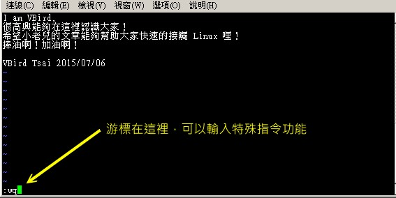

# 第九章、vim 程序编辑器

最近更新日期：20//

系统管理员的重要工作就是得要修改与设置某些重要软件的配置文件，因此至少得要学会一种以上的命令行的文书编辑器。 在所有的 Linux distributions 上头都会有的一套文书编辑器就是 vi ，而且很多软件默认也是使用 vi 做为他们编辑的接口， 因此鸟哥建议您务必要学会使用 vi 这个正规的文书编辑器。此外，vim 是进阶版的 vi ， vim 不但可以用不同颜色显示文字内容，还能够进行诸如 shell script, C program 等程序编辑功能， 你可以将 vim 视为一种程序编辑器！鸟哥也是用 vim 编辑鸟站的网页文章呢！ ^_^

## 9.1 vi 与 vim

在前面的章节中，我们强调了使用文字模式来处理 Linux 系统设置的重要性。文字模式不仅让你更容易了解系统的运行状况，还能保证你的修改顺利生效。因此，熟悉至少一种文书处理器对系统管理员来说是必备的技能。

### 9.1.1 为何要学 vim

虽然有很多命令行的文书编辑器，如 emacs、pico、nano、joe 和 vim 等，但我们特别推荐学习 vim，原因如下：

1. **通用性**：所有的 Unix Like 系统都会内置 vi 文书编辑器，而其他编辑器不一定存在。
2. **兼容性**：许多软件的编辑接口默认调用 vi，如 crontab、visudo、edquota 等指令。
3. **程序编辑能力**：vim 可以用颜色或底线显示语法，方便程序设计。
4. **快速性**：程序简单，编辑速度快。

vim 可以视作 vi 的进阶版本，不仅支持基本的文书处理功能，还具有强大的程序编辑能力。vim 的官方网站（http://www.vim.org）甚至将 vim 定义为“程序开发工具”而不是文书处理软件。vim 具备以下功能：

- **语法高亮**：自动识别不同语言的语法并用颜色显示。
- **多文件编辑**：支持同时编辑多个文件。
- **正则表达式**：支持复杂的正则表达式搜索。
- **区块复制**：支持区域选择和复制。

鸟哥的整个网站就是在 vim 环境下创建的。vim 的便捷性和强大功能让我们在处理配置文件和编写代码时非常高效。

### 9.1.2 vi 与 vim 的基本用法

#### vi 的基本操作

vi 编辑器分为三种模式：命令模式、插入模式和底线命令模式。

1. 命令模式

   ：这是 vi 的默认模式，在该模式下可以输入命令控制光标移动、删除文本等。

   - **进入插入模式**：按 `i` 键或 `a` 键。
   - **进入底线命令模式**：按 `:` 键。

2. **插入模式**：在该模式下可以输入文本，按 `Esc` 键返回命令模式。

3. **底线命令模式**：在该模式下可以输入以 `:` 开头的命令，执行文件保存、退出等操作。

#### vim 的增强功能

vim 在 vi 的基础上增加了许多实用的功能，例如：

- **语法高亮**：根据文件类型自动高亮显示语法。
- **多文件编辑**：使用 `:split` 命令可以分屏编辑多个文件。
- **插件支持**：可以安装各种插件扩展功能，如自动补全、代码格式化等。
- **自动补全**：在插入模式下按 `Ctrl+n` 或 `Ctrl+p` 可以进行单词补全。

### 9.1.3 vim 的使用实例

以下是一些常用的 vim 操作实例：

1. **打开文件**：在命令行输入 `vim filename` 打开文件。
2. **保存文件**：在命令模式下输入 `:w` 保存文件。
3. **退出编辑**：在命令模式下输入 `:q` 退出，若有未保存的修改，输入 `:q!` 强制退出。
4. **查找字符串**：在命令模式下输入 `/string` 查找字符串，按 `n` 查找下一个。
5. **替换字符串**：在底线命令模式下输入 `:%s/old/new/g` 将全文件中的 `old` 替换为 `new`。

通过熟练掌握 vim 的基本操作和常用命令，你将能够高效地编辑和管理 Linux 系统中的各种配置文件和代码，提高工作效率。

**原文：**

## 9.1 vi 与 vim

由前面一路走来，我们一直建议使用文字模式来处理 Linux 系统的设置问题，因为不但可以让你比较容易了解到 Linux 的运行状况，也比较容易了解整个设置的基本精神，更能“保证”你的修改可以顺利的被运行。 所以，在 Linux 的系统中使用文字编辑器来编辑你的 Linux 参数配置文件，可是一件很重要的事情呦！也因此呢，系统管理员至少应该要熟悉一种文书处理器的！


**Tips** 这里要再次的强调，不同的 Linux distribution 各有其不同的附加软件，例如 Red Hat Enterprise Linux 与 Fedora 的 ntsysv 与 setup 等，而 SuSE 则有 YAST 管理工具等等， 因此，如果你只会使用此种类型的软件来控制你的 Linux 系统时，当接管不同的 Linux distributions 时，呵呵！那可就苦恼了！

在 Linux 的世界中，绝大部分的配置文件都是以 ASCII 的纯文本形态存在，因此利用简单的文字编辑软件就能够修改设置了！ 与微软的 Windows 系统不同的是，如果你用惯了 Microsoft Word 或 Corel Wordperfect 的话，那么除了 X window 里面的图形接口编辑程序（如 xemacs ）用起来尚可应付外，在 Linux 的文字模式下，会觉得文书编辑程序都没有窗口接口来的直观与方便。


**Tips** 什么是纯文本文件？其实文件记录的就是 0 与 1 ，而我们通过编码系统来将这些 0 与 1 转成我们认识的文字就是了。 在[第零章里面的数据表示方式](https://wizardforcel.gitbooks.io/vbird-linux-basic-4e/Text/index.html#data)有较多说明，请自行查阅。 ASCII 就是其中一种广为使用的文字编码系统，在 ASCII 系统中的图示与代码可以参考 http://zh.wikipedia.org/wiki/ASCII呢！

那么 Linux 在命令行下的文书编辑器有哪些呢？其实有非常多喔！常常听到的就有： [emacs](http://www.gnu.org/software/emacs/), [pico](https://en.wikipedia.org/wiki/Pico_（text_editor）), [nano](http://sourceforge.net/projects/nano/), [joe](http://sourceforge.net/projects/joe-editor/), 与 [vim](http://www.vim.org/) 等等[[1\]](https://wizardforcel.gitbooks.io/vbird-linux-basic-4e/content/79.html#ps1)。 既然有这么多命令行的文书编辑器，那么我们为什么一定要学 vi 啊？还有那个 vim 是做啥用的？下面就来谈一谈先！

### 9.1.1 为何要学 vim

文书编辑器那么多，我们之前在[第四章](https://wizardforcel.gitbooks.io/vbird-linux-basic-4e/Text/index.html#nano)也曾经介绍过那简单好用的 [nano](https://wizardforcel.gitbooks.io/vbird-linux-basic-4e/Text/index.html#nano) ，既然已经学会了 nano ，干嘛鸟哥还一直要你学这不是很友善的 vi 呢？其实是有原因的啦！因为：

- 所有的 Unix Like 系统都会内置 vi 文书编辑器，其他的文书编辑器则不一定会存在；
- 很多个别软件的编辑接口都会主动调用 vi （例如未来会谈到的 [crontab](https://wizardforcel.gitbooks.io/vbird-linux-basic-4e/Text/index.html#crontab), [visudo](https://wizardforcel.gitbooks.io/vbird-linux-basic-4e/Text/index.html#visudo), edquota 等指令）；
- vim 具有程序编辑的能力，可以主动的以字体颜色辨别语法的正确性，方便程序设计；
- 因为程序简单，编辑速度相当快速。

其实重点是上述的第二点，因为有太多 Linux 上面的指令都默认使用 vi 作为数据编辑的接口，所以你必须、一定要学会 vi ，否则很多指令你根本就无法操作呢！这样说，有刺激到你务必要学会 vi 的热情了吗？ ^_^

那么什么是 vim 呢？其实你可以将 vim 视作 vi 的进阶版本，vim 可以用颜色或底线等方式来显示一些特殊的信息。 举例来说，当你使用 vim 去编辑一个 C 程序语言的文件，或者是我们后续会谈到的 [shell script](https://wizardforcel.gitbooks.io/vbird-linux-basic-4e/Text/index.html) 脚本程序时，vim 会依据文件的扩展名或者是文件内的开头信息， 判断该文件的内容而自动的调用该程序的语法判断式，再以颜色来显示程序码与一般信息。也就是说， 这个 vim 是个“程序编辑器”啦！甚至一些 Linux 基础配置文件内的语法，都能够用 vim 来检查呢！ 例如我们在第七章谈到的 [/etc/fstab](https://wizardforcel.gitbooks.io/vbird-linux-basic-4e/Text/index.html#fstab) 这个文件的内容。

简单的来说， vi 是老式的文书处理器，不过功能已经很齐全了，但是还是有可以进步的地方。 vim 则可以说是程序开发者的一项很好用的工具，就连 vim 的官方网站 （[http://www.vim.org](http://www.vim.org/)） 自己也说 vim 是一个“程序开发工具”而不是文书处理软件～^_^。 因为 vim 里面加入了很多额外的功能，例如支持正则表达式的搜寻架构、多文件编辑、区块复制等等。 这对于我们在 Linux 上面进行一些配置文件的修订工作时，是很棒的一项功能呢！


**Tips** 什么时候会使用到 vim 呢？其实鸟哥的整个网站都是在 vim 的环境下一字一字的创建起来的喔！ 早期鸟哥使用网页制作软件在编写网页，但是老是发现网页编辑软件都不怎么友善，尤其是写到 PHP 方面的程序码时。 后来就干脆不使用所见即所得的编辑软件，直接使用 vim ，然后标签 （tag） 也都自行用键盘输入！ 这样整个文件也比较干净！所以说，鸟哥我是很喜欢 vim 的啦！ ^_^

下面鸟哥会先就简单的 vi 做个介绍，然后再跟大家报告一下 vim 的额外功能与用法呢！


## 9.2 vi 的使用

基本上，vi 共分为三种模式，分别是“一般指令模式”、“编辑模式”与“命令行命令模式”。这三种模式的作用分别是：

- **一般指令模式 (command mode)**
  - 以 vi 打开一个文件就直接进入一般指令模式了（这是默认的模式，也简称为一般模式）。在这个模式中，你可以使用“上下左右”按键来移动光标，可以使用“删除字符”或“删除整列”来处理文件内容，也可以使用“复制、贴上”来处理你的文件数据。
- **编辑模式 (insert mode)**
  - 在一般指令模式中可以进行删除、复制、贴上等动作，但无法编辑文件内容。按下“i, I, o, O, a, A, r, R”等任何一个字母之后会进入编辑模式。通常在 Linux 中，按下这些按键时，在画面的左下方会出现“INSERT 或 REPLACE”的字样，此时可以进行编辑。按下“Esc”键退出编辑模式，返回一般指令模式。
- **命令行命令模式 (command-line mode)**
  - 在一般模式当中，输入“: / ?”中的任何一个按钮，光标移动到最下面那一列。在这个模式中，可以进行“搜寻数据”的操作，读取、存盘、大量取代字符、离开 vi、显示行号等操作。

简而言之，我们可以将这三个模式想成如下图示：


### 9.2.1 简易执行范例

如果你想要使用 vi 创建一个名为 welcome.txt 的文件，可以按如下步骤进行：

1. 使用“vi filename”进入一般指令模式

   ```
   sh
   复制代码
   [dmtsai@study ~]$ /bin/vi welcome.txt
   ```

2. 按下 i 进入编辑模式，开始编辑文字

3. 按下 `Esc` 按钮回到一般指令模式

4. 进入命令行界面，文件储存并离开 vi 环境

   ```
   sh
   复制代码
   :wq
   ```

如下图所示：



### 9.2.2 按键说明

#### 一般指令模式可用的按钮说明

- **移动光标的方法**

  | 按键                 | 作用                                            |
  | -------------------- | ----------------------------------------------- |
  | h 或 ←               | 光标向左移动一个字符                            |
  | j 或 ↓               | 光标向下移动一个字符                            |
  | k 或 ↑               | 光标向上移动一个字符                            |
  | l 或 →               | 光标向右移动一个字符                            |
  | 0 或 Home            | 移动到这一列的最前面字符处                      |
  | $ 或 End             | 移动到这一列的最后面字符处                      |
  | G                    | 移动到文件的最后一列                            |
  | gg                   | 移动到文件的第一列                              |
  | nG                   | 移动到文件的第 n 列                             |
  | /word                | 向光标之下寻找 word 字串                        |
  | ?word                | 向光标之上寻找 word 字串                        |
  | n                    | 重复前一个搜寻动作                              |
  | N                    | 反向进行前一个搜寻动作                          |
  | ,n2s/word1/word2/g   | 在 n1 到 n2 行之间将 word1 替换为 word2         |
  | :1,$s/word1/word2/g  | 从第一行到最后一行将 word1 替换为 word2         |
  | :1,$s/word1/word2/gc | 从第一行到最后一行将 word1 替换为 word2，并确认 |
  | x, X                 | 删除一个字符                                    |
  | dd                   | 删除光标所在的一整行                            |
  | ndd                  | 删除光标所在的向下 n 行                         |
  | yy                   | 复制光标所在的那一行                            |
  | nyy                  | 复制光标所在的向下 n 行                         |
  | p, P                 | 粘贴已复制的内容                                |
  | u                    | 复原前一个动作                                  |
  | Ctrl+r               | 重做上一个动作                                  |
  | .                    | 重复前一个动作                                  |

#### 一般指令模式切换到编辑模式的按钮说明

- **进入插入或取代的编辑模式**

  | 按键 | 作用                                                 |
  | ---- | ---------------------------------------------------- |
  | i, I | 插入模式：i 在光标处插入，I 在行首插入               |
  | a, A | 插入模式：a 在光标后插入，A 在行尾插入               |
  | o, O | 插入模式：o 在光标下方插入新行，O 在光标上方插入新行 |
  | r, R | 取代模式：r 取代一个字符，R 取代直到按下 Esc         |
  | Esc  | 退出编辑模式，回到一般指令模式                       |

#### 一般指令模式切换到命令行界面的按钮说明

- **命令行界面的储存、离开等指令**

  | 按键             | 作用                               |
  | ---------------- | ---------------------------------- |
  |                  | 保存文件                           |
  | !                | 强制保存文件                       |
  |                  | 退出 vi                            |
  | !                | 不保存文件退出 vi                  |
  |                  | 保存并退出 vi                      |
  | [filename]       | 将文件另存为 filename              |
  | [filename]       | 在编辑的数据中插入另一个文件的数据 |
  | ,n2 w [filename] | 将 n1 到 n2 行保存为 filename      |
  | :! command       | 暂时离开 vi 执行命令               |
  | nu               | 显示行号                           |
  | nonu             | 取消显示行号                       |

### 9.2.3 一个案例练习

按照下面的需求进行 vi 操作练习：

1. 在 `/tmp` 目录下创建一个名为 `vitest` 的目录；
2. 进入 `vitest` 目录；
3. 将 `/etc/man_db.conf` 复制到本目录（或从链接下载 `man_db.conf` 文件）；
4. 使用 `vi` 打开 `man_db.conf` 文件；
5. 设置行号；
6. 移动到第 43 行，向右移动 59 个字符；
7. 向下搜索 `gzip` 字符串；
8. 将 29 到 41 行之间的 `man` 改为 `MAN` 并确认；
9. 复原修改；
10. 复制 66 到 71 行，并粘贴到最后一行之后；
11. 删除 113 到 128 行的注释；
12. 将文件另存为 `man.test.config`；
13. 删除第 25 行的 15 个字符；
14. 在第一行新增一行，输入 `I am a student...`；
15. 保存并退出。

具体操作如下：

1. `mkdir /tmp/vitest`
2. `cd /tmp/vitest`
3. `cp /etc/man_db.conf .`
4. `/bin/vi man_db.conf`
5. `:set nu`
6. `43G` 再按 `59→`
7. `1G` 后输入 `/gzip`
8. `:29,41s/man/MAN/gc`
9. 按 `u` 复原或 `:q!` 不保存退出再重新打开文件
10. `66G` 后 `6yy`，再 `G` 后 `p`
11. `113G` 后 `16dd`
12. `:w man.test.config`
13. `25G` 后 `15x`
14. `1G` 后 `O`，输入 `I am a student...`，按 `Esc`
15. `:wq`

### 9.2.4 vim 的暂存盘、救援回复与打开时的警告讯息

vim 在编辑时会创建一个 `.filename.swp` 的暂存盘文件。若编辑过程中出现异常中断，暂存盘可用于恢复编辑内容。

例如，在编辑 `man_db.conf` 文件时：

1. 用 

   ```
   vim
   ```

    编辑文件，并按 

   ```
   Ctrl+z
   ```

    挂起

   ```
   sh
   复制代码
   vim man_db.conf
   ```

2. 查看暂存盘

   ```
   sh
   复制代码
   ls -al
   ```

3. 模拟异常中断

   ```
   sh
   复制代码
   kill -9 %1
   ```

4. 重新编辑文件时，会提示存在暂存盘，选择合适的操作如 `R` 恢复文件、`D` 删除暂存盘。

通过熟练掌握上述操作，可以高效地使用 vi/vim 编辑和管理文件，提高工作效率。

## 9.3 vim 的额外功能

### 9.3.1 区块选择 (Visual Block)

在 vi 的操作过程中，大多数是以列为单位的操作。然而，有时我们需要处理的是一个区块范围的数据。比如以下这种格式的文件：

```
arduino复制代码192.168.1.1    host1.class.net
192.168.1.2    host2.class.net
192.168.1.3    host3.class.net
192.168.1.4    host4.class.net
```

如果我们想要将 `host1, host2...` 这些数据复制并添加到每一行的末尾，结果要变成：

```
arduino复制代码192.168.1.1    host1.class.net    host1
192.168.1.2    host2.class.net    host2
192.168.1.3    host3.class.net    host3
192.168.1.4    host4.class.net    host4
```

可以使用 vim 的区块选择功能来完成。按下 `v`, `V`, 或者 `Ctrl+v` 可以进行字符选择、列选择和区块选择。

例如，具体步骤如下：

1. 使用 `vim hosts` 打开文件。
2. 将光标移动到第一行的 `host1` 上，按下 `Ctrl+v` 进入区块选择模式。
3. 移动光标到最底部，此时光标移动过的区域会反白。
4. 按下 `y` 复制区块。
5. 将光标移动到第一行的最右边，按下 `p` 进行粘贴。

这样，每一行的末尾都会粘贴上相应的 `host` 数据。

### 9.3.2 多文件编辑

假设你想将 `hosts` 文件中的 IP 地址复制到 `/etc/hosts` 文件中，可以使用多文件编辑功能。

1. 使用 `vim hosts /etc/hosts` 打开多个文件。
2. 在 vim 中输入 `:files` 查看打开的文件列表。
3. 复制 `hosts` 文件中的数据，如 `4yy` 复制四行。
4. 输入 `:n` 切换到下一个文件 `/etc/hosts`。
5. 在 `/etc/hosts` 中按 `G` 移动到最后一行，按 `p` 进行粘贴。
6. 按 `:q` 退出 vim。

### 9.3.3 多窗口功能

多窗口功能可以让你同时查看和编辑多个文件或同一文件的不同部分。具体操作如下：

1. 打开文件，如 `vim /etc/man_db.conf`。
2. 输入 `:sp` 创建一个新窗口，默认打开同一文件。
3. 在新窗口中可以输入 `:sp /etc/hosts` 打开另一个文件。
4. 使用 `Ctrl+w` 进行窗口间切换，如 `Ctrl+w j` 移动到下一个窗口。

### 9.3.4 vim 的挑字补全功能

vim 提供了挑字补全功能，可以根据当前文件的内容、文件名或扩展名进行补全。常用的组合键有：

- `Ctrl+x Ctrl+n` 通过当前文件内容补全。
- `Ctrl+x Ctrl+f` 以当前目录的文件名补全。
- `Ctrl+x Ctrl+o` 以扩展名作为语法补充。

例如，在编写 HTML 文件时，可以使用 `Ctrl+x Ctrl+o` 来补全 CSS 关键字。

### 9.3.5 vim 环境设置与记录： ~/.vimrc, ~/.viminfo

vim 的设置参数可以保存在 `~/.vimrc` 文件中。例如：

```
vim复制代码"这个文件的双引号是注解
set hlsearch            "高亮度反白
set backspace=2         "可随时用倒退键删除
set autoindent          "自动缩排
set ruler               "显示最后一列的状态
set showmode            "显示编辑模式
set nu                  "显示行号
set bg=dark             "使用深色背景
syntax on               "启用语法检验和颜色显示
```

这些设置会在每次启动 vim 时自动生效。此外，vim 会将你的操作记录在 `~/.viminfo` 文件中，以便下次编辑时恢复状态。

### 9.3.6 vim 常用指令示意图

为了方便大家查找在不同模式下可以使用的 vim 指令，可以参考如下示意图：


通过掌握这些额外功能和设置，可以大大提高在 vim 中的编辑效率和灵活性。

## 9.4 其他 vim 使用注意事项

vim 是一个非常强大的文本编辑器，但它也有一些需要注意的问题和操作技巧。下面将介绍几个常见的使用注意事项和操作方法。

### 9.4.1 中文编码的问题

在使用 vim 编辑中文文件时，可能会遇到中文显示乱码的问题。这通常是由于文件编码和终端编码不一致造成的。常见的中文编码有 big5 和 utf8，如果文件是使用 big5 编码而终端使用 utf8 编码，就会出现乱码。解决方法如下：

1. 确认系统支持的语系数据（与 `/etc/locale.conf` 有关）。

2. 设置终端的语系：

   ```
   bash复制代码LANG=zh_TW.big5
   export LC_ALL=zh_TW.big5
   ```

3. 设置终端软件的字符编码，例如在 GNOME 终端中设置字符编码为“中文（正体）（BIG5）”。

4. 使用 vim 编辑文件时，确保文件编码和终端编码一致。

### 9.4.2 DOS 与 Linux 的断行字符

DOS（Windows）和 Linux 使用不同的断行字符，DOS 使用 CRLF (`^M$`)，而 Linux 使用 LF (`$`)。如果在 Linux 中编辑的文件包含 DOS 的断行字符，可能会导致脚本无法正常执行。可以使用 `dos2unix` 和 `unix2dos` 工具进行转换。

#### 安装 `dos2unix` 工具

如果系统中没有安装该工具，可以使用以下命令从光盘安装：

```
bash复制代码su -
mount /dev/sr0 /mnt
rpm -ivh /mnt/Packages/dos2unix-*
umount /mnt
exit
```

#### 使用示例

1. 将文件从 DOS 格式转换为 Unix 格式：

   ```
   bash
   复制代码
   dos2unix -k man_db.conf
   ```

2. 将文件从 Unix 格式转换为 DOS 格式：

   ```
   bash
   复制代码
   unix2dos -k man_db.conf
   ```

### 9.4.3 语系编码转换

如果需要将文件的编码从一种格式转换为另一种格式，可以使用 `iconv` 工具。该工具支持多种编码格式的转换。

#### 使用示例

1. 将文件从 big5 编码转换为 utf8 编码：

   ```
   bash
   复制代码
   iconv -f big5 -t utf8 vi.big5 -o vi.utf8
   ```

2. 将文件从 utf8 编码转换为简体中文的 utf8 编码：

   ```
   bash
   复制代码
   iconv -f utf8 -t big5 vi.utf8 | iconv -f big5 -t gb2312 | iconv -f gb2312 -t utf8 -o vi.gb.utf8
   ```

通过上述方法和工具，可以解决 vim 使用中常见的中文编码和文件格式问题，从而提高文本编辑的效率和准确性。

## 9.5 重点回顾

- Linux 下面的配置文件多为文本文件，故使用 vim 即可进行设置编辑；
- vim 可视为程序编辑器，可用以编辑 shell script, 配置文件等，避免打错字；
- vi 为所有 unix like 的操作系统都会存在的编辑器，且执行速度快速；
- vi 有三种模式，一般指令模式可变换到编辑与命令行界面，但编辑模式与命令行界面不能互换；
- 常用的按键有i, [Esc], :wq 等；
- vi 的画面大略可分为两部份，（1）上半部的本文与（2）最后一行的状态+命令行界面；
- 数字是有意义的，用来说明重复进行几次动作的意思，如 5yy 为复制 5 列之意；
- 光标的移动中，大写的 G 经常使用，尤其是 1G, G 移动到文章的头/尾功能！
- vi 的取代功能也很棒！ :n1,n2s/old/new/g 要特别注意学习起来；
- 小数点“ . ”为重复进行前一次动作，也是经常使用的按键功能！
- 进入编辑模式几乎只要记住： i, o, R 三个按钮即可！尤其是新增一列的 o 与取代的 R
- vim 会主动的创建 swap 暂存盘，所以不要随意断线！
- 如果在文章内有对齐的区块，可以使用 [ctrl]-v 进行复制/贴上/删除的行为
- 使用 :sp 功能可以分区窗口
- 若使用 vim 来撰写网页，若需要 CSS 元素数据，可通过 [crtl]+x, [crtl]+o 这两个连续组合按键来取得关键字
- vim 的环境设置可以写入在 ~/.vimrc 文件中；
- 可以使用 iconv 进行文件语系编码的转换
- 使用 dos2unix 及 unix2dos 可以变更文件每一列的行尾断行字符。