# 绪论

​		关于学习Linux相关知识很早就开始了，尽管在研究生阶段科研项目主要在windows下进行开发，但是接触最多的编程语言是C、C++，并且从事网络协议的开发也经常用到虚拟机、Linux，再到后面找工作，第一优先级也是软件开发工程师，所以Linux、操作系统、计算机网络等知识是必备的。

​		而如今入职后更是从事计算机底层相关开发，更是对于Linux的掌握要求更上一层。遂捡起从前的笔记，发现之前还是整理太少，这次更是在导师要求下需要读完这本经典Linux入门书籍《鸟哥的Linux私房菜：基础学习篇 第四版》，那总要留下点什么，以备今后不时之需。废话不多说，直接开看。

# 第零章 计算机概率

## 2.1 0.1 电脑：辅助人脑的好工具

主要讲了计算机在我们当今世界的影响，可谓是不可或缺的。当今电脑功能繁多，不仅仅是计算。

### 0.1.1 计算机硬件的五大单元

观察台式机，可以分为三部分：输入单元--键盘、鼠标，主机部分--系统单元，还有一堆板子、CPU与内存，输出单元--屏幕、打印机等。

**计算机硬件五大单元 ：** 输入、输出、CPU控制单元、CPU算术逻辑单元、内存。P3  

### 0.1.2 一切设计的起点：CPU的架构

**CPU种类 ：**RISC（Reduced Instruction Set Computing）精简指令集-----x86、ARM，这种CPU的设计，微指令集较为精简，每个指令的执行时间都很短，完成的动作也单纯，指令的执行性能较佳；但是若要做复杂的的事情，就要由多个指令来完成。

 CISC（Complex Instruction Set Computer）复杂指令集--AMD、Intel，与RISC不同的是，CISC在微指令集的每个小指令都可以执行一些较低阶的硬件操作，指令数目多而且复杂，每个指令的长度并不相同。因为指令执行较为复杂且每条指令花费时间较长，但每条个别指令可以处理的工作较为丰富。x86架构的命名是因为初代Intel CPU代号为 8086。

**TIPS：**位是指CPU一次数据读取的最大量！64位CPU代表CPU一次可以读取64bits数据。因为CPU读取数据量有限制，因此能够从内存中读写的数据也有所限制。一般32位CPU能读写的数据量是4GB左右。

### 0.1.3 其他单元的设备

五大单元中最重要的控制、算术逻辑被整合到CPU。其他三个单元：

系统单元：包括CPU与内存及主板相关元件。并且主板上有很多连接接口与相关的适配卡，网卡，显卡等。

存储单元：包括内存（main memory, RAM）与辅助内存，辅助内存指硬盘、光盘等。

输入、输出单元：输入包括触摸屏、键盘、鼠标，输出包括屏幕、音效喇叭、投影机、蓝牙耳机等。

### 0.1.4 运行流程

- CPU=脑袋瓜子：每个人会作的事情都不一样（微指令集的差异），但主要都是通过脑袋瓜子来进行判断与控制身体各部分的活动；
- 内存=脑袋中放置正在被思考的数据的区块：在实际活动过程中，我们的脑袋瓜子需要有外界刺激的数据 （例如光线、环境、语言等） 来分析，那这些互动数据暂时存放的地方就是内存，主要是用来提供给脑袋瓜子判断用的信息。
- 硬盘=脑袋中放置回忆的记忆区块：跟刚刚的内存不同，内存是提供脑袋目前要思考与处理的信息，但是有些生活琐事或其他没有要立刻处理的事情， 就当成回忆先放置到脑袋的记忆深处吧！那就是硬盘！主要目的是将重要的数据记录起来，以便未来将这些重要的经验再次的使用；
- 主板=神经系统：好像人类的神经一样，将所有重要的元件连接起来，包括手脚的活动都是脑袋瓜子发布命令后， 通过神经（主板）传导给手脚来进行活动啊！
- 各项周边设备=人体与外界沟通的手、脚、皮肤、眼睛等：就好像手脚一般，是人体与外界互动的重要关键！
- 显卡=脑袋中的影像：将来自眼睛的刺激转成影像后在脑袋中呈现，所以显卡所产生的数据来源也是CPU控制的。
- 电源供应器 （Power）=心脏：所有的元件要能运行得要有足够的电力供给才行！这电力供给就好像心脏一样，如果心脏不够力， 那么全身也就无法动弹的！心脏不稳定呢？那你的身体当然可能断断续续的～不稳定！

###  0.1.5 电脑按用途分类

超级计算机、大型计算机、迷你电脑、工作站、微电脑

0.1.6 电脑上面常用的计算单位

**计算单位 ：** 大小—bit、Byte、M、K、G、T、P；速度—Mbit/s，通常除以8转换成MByte/s；另外硬盘容量通常以十进制，所以实际上应该乘以一个系数。  

## 2.2 0.2 个人电脑架构与相关设备元件

**计算机架构和接口 ：** 北桥与南桥；北桥（系统总线）—负责速度较快的CPU、内存、显卡；南桥（I/O总线）—负责速度较慢的周边接口，硬盘、网卡、USB等  

### 0.2.1 执行脑袋运算与判断的CPU

**CPU ：** （１）多核－－在一个CPU封装当中嵌入了两个以上的运算内核，一个实际的CPU外壳中含有两个以上的CPU单元。  
**外频和倍频 ：** 外频是CPU与外部组件进行数据传输／运算时的速度；倍频是CPU内部迎来加速工作性能的一个倍数，两者相乘才是CPU的频率。  
**32位与64位 ：** CPU解析的自组大小。北桥支持的频率称为前端总线速度，每次传送的位数为总线宽度。  
**CPU等级 ：** 引脚位与设计。  

### 0.2.2 内存

**内存 ：** DRAM（dynamic　random　access　memory）个人计算机主要组件；SRAM为CPU内部第二层缓存。 

 下表列出SDRAM与DDR SDRAM的型号与频率及带宽之间的关系。

 

**Tips:**内存除了频率/带宽与型号需要考虑之外，内存的容量也是很重要的喔！ 因为所有的数据都得要载入内存当中才能够被CPU判读，如果内存容量不够大的话将会导致某些大容量数据无法被完整的载入， 此时已存在内存当中但暂时没有被使用到的数据必须要先被释放，使得可用内存容量大于该数据，那份新数据才能够被载入呢！ 所以，通常越大的内存代表越快速的系统，这是因为系统不用常常释放一些内存内部的数据。 以服务器来说，内存的容量有时比CPU的速度还要来的重要的！

- 多通道设计

由于所有的数据都必须要存放在内存，所以内存的数据宽度当然是越大越好。 但传统的总线宽度一般大约仅达64位，为了要加大这个宽度，因此芯片组厂商就将两个内存汇整在一起， 如果一支内存可达64位，两支内存就可以达到128位了，这就是双通道的设计理念。

- DRAM与SRAM

我们现在知道CPU的数据都是由内存提供，但CPU到内存之间还是得要通过内存控制器啊！ 如果某些很常用的程序或数据可以放置到CPU内部的话，那么CPU数据的读取就不需要跑到内存重新读取了！ 这对于性能来说不就可以大大的提升了？这就是第二层高速缓存的设计概念。第二层高速缓存与内存及CPU的关系如下图所示：

因为第二层高速缓存（L2 cache）整合到CPU内部，因此这个L2内存的速度必须要CPU频率相同。 使用DRAM是无法达到这个频率速度的，此时就需要静态随机存取内存（Static Random Access Memory, SRAM）的帮忙了。 SRAM在设计上使用的电晶体数量较多，价格较高，且不易做成大容量，不过由于其速度快， 因此整合到CPU内成为高速缓存内存以加快数据的存取是个不错的方式喔！新一代的CPU都有内置容量不等的L2高速缓存在CPU内部， 以加快CPU的运行性能。

- 只读存储器（ROM）

 而主板上面如果有内置的网卡或者是显卡时，该功能是否要启动与该功能的各项参数， 是被记录到主板上头的一个称为CMOS的芯片上，这个芯片需要借着额外的电源来发挥记录功能， 这也是为什么你的主板上面会有一颗电池的缘故。

那CMOS内的数据如何读取与更新呢？还记得你的电脑在开机的时候可以按下[Del]按键来进入一个名为BIOS的画面吧？ BIOS（Basic Input Output System）是一套程序，这套程序是写死到主板上面的一个内存芯片中， 这个内存芯片在没有通电时也能够将数据记录下来，那就是只读存储器（Read Only Memory, ROM）。 ROM是一种非挥发性的内存。另外，BIOS对于个人电脑来说是非常重要的， 因为他是系统在开机的时候首先会去读取的一个小程序喔！

### 0.2.3 显卡

**显卡 ：** VGA每个图像显示的颜色都会占用内存，内存容量

显卡又称为VGA（Video Graphics Array），他对于图形影像的显示扮演相当关键的角色。

除了显存之外，现在由于三度空间游戏（3D game）与一些3D动画的流行，因此显卡的“运算能力”越来越重要。 一些3D的运算早期是交给CPU去运行的，但是CPU并非完全针对这些3D来进行设计的，而且CPU平时已经非常忙碌了呢！ 所以后来显卡厂商直接在显卡上面嵌入一个3D加速的芯片，这就是所谓的GPU称谓的由来。

### 0.2.4 硬盘与储存设备

**硬盘 ：** 扇区（最小单位，512bytes）、柱面、磁头  

在硬盘盒里面其实是由许许多多的圆形盘片、机械手臂、 磁头与主轴马达所组成的，整个内部如同下图所示：

实际的数据都是写在具有磁性物质的盘片上头，而读写主要是通过在机械手臂上的磁头（head）来达成。 实际运行时， 主轴马达让盘片转动，然后机械手臂可伸展让磁头在盘片上头进行读写的动作。 另外，由于单一盘片的容量有限，因此有的硬盘内部会有两个以上的盘片喔！

- 盘片上的数据

由于盘片是圆的，并且通过机器手臂去读写数据，盘片要转动才能够让机器手臂读写。因此，通常数据写入当然就是以圆圈转圈的方式读写啰！ 所以，当初设计就是在类似盘片同心圆上面切出一个一个的小区块，这些小区块整合成一个圆形，让机器手臂上的磁头去存取。 这个小区块就是磁盘的最小物理储存单位，称之为扇区 （sector），那同一个同心圆的扇区组合成的圆就是所谓的磁道（track）。 由于磁盘里面可能会有多个盘片，因此在所有盘片上面的同一个磁道可以组合成所谓的柱面 （cylinder）。

我们知道同心圆外圈的圆比较大，占用的面积比内圈多啊！所以，为了善用这些空间，因此外围的圆会具有更多的扇区[[16\]](https://wizardforcel.gitbooks.io/vbird-linux-basic-4e/content/4.html#ps16)！ 就如同图 0.2.5 的示意一般。此外，当盘片转一圈时，外圈的扇区数量比较多，因此如果数据写入在外圈，转一圈能够读写的数据量当然比内圈还要多！ 因此通常数据的读写会由外圈开始往内写的喔！这是默认值啊！

另外，原本硬盘的扇区都是设计成 512Byte 的容量，但因为近期以来硬盘的容量越来越大，为了减少数据量的拆解，所以新的大容量硬盘已经有 4KByte 的扇区设计！ 购买的时候也需要注意一下。也因为这个扇区的设计不同了，因此在磁盘的分区方面，目前有旧式的 MSDOS 相容模式，以及较新的 GPT 模式喔！ 在较新的 GPT 模式下，磁盘的分区通常使用扇区号码来设计，跟过去旧的 MSDOS 是通过柱面号码来分区的情况不同喔！相关的说明我们谈到磁盘管理 （第七章） 再来聊！

近年来在测试磁盘的性能时， 有个很特殊的单位，称为**每秒读写操作次数 （Input/Output Operations Per Second, IOPS）**！这个数值越大，代表可操作次数较高，当然性能好的很！

- **硬盘接口 ：** IDE、SATA  

- 固态硬盘

后来就有厂商拿闪存去制作成大容量的设备，这些设备的连接接口也是通过 SATA 或 SAS，而且外型还做的跟传统磁盘一样！所以， 虽然这类的设备已经不能称为是磁盘 （因为没有磁头与盘片啊！都是内存！）。但是为了方便大家称呼，所以还是称为磁盘！只是跟传统磁盘 （Hard Disk Drive, HDD） 不同， 就称为固态硬盘 （Solid State Disk 或 Solid State Driver, SSD）。

### 0.2.5 扩展卡与接口

### 0.2.6 主板

**主板 ：** CMOS（硬件）、BIOS（程序）–ROM  
**软件 ：** 系统软件（操作系统）、应用程序  
**操作系统 ：** 控制盒管理硬件资源（CPU、内存、输入输出设备、系统文件）；包括内核和系统调用（接口)两部分。

2.

-   所谓的计算机就是一种计算器，而计算器其实是：『**接受用户输入指令与数据，经由中央处理器的数学与逻辑单元运算处理后， 以产生或储存成有用的信息**』。因此，只要有输入设备（不管是键盘还是触摸屏）及输出设备（例如计算机屏幕或直接由打印机打印出来），让你可以输入数据使该机器产生信息的， 那就是一部计算器了。
-   关于计算机的硬件组成部分，其实你可以观察你的桌面计算机来分析一下，依外观来说主要可分为三部分：
    -   输入单元：包括键盘、鼠标、读卡器、扫描仪、手写板、触控屏幕等等；
    -   主机部分：这个就是系统单元，被主机机箱保护着，里面含有一堆板子、CPU 与内存等；
    -   输出单元：例如屏幕、打印机等。
-   中央处理单元（Central Processing Unit，CPU）为一个具有特定功能的芯片，里面含有指令集。CPU 内又可分为两个主要的单元：**算术逻辑单元与控制单元**。其中算术逻辑单元主要负责程序运算与逻辑判断，控制单元则主要在协调各周边组件与各单元间的工作。
-   综上所述，电脑是由几个单元组成的，包括输入单元、 输出单元、CPU 内部的控制单元、算术逻辑单元与内存五大部分。
-   目前世界上最常见的两种 CPU 架构分别是：**精简指令集（RISC）与复杂指令集（CISC）系统**。常见的 RISC 指令集 CPU 主要有甲骨文公司的 SPARC 系列、IBM 公司的 Power Architecture 系列与 ARM 公司的 ARM CPU 系列等。目前世界上使用范围最广的 CPU 可能就是 ARM 这种架构；常见的使用 CISC 指令集的 CPU 有 AMD、Intel、VIA 等 x86 架构的 CPU。
-   假设电脑是一个人体，CPU = 脑袋； 内存 = 脑袋中存放正在被思考的数据的区块；硬盘 = 脑袋中存放回忆的记忆区块；主板 = 神经系统；各项接口设备 = 人体与外界沟通的手、脚、皮肤、眼睛等；显卡 = 脑袋中的影像；主机电源 = 心脏。
-   早期的芯片组通常分为两个网桥来控制各组件的通信，分别是北桥（负责连接速度较快的 CPU、内存与显卡等组件）和南桥（负责连接速度较慢的设备接口，包括硬盘、USB 设备、网卡等）。由于北桥最重要的就是 CPU 与内存之间的桥接，因此目前的主流架构中，大多将北桥的内存控制器整合到了 CPU 当中。
-   早期的 CPU 设计中，所谓的外频指的是 CPU 与外部组件进行数据传输时的速度，倍频则是 CPU 内部用来加速工作性能的一个倍数，两者相乘才是 CPU 的频率速度。
-   **CPU 每次能够解析的数据量有限，因此由内存传来的数据量就有所限制，这也导致 32 位的 CPU 最多只能支持最大到 4GB 的内存。** 理解如下：对于 32 位的 CPU，其最多可以支持的内存空间是由其寻址能力决定的。在 32 位系统中，每个地址都是由 32 位二进制数表示的，因此总共有 2^32（约为 4.29 billion）个不同的地址。内存空间的大小是通过将这些地址转换为字节来计算的。由于在计算机中，内存通常被组织为字节的序列，每个地址对应一个字节，因此，32位系统最多能够寻址的字节数就是 2^32 字节，2^32 字节 = 4,294,967,296 字节 ≈ 4GB。64 位系统：2^64 字节 = 18,446,744,073,709,551,616 字节 ≈ 18.4 million TB。
-   个人电脑的内存主要组件为动态随机存取内存（Dynamic Random Access Memory，DRAM），随机读写内存只有在通电时才能记录与使用，断电之后数据就消失，因此我们也称这种 RAM 为挥发性内存。静态随机存取内存（Static Random Access Memory，SRAM）。
-   BIOS（Basic Input Output System）是一个程序，这个程序是写死到主板上面的一个存储芯片中，这个存储芯片在没有通电时也能够记录数据，这就是只读存储器（Read Only Memory，ROM），其是一个非易失性的存储。
-   显卡又称为 VGA（Video Graphics Array），直接在显卡上嵌入一个 3D 加速芯片，这就是所谓的 GPU 的由来。显卡主要也是通过 GPU 的控制芯片来与 CPU、内存等通信。
-   显卡与电脑屏幕主要通过以下几种连接接口通信：D-Sub（VGA接口，较早之前的连接接口，主要为 15 针接口)、DVI、HDMI（**相对于 D-Sub 与 DVI 仅能传输影像数据，HDMI 可以同时传输影像与声音**）和 DisplayPort（可以同时传输声音和影像）。
-   机械硬盘（Hard Disk Driver，HDD）和固态硬盘（Solid State Disk 或 Solid State Driver，SSD）。固态硬盘最大的好处是，它没有马达不需要转动，而是透过内存直接读写的特性。
-   CMOS 主要的功能为记录主板上的重要参数， 包括系统时间、CPU 电压与频率、各项设备的 I/O 地址与 IRQ 等，由于这些数据的记录要用电，因此主板上面有电池。 BIOS 是写入到主板上某一块 flash 或 EEPROM 的程序，它可以在开机的时候执行，以加载 CMOS 当中的参数， 并尝试调用存储设备中的引导程序，进一步进入操作系统当中。
-   操作系统（Operating System，OS）其实也是一组程序，这组程序的重点在于管理电脑的所有活动以及驱动系统中的所有硬件。其实就是内核及其提供的接口工具。
-   电脑系统主要由硬件构成，然后内核程序主要在管理硬件，提供合理的电脑系统资源分配（包括 CPU 资源、内存资源等），因此只要硬件不同（如 x86 架构与 RISC 架构的 CPU），内核就得进行修改才行。

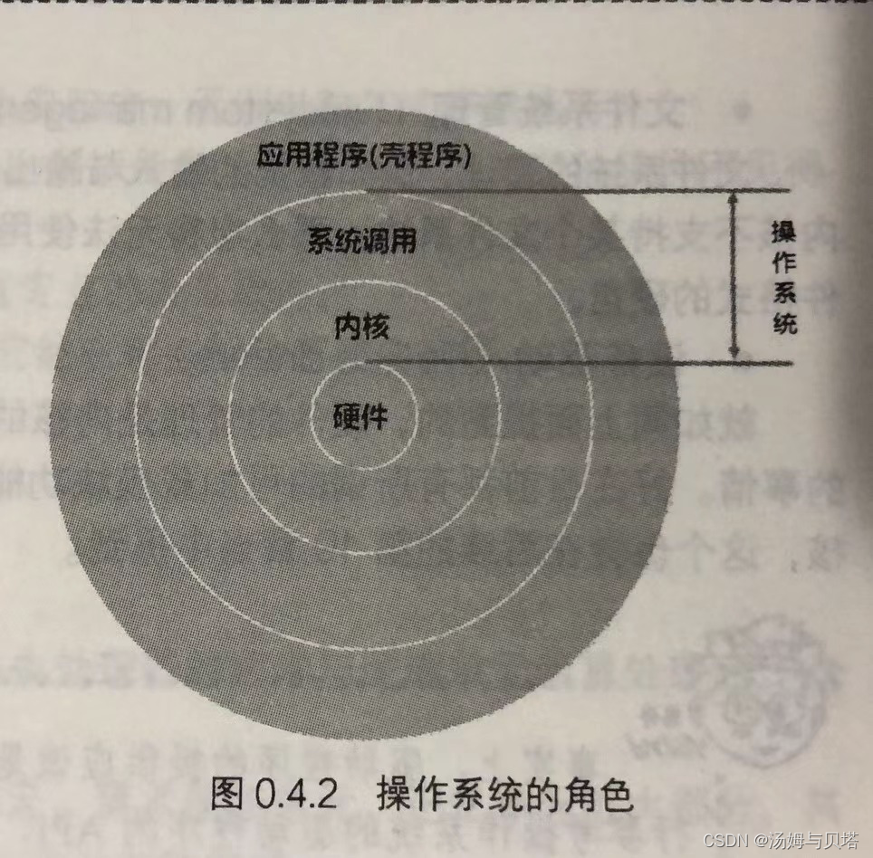

### 第一章、Linux 是什么与如何学习

-   1973 年：Unix 的正式诞生，Ritchie 等人使用 C 语言写出第一个正式 Unix 核心。
-   Linux 的内核是由芬兰人 Linus Torvalds 在 1991 年编写。
-   1994 年完成 Linux 的内核正式版，Version 1.0。
-   Unix like == Linux 很像 Unix 的操作系统。
-   GNU 是 GNU‘s Not UNIX。

### 第二章、主机规划与磁盘分区

- 个人计算机常见的磁盘接口有两种：SATA 和 SAS，目前主流的是 SATA。

- 设备文件名 `/dev/sd[a-p]` 根据 Linux 内核检测到的磁盘的顺序来命名，并非与实际插槽顺序有关。 虚拟机的设备名可能为 `/dev/vd[a-p]`。

- 磁盘的第一个扇区里主要记录了两个重要信息，分别是：（1）**主引导记录 MBR（Master Boot Record）**：可以安装启动引导程序的地方，有 446 字节。（2）**分区表（partition table）**：记录整块硬盘分区状态，有 64 字节。由于近年来磁盘容量的不断扩大，造成读写上一些困扰，甚至 2TB 以上的磁盘分区已经让某些操作系统无法存取，因此后来又多了一个新的磁盘分区格式，称为 GPT （GUID partition table）。

- `/dev/sda1` 、`/dev/sda2` 、`/dev/sda3` 、`/dev/sda4` 是保留给主分区或扩展分区的，逻辑分区的设备名称号码从 5 开始。

- MBR 主分区、扩展分区与逻辑分区的特性：

  -   主分区与扩展分区最多可以有 4 个（硬盘的限制）；
  -   扩展分区最多只能有 1 个（操作系统的限制）；
  -   逻辑分区是由扩展分区持续划分出来的分区；
  -   能够被格式化后作为数据存取的分区是主分区与逻辑分区，扩展分区无法格式化；
  -   逻辑分区的数量依操作系统而不同，在 Linux 系统中 SATA 硬盘已经可以突破 63 个以上的分区限制。

- GPT 分区已经没有所谓的主、扩展、逻辑分区的概念，既然每组记录都可以独立存在，当然每个都可以视为主分区，每一个分区都可以拿来格式化使用。

- 传统 BIOS 与 UEFI 的差异（BIOS（Basic Input/Output System，基本输入输出系统）、UEFI（Unified Extensible Firmware Interface，统一可扩展固件接口））

  -   设计差异：
      -   BIOS：传统的 BIOS 是使用面向硬件的汇编语言编写的，代码庞大且复杂。它采用分区表（MBR）作为磁盘分区方案，并依赖于实模式的 x86 处理器。
      -   UEFI：UEFI 是使用 C/C++ 语言编写的，具有模块化设计。它支持在各个平台（如 x86、ARM）上运行，并引入了全新的 GPT 磁盘分区方案。
  -   启动速度：
      -   BIOS：BIOS 启动过程较慢，因为它需要在每次启动时执行完整的自检过程，并加载操作系统。
      -   UEFI：UEFI 启动过程更快，因为它采用预初始化驱动程序和模块，可以直接加载操作系统。
  -   容量限制：
      -   BIOS：由于历史原因，BIOS 面临着内存寻址和磁盘容量上的限制。它只能处理 16 位地址总线和 2TB 以下的硬盘。
      -   UEFI：UEFI 支持 64 位地址总线和更大的磁盘容量。它能够处理超过 2TB 的硬盘，并支持较大内存配置。
  -   用户界面：
      -   BIOS：BIOS 提供了基本的文本界面，通常由键盘操作进行配置。
      -   UEFI：UEFI 提供了更现代化的图形用户界面（GUI），允许鼠标操作和更多可视化选项。
  -   扩展性和功能：
      -   BIOS：传统的 BIOS 难以扩展和更新，功能相对有限。
      -   UEFI：UEFI 具有更好的扩展性，支持插件式驱动程序和支持外部设备（如鼠标、键盘等）的应用程序。

  与传统的 BIOS 不同，UEFI 简直就像是一个低阶的操作系统，甚至于连主板上面的硬件资源的管理， 也跟操作系统相当类似，只需要加载驱动程序即可控制操作。同时由于程控得宜，一般来说，使用 UEFI 接口的主机，在开机的速度上要比 BIOS 来的快许多！ 因此很多人都觉得 UEFI 似乎可以发展成为一个很有用的操作系统。

- 开机的流程：BIOS —> MBR —> 引导启动程序 —> 内核文件。

- 引导启动程序的功能主要有：提供选项、加载内核、转交控制权给其他引导启动程序。

- 引导程序可以安装的地点有两个，分别是 MBR 与引导扇区。

### 第四章、首次登入与在线求助

-   Linux 默认情况下会提供六个终端来让用户登录，切换的方式为使用 `Ctrl+Alt+F1~F6`的组合键。
-   命令行模式登录后所运行的程序被称为壳（shell），这是因为这个程序负责最外面跟用户沟通，所以才被戏称为壳程序。
-   请特别留意，在 Linux 环境中大小写字母是不一样的东西。
-   显示日期与时间的指令： `date`
-   显示日历的指令： `cal` `cal [year]` `cal [month] [year]`
-   简单好用的计算器： `bc`，默认仅输出整数，如果要输出小数点下位数，那么必须要执行 `scale=number` 命令，那个 `number` 就是小数点位数。 `quit` 退出 bc。
-   数据同步写入磁盘： `sync`，直接在命令行模式下输入 `sync` ，那么在内存中尚未被更新的数据，就会被写入硬盘中。所以，**这个命令在系统关机或重新启动之后，最好多执行几次。** `sync; sync; sync; reboot`
-   Linux 运行级别 共有 0-6 七个级别，其中 0 是关机，6 是重新启动等。 `init 0` `init 6` `systemctl reboot` 重启 `systemctl poweroff` 关机。
-   在终端环境中，可依据提示符 `$` 和 `#` 判断一般用户或 root 用户。
-   `Ctrl+d` 键盘输入结束（End Of File，EOF 或 End Of Input），可以用来取代 exit 的输入。

### 第五章、Linux 的文件权限与目录配置

- Linux 一般将文件可读写的身份分为三个类别：拥有者（owner）、所属群组（group）、其他人（others），且三种身份各有读（read）、写（write）、执行（execute）等权限。

- `chgrp` — change group 修改文件所属群组； `chgrp users test.log` `chgrp -R dirname/filename ...` 递归修改群组

- `chown` — change owner 修改文件拥有者； `chown [-R] 所有者:用户组 文件或目录` `chown [-R] 所有者 文件或目录`

- `chmod` 修改文件的权限，SUID、SGID、SBIT 等的特性。 修改权限的方式有两种：数字或符号。

  - 数字类型改变文件权限

    Linux 文件的基本权限就有九个，分别是 owner/group/others 三种身份各有自己的 read/write/execute 权限。`r:4 w:2 x:1` `chmod 777 test`

  - 符号类型改变文件权限

        chmod u=rwx,g=rx,o=r filename
        chmod a+w .bashrc
        chmod a-x .bashrc

- 默认的情况下，所有的系统上的账号与一般身份使用者，还有那个 root 的相关信息，都是记录在 /etc/passwd 这个文件内的。至于个人的密码则是记录在 /etc/shadow 这个文件下。此外，Linux 所有的组名都记录在 /etc/group 内！这三个文件可以说是 Linux 系统里面账号、密码、群组信息的集中地。

- 权限对文件的意义：

  -   r（read）：可读取此文件的实际内容，如读取文本文件的文本内容等；
  -   w（write）：可以编辑、新增或修改该文件的内容（**但不含删除该文件**）；
  -   x（execute）：该文件具有可以被系统执行的权限。

- 权限对目录的意义：

  -   r（read contents in directory）表示具有读取目录结构列表的权限，即 `ls`；
  -   w（modify contents of directory）表示具有改动该目录结构列表的权限，即建立新的文件与目录 `touch add.txt` `mkdir new_dir`、删除已经存在的文件与目录（不论该文件的权限是什么） `rm rmdir`、将已存在的文件或目录进行更名 `cp` `mv` 、移动该目录内的文件、目录位置；
  -   x（access directory）表示用户能否进入该目录 `cd`。能否读取到某个文件内容，跟该文件所在的目录权限也有关系（目录至少需要有 `x` 的权限）。

- 文件系统  
  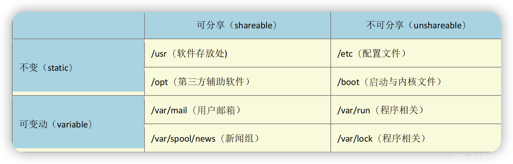

  -   / （root，根目录）：与启动系统有关；
  -   /usr （**unix software resource**）：与软件安装/执行有关；UNIX操作系统软件资源所放置的目录，而不是用户的数据。
  -   /var （variable）：与系统运作过程有关。  
      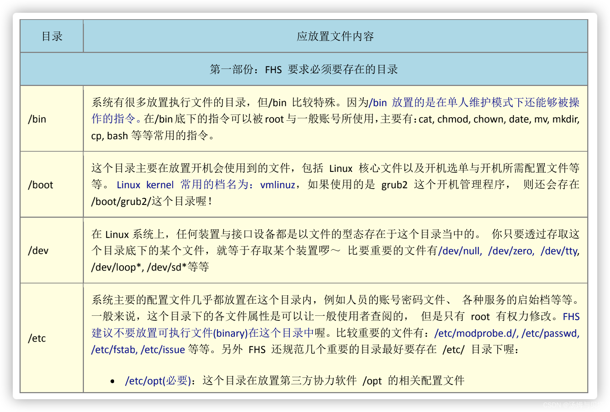  
      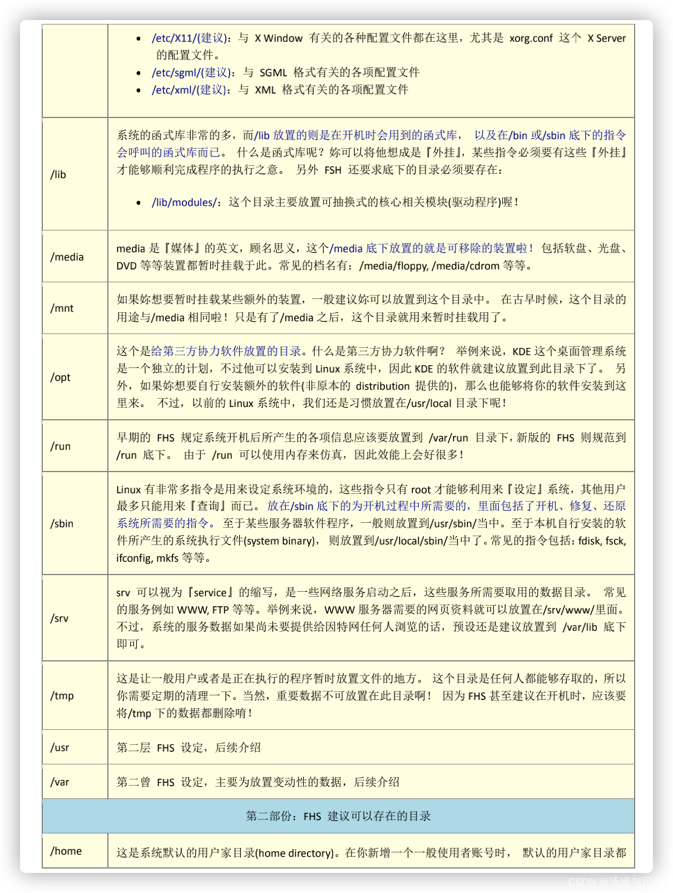  
      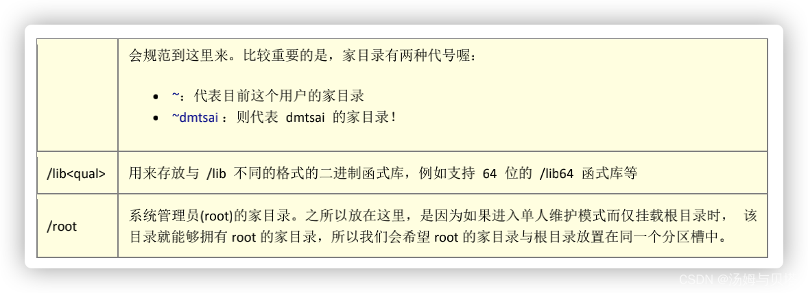  
      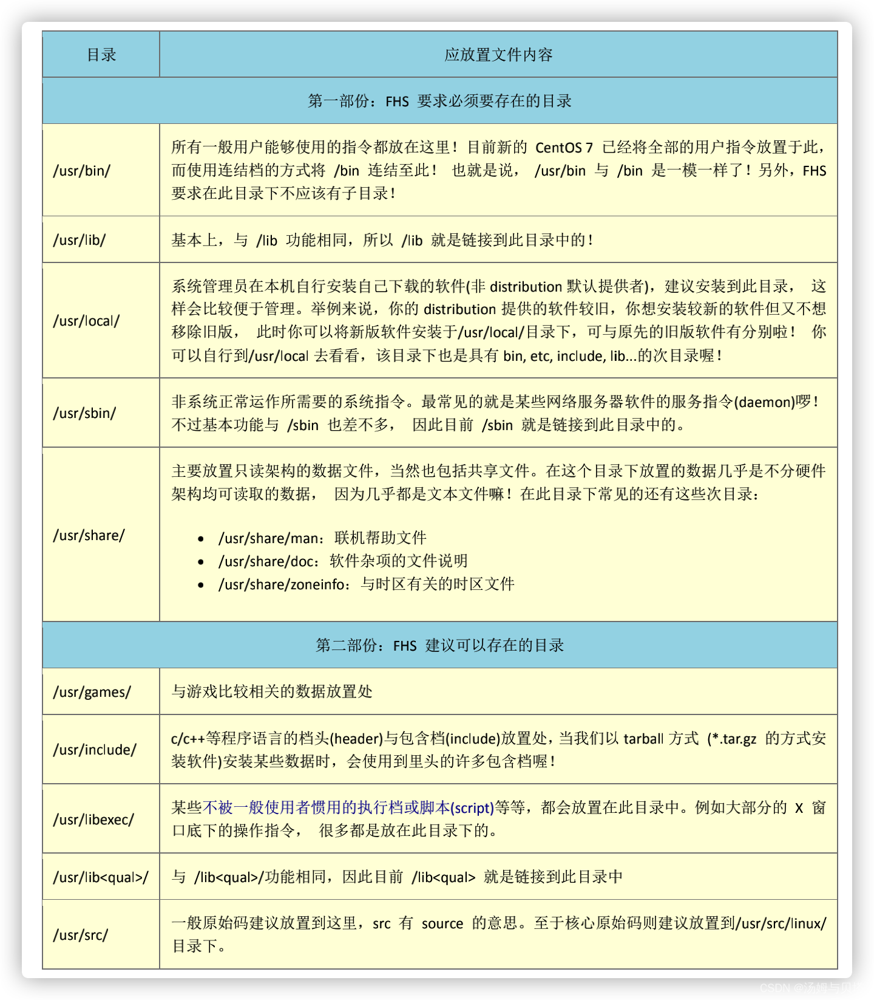  
      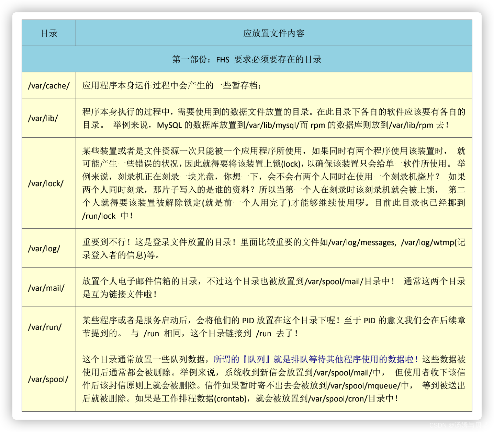

- 一个 Linux 文件能不能被执行，与他的第一栏的十个属性有关， 与文件名根本一点关系也没有。 `drwxrwxrwx`

### 第六章、Linux 文件与目录管理

- cp

      -i ：若目标文件已经存在时，在覆盖时会询问操作的进行
      -p ：连同文件的属性（权限、用户、时间）一起复制过去，而非使用默认属性（备份常用）

- 文件内容查看

  - cat 由第一行开始显示文件内容； `cat -n test.log` 显示行号

  - tac 从最后一行开始显示，可以看出 tac 是 cat 的倒着写；

  - nl 显示的时候，同时输出行号；

  - od 以二进制的方式读取文件内容；

  - more

    `空格键` ：代表向下翻一页

    `Enter` ：向下翻一行

    `/字符串` ：向下查找关键词

    `:f` ：显示文件名以及目前显示的行数

    `q` ：离开more

    `b 或 ctrl-b`：往回翻页，只对文件管用，对管道无用。

  - less

    `空格键` ：代表向下翻一页

    `[pagedown]`：向下翻动一页

    `[pageup]`：向上翻动一页

    `/字符串` ：向下查找关键词

    `?字符串` ：向上查找关键词

    `n` ：重复前一个查找（与 / 或 ? 有关）

    `N` ：反向重复前一个查找（与 / 或 ? 有关）

    `g` ：前进到这个数据的的第一行

    `G` ：前进到这个数据的最后一行

    `q`：离开 less

  - tail （head）

    `-n` ：后面接数字，代表显示几行的意思

    `-f`：表示持续刷新显示后面所接文件中的内容

- umask 就是指定目前用户在建立文件或目录时候的权限默认值。查看的方式有两种，一种是直接输入umask，可以看到数字类型的权限设置值；一种则加入 `-S` （Symbolic）这个选项，就会以符号类型的方式来显示出权限了。

      # umask
      0022  # 第一个数字是特殊权限用的
      # umask -S
      u=rwx, g=rx, o=rx
      ---
      # 假设 umask 为 003，请问该 umask 情况下，建立的文件与目录权限是什么？（注意：直接使用文件默认权限减去 umask 默认权限是不对的）
      文件：（-rw-rw-rw-）-（--------wx）= -rw-rw-r--
      目录：（drwxrwxrwx）-（d-------wx）= drwxrwxr--

  - 在默认权限的属性上，目录和文件是不一样的，x 权限对于目录是非常重要的，但一般文件通常用于数据的记录，不需要执行权限。因此：

    若用户建立为文件，则默认没有可执行 `x` 权限，即只有 `rw` ，也就是最大为 666 权限；

    若用户建立为目录，由于 `x` 与是否可以进入此目录有关，因此默认为所有权限均开放，即 777。

  - 要注意的是，umask 的数字指的是该默认值需要减掉的权限。

- 文件隐藏属性

  - chattr 配置文件隐藏属性，命令只能在 ext2、ext3、ext4的 Linux 传统文件系统上面完整生效。

        + ：增加某一个特殊参数，其他原本存在参数则不动
        - ：删除某一个特殊参数，其他原本存在参数则不动
        = ：直接设置参数，且仅有后面接的参数
        a ：当设置a之后，这个文件将只能增加数据，而不能删除也不能修改数据，只有root才能设置这属性
        i ：很厉害的参数，它可以让一个文件【不能被删除、改名、设置链接也无法写入或新增数据】。对于系统安全性有相当大的助益，只有root能设置此属性

    对于 logfile 这样的日志文件，就更需要 `+a` 这个可以增加但不能修改旧数据与删除的参数。

  - lsattr 显示文件隐藏属性

- 文件的查找，一般先使用 whereis 或 locate 来检查，如果真的找不到了，才以 find 来查找。 locate 执行之前 可先执行 updatedb 更新查找的数据库，参数 `-l 5` 可控制输出的行数。

### 第七章、Linux 磁盘与文件系统管理

- 磁盘分区表主要有两种格式，一种是限制较多的 MBR 分区表，一种是较新且限制较少的 GPT 分区表；MBR 分区表中，第一个扇区最重要，里面有：主引导记录（Master boot record，MBR）及分区表（partition table），其中 MBR 占有 446B，而分区表则占有 64B。

- 将文件系统与目录树结合的操作我们称为挂载；

- 挂载点一定是目录 ，该目录为进入该文件系统的入口。

- df：列出文件系统的整体磁盘使用量； `df -h` 以人们交易阅读的 GBytes、MBytes、KBytes 等格式自行显示；

  由于 df 主要读取的数据几乎都是针对一整个文件系统，因此读取的范围主要是在超级区块内的信息，所以这个命令显示结果的速度非常快。

- du：查看文件系统的磁盘使用量（常用在查看目录所占磁盘空间）； `du -sm` `du -h --max-depth=1 /opt`

      -a ：列出所有的文件与目录容量，因为默认仅统计目录下面的文件量；
      -h ：以人们较易读的容量格式（G/M）显示；
      -s ：仅列出总量，而不列出每个各别的目录占用容量；
      -k ：以 KBytes 列出容量显示；
      -m ：以 MBytes 列出容量显示；

- lsblk （list block device）列出系统上的所有磁盘列表。

- fdisk `fdisk -l`

- fsck 检查文件系统并尝试修复错误

- 文件系统挂载：

  - 单一文件系统不应该被重复挂载在不同的挂载点（目录）中；

  - 单一目录不应该重复挂载多个文件系统；

  - 要作为挂载点的目录，理论上应该是空目录才行，否则原目录下的东西就会暂时的消失。

    mount -a # 依照配置文件 /etc/fstab 的数据将所有未挂载的磁盘都挂载上来
    mount -l # 单纯的输入mount会显示目前的挂载信息，加上 -l 可增列 Label 名称
    mount -o # 后面可以接一些挂载时额外加上的参数，比如账号、密码、读取权限、重新挂载等
    mount -o remount,rw,auto / # 将 / 重新挂载，并加入参数为 rw 与 auto
    mount --bind /var /data/var # 将/var这个目录暂时挂载到 /data/var 目录下

    # umount [-fn] 设备文件名或挂载点

    -f ：强制卸载
    -l ：立刻卸载文件系统，比 -f 还强
    -n ：不更新 /etc/mtab 情况下卸载

### 第八章、文件与文件系统的压缩

- 常见的压缩文件扩展名

      *.Z   # compress 程序压缩的文件
      *.zip # zip 程序压缩的文件
      *.gz  # gzip 程序压缩的文件
      *.bz2 # bzip2
      *.xz  # xz
      *.tar # tar 程序打包的文件，并没有压缩过
      *.tar.gz # tar 程序打包的文件，并且经过 gzip 压缩
      *.tar.bz2 # tar 程序打包的文件，并且经过 bzip2 压缩
      *.tar.xz  # tar 程序打包的文件，并且经过 xz 压缩 

- Linux 下常见的压缩命令就是 gzip、bzip2 以及最新的 xz，至于 compress 已经不流行了。**bzip2 及 xz 这几个压缩比更好**。但这些命令通常仅能针对一个文件来压缩与解压缩。

- gzip 压缩时，在默认的状态下原本的文件会被压缩成为 .gz 后缀的文件，源文件就不再存在了。

- tar 可以将很多文件打包成为一个文件，甚至是目录也可以这么玩。单纯的 tar 功能仅是打包而已，并没有提供压缩的功能，后来将整个 tar 与压缩的功能结合在一起。

- cat/more/less 可以使用不同的方式来读取纯文本文件，zcat/zmore/zless 则可以读取纯文本文件被压缩后的压缩文件。

- tar `zcvf` `ztvf` `zxvf` `jcvf` `jtvf` `jxvf`

      -c ：建立打包文件，可搭配 -v 来查看过程中被打包的文件名；
      -t ：查看打包文件的内容含有哪些文件名，重点在查看【文件名】；
      -x ：解包或解压缩的功能；
      -z ：通过 gzip 的支持进行压缩/解压缩；此时文件名最好为 *.tar.gz；
      -j ：通过 bzip2 的支持进行压缩/解压缩；此时文件名最好为 *.tar.bz2；
      -J ：通过 xz 的支持进行压缩/解压缩；此时文件名最好为 *.tar.xz，特别留意，-z、-j、-J 不可以同时出现在一串命令行中；
      -v ：在压缩/解压缩的过程中，将正在处理的文件名显示出来；
      -f 文件名 ：后面要立刻接要被处理的文件名；
      -C 目录 ：解压缩到特定目录；
      --exclude=FILE ：在压缩的过程中，不要将 FILE 打包；

- 仅解开单一文件的方法 `tar -jxv -f 打包文件.tar.bz2 待解开文件名`

- 打包某目录，但不含该目录下的某些文件（不压缩 /root/etc\* 开头的文件和 压缩包自己） `tar -jcv -f /root/system.tar.gz2 --exclude=/root/etc* --exclude=/root/system.tar.bz2 /etc /root` 或 `tar -jcv -f /root/system.tar.gz2 --exclude /root/etc* --exclude /root/system.tar.bz2 /etc /root`，注意 要打包的文件需要写在最后。

### 第九章、vim 程序编辑器

-   基本上 vi 共分为 3 种模式，分别是一般命令模式、编辑模式与命令行模式。  
    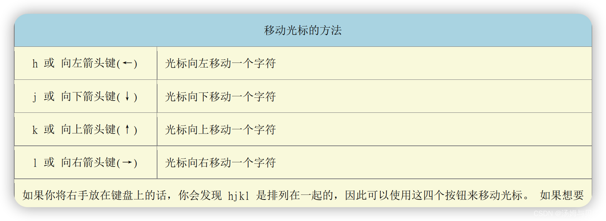  
    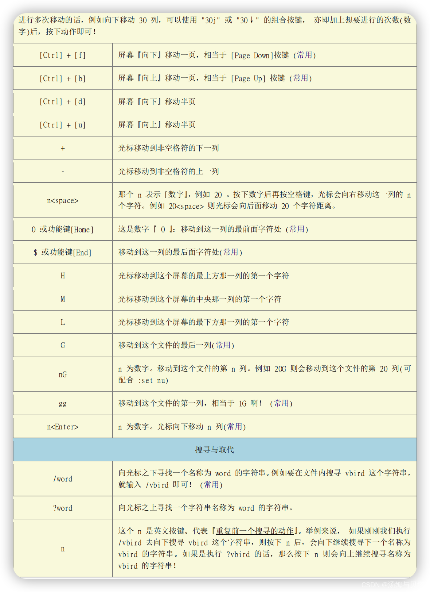  
    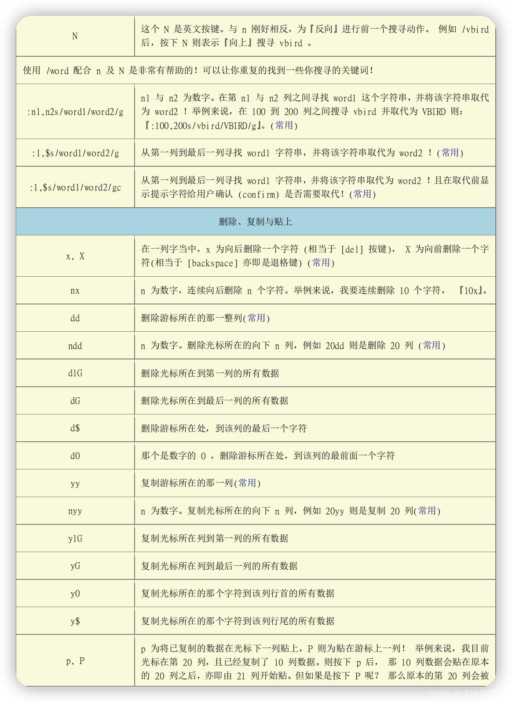  
    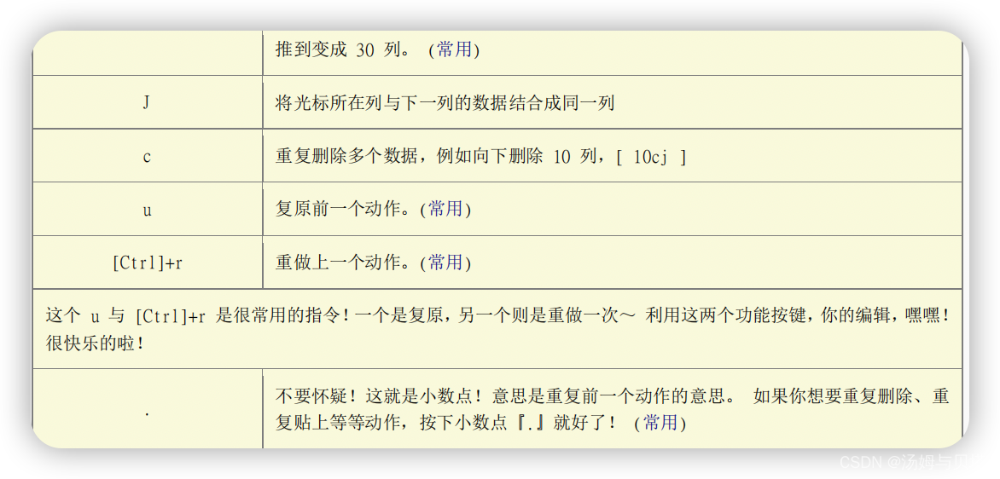  
    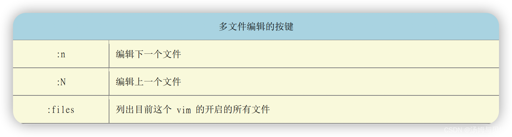  
    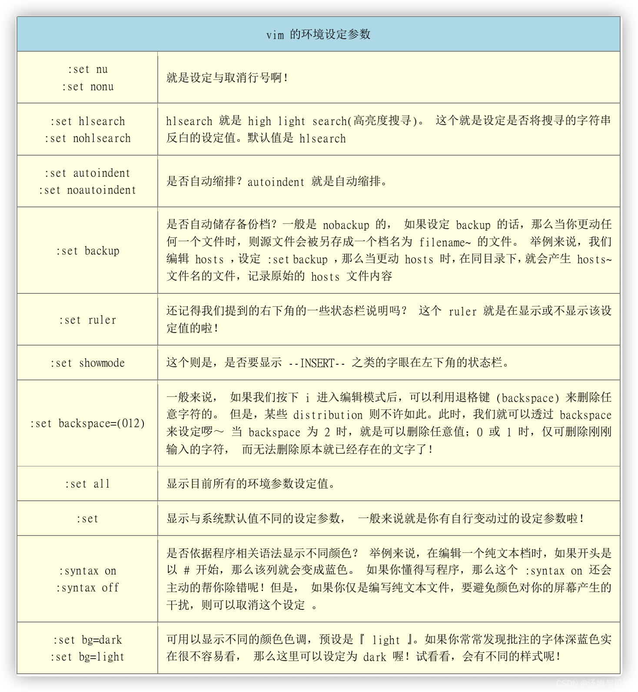

### 第十章、认识与学习 BASH

- 我们必须要透过『 Shell 』将我们输入的指令与 Kernel 沟通，好让 Kernel 可控制硬件来正确无误的工作！

- 只要能够操作应用程序的接口都能够称为壳程序。狭义的壳程序指的是指令列方面的软件，包括本章要介绍的 bash 等。 广义的壳程序则包括图形接口的软件！因为图形接口其实也能够操作各种应用程序来呼叫核心工作！

- **变量的设定规则：**

  -   变量与变量内容以一个等号『=』来连接；
  -   等号两边不能直接接空格符；
  -   变量名称只能是英文字母与数字，但是开头字符不能是数字；
  -   变量内容若有空格符可使用双引号『"』或单引号『'』将变量内容结合起来，但
      -   双引号内的特殊字符如 $ 等，可以保有原本的特性；
      -   单引号内的特殊字符则仅为一般字符 （纯文本）；
  -   可用转义符 `\` 将特殊符号（如 Enter、$、\\、空格、‘等）变成一般字符；
  -   在一串命令的执行中，还需要借由其他额外的命令所提供的信息时，可以使用反单引号 【\`】或 `$ (命令)` 。 `version=$(uname -r)` ；
  -   若该变量需要在其他子程序执行，则需要以 export 来使变量变成环境变量；
  -   通常大写字符为系统默认变量，自行设置变量可以使用小写字符；
  -   取消变量的方法为使用 unset；

- 在命令执行过程中，反单引号之内的命令将会被先执行，而其执行出来的结果将做为外部的输入信号。 【ls -ld `locate crontab` 】 `ls -ld $(locate crontab)`

- `history` 历史命令 `!number`

- 通配符  
  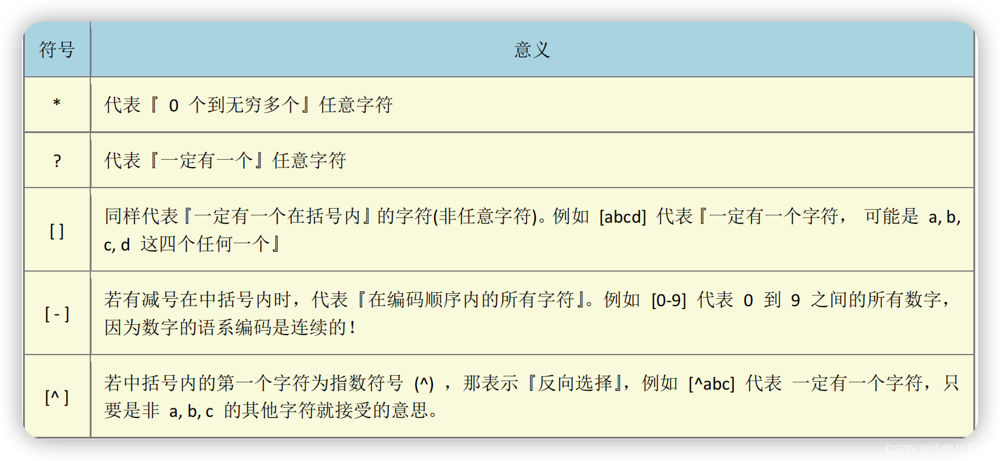

- `/dev/null` 垃圾桶黑洞装置与特殊写法。

- 标准输入（stdin）：代码为 0 ，使用 < 或 << ；  
  标准输出（stdout）：代码为 1 ，使用 > 或 >> ；  
  标准错误输出（stderr）：代码为 2 ，使用 2> 或 2>> ；

- 命令执行的判断根据 `;、&&、||`

  -   一次执行多个命令 `cmd;cmd;cmd` `sync; sync; shutdown -h now`
  -   两个命令之间有依赖性，前一个命令的执行结果关系到后一个命令的是否执行；  
      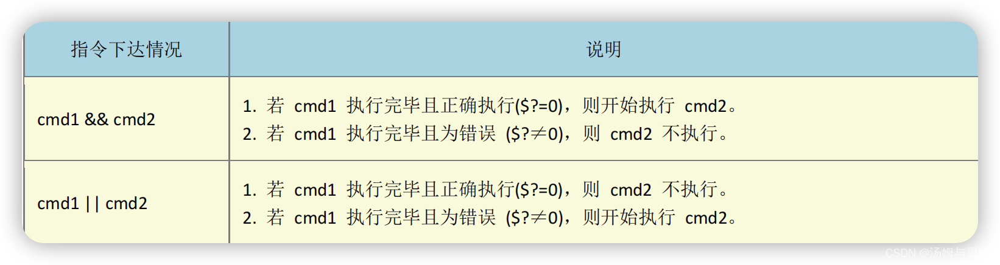

- 管道命令 pipe `|`

  -   管道命令只会处理标准输出，对于标准错误会予以忽略；
  -   管道命令必须要能够接收来自前一个命令的数据成为标准输入继续处理才行。

- 选取命令 `cut` `grep`

  - `cut` 可以将一段信息的某一段给它切出来，处理的信息是以行为单位。

        cut -d '分隔字符' -f fields
        -d：后接分隔字符，与-f一起使用
        -f：根据-d的分隔字符将一段信息划分成为数段，用-f取出第几段的意思
        
        ll | cut -d ' ' -f 1,3 # 1、3段
        ll | cut -d ' ' -f 1-3 # 1到3段

  - grep 分析一行的信息，若有匹配到需要的信息，就将该行拿出来

        -c # 打印匹配的文本行的行数
        **-v # 不包括，反向查找
        -i # 忽略字母大小写**
        -n # 列出所有匹配的文本行，并显示行号
        **-w # 匹配整个单词**
        **-E # 表示过滤 多个参数
        -a # 可将二进制视为文本文件搜寻，相当于--binary-files=text这个参数。**
        
        **# grep -A  -B -C(大写)    后面都跟阿拉伯数字 
        -A # 是显示匹配后和它后面的n行。after 
        -B # 是显示匹配行和它前面的n行。 before
        -C # 是匹配行和它前后各n行。 context**
        
        cat test.txt | grep -A1 ‘hello’ # 输出 hello 匹配行，以及之后一行 after 1
        cat test.txt | grep -B1 ‘hello’ # 输出 hello 匹配行，以及之前一行 before 1
        cat test.txt | grep -1 ‘hello’ # 输出hello 匹配行，以及之前、之后各一行内容

- 排序命令 `sort` `wc` `uniq`

  - sort

        -f ：忽略大小写的差异，例如 A 与 a 视为编码相同；
        -b ：忽略最前面的空格符部分；
        -M ：以月份的名字来排序，例如 JAN, DEC 等等的排序方法；
        -n ：使用『纯数字』进行排序(默认是以文字型态来排序的)； -r ：反向排序；
        -u ：就是 uniq ，相同的数据中，仅出现一行代表；
        -t ：分隔符，预设是用 [tab] 键来分隔；
        -k ：以那个区间 (field) 来进行排序的意思
        
        last | cut -d ' ' -f1 | sort
        cat /etc/passwd | sort -t ':' -k 3

  - uniq 当我们排序完成后，想要将重复的数据仅列出一个显示

        -i：忽略大小写字符的不同
        -c：进行计数
        
        last | cut -d ' ' -f1 | sort | uniq

    **注意：uniq 统计的相邻行的信息，所以统计前需要先 sort。**

  - wc 统计字数、行数等

        -l：仅列出行数
        -w：仅列出列数
        -m：字符数
      
        ll | wc -l

- 双向重定向 `tee` 同时将数据流分送到文件与屏幕。

- 字符转换命令 `tr` `col` `join` `paste` `expand`

  - tr 用来删除一段信息中的文字，或是进行文字信息的替换

        cat /etc/passwd | tr -d ':' # 删除冒号

  - col 可将 tab转成对等的空格键。 `cat -A test.txt | col -x`

  - expand 将\[tab\] 按键转成空格键。 `-t 4/8`

- 划分命令 `split` ，将大文件依据文件大小或行数划分成小文件。

      -b：后接欲划分成的文件大小，可加单位，例如b, k m等
      -l：以行数划分
      
      split -b 300k /etc/services services # 300k一个文件，文件名services开头

- 参数代换 `xargs` 字面上的意义来看， x 是加减乘除的乘号，args 则是 arguments （参数）的意思，产生某个指令的参数的意思！ xargs 可以读入 stdin 的数据，并  
  且以空格符或断行字符作为分辨，将 stdin 的资料分隔成为 arguments 。 因为是以空格符作为分隔，所以，如果有一些文档名或者其他意义的名词内含有空格符的时候， xargs 可能就会误判。 `find /usr/sbin -perm 700 | xargs ls -l`

- `-` 用途。在管线命令当中，常常会使用到前一个指令的 stdout 作为这次的 stdin ， 某些指令需要用到文件名 （例如 tar） 来进行处理时，该 stdin 与 stdout 可以利用减号 "-” 来替代。

  `tar -cvf - /home | tar -xvf - -C /tmp/homeback` 将 /home 里面的文件给他打包，但打包的数据不是纪录到文件，而是传送到 stdout； 经过管线后，将 tar -cvf - /home 传送给后面的 tar -xvf - 。后面的这个 - 则是取用前一个指令的 stdout， 因此，我们就不需要使用 filename 了。

### 第十一章、正则表达式与文件格式化处理

- 简单的说，正规表示法就是处理字符串的方法，他是以行为单位来进行字符串的处理行为， 正规表示法透过一些特殊符号的辅助，可以让使用者轻易的达到『搜寻/删除/取代』某特定字符串的处理程序！ `grep 'screen' catkin_ws/src/* -r`

- 正则表达式的字符串表示方式依照不同的严谨度而分为：基础正则表达式与扩展正则表达式。

      # 例题一、搜寻特定字符串
      grep -n 'the' regular_express.txt  # 搜索特定字符串
      grep -in 'the' regular_express.txt  # 忽略大小写搜索特定字符串
      # 例题二、利用中括号 [] 来搜寻集合字符
      grep -n 't[ae]st' regular_express.txt  # 搜寻 test 或 tast 这两个单字时
      # 例题三、行首与行尾字符 ^ $
      grep -n '^the' regular_express.txt # 查询the在行首
      # 例题四、任意一个字符 . 与重复字符 *
      **. (小数点)：代表『一定有一个任意字符』的意思；
      * (星星号)：代表『重复前一个字符， 0 到无穷多次』的意思，为组合形态
      .* ： 代表零个或多个任意字符**
      # 例题五、限定连续 RE 字符范围 {}
      使用到限定范围的字符 {}，找出两个到五个 o 的连续字符串，因为 { 与 } 的符号在 shell 是有	特殊意义的，因此， 我们必须要使用跳脱字符 \ 来让他失去特殊意义才行。
      grep -n 'o\{2\}' regular_express.txt

- `^` 符号在字符集合符号（括号 `[]` ）之内与之外是不同的。在 `[]` 内代表反向选择，则 `[]` 之外则代表定位在行首的意义。

- 查找空白行 `^$`

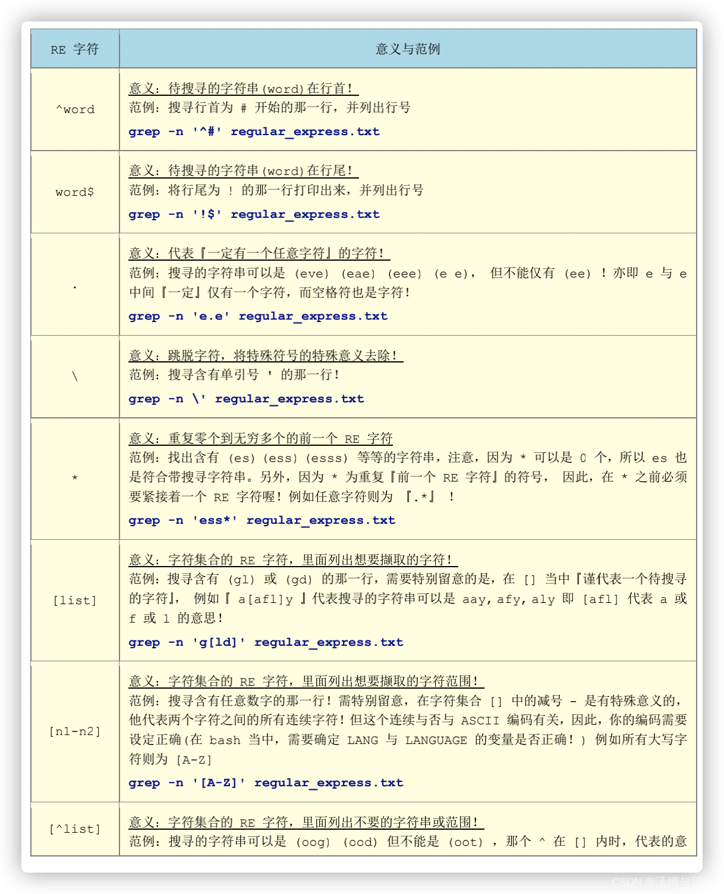

- 注意： 正则表达式的特殊字符与一般在命令行输入命令的通配符并不相同，例如，在通配符当中的 \* 代表的是【0 ~ 无穷多个字符】的意思，但是在正则表达式当中， \* 则是【重复 0 到无穷多个的前一个字符】的意思。

- sed 工具。sed 本身也是一个管道命令，可以将数据进行取代、删除、新增、撷取特定行等等的功能。

      选项与参数： 
      -n ：使用安静(silent)模式。在一般 sed 的用法中，所有来自 STDIN 的数据一般都会被列出到屏幕上。
      但如果加上 -n 参数后，则只有经过 sed 特殊处理的那一行(或者动作)才会被列出来。 
      -e ：直接在指令列模式上进行 sed 的动作编辑；
      -f ：直接将 sed 的动作写在一个文件内， -f filename 则可以执行 filename 内的 sed 动作；
      -r ：sed 的动作支持的是延伸型正规表示法的语法。(预设是基础正规表示法语法) 
      -i ：直接修改读取的文件内容，而不是由屏幕输出。
      
      function 有底下这些咚咚：
      a ：新增， a 的后面可以接字符串，而这些字符串会在新的一行出现(目前的下一行)
      c ：取代， c 的后面可以接字符串，这些字符串可以取代 n1,n2 之间的行！
      d ：删除，因为是删除啊，所以 d 后面通常不接任何咚咚；
      i ：插入， i 的后面可以接字符串，而这些字符串会在新的一行出现(目前的上一行)；
      p ：打印，亦即将某个选择的数据印出。**通常 p 会与参数 sed -n 一起运作**
      s ：取代，可以直接进行取代的工作哩！通常这个 s 的动作可以搭配正规表示法！

  - 以行为单位的新增/删除功能

        范例一：将 /etc/passwd 的内容列出并且打印行号，同时，请将第 2~5 行删除！
        [dmtsai@study ~]$ nl /etc/passwd | sed '2,5d'
        范例二：承上题，在第二行后(亦即是加在第三行)加上『drink tea?』字样！
        [dmtsai@study ~]$ nl /etc/passwd | sed '2a drink tea'
        范例三：在第二行后面加入两行字，例如『Drink tea or .....』与『drink beer?』
        [dmtsai@study ~]$ nl /etc/passwd | sed '2a Drink tea or ......\
        > drink beer ?'
        范例四：我想将第 2-5 行的内容取代成为『No 2-5 number』呢？
        [dmtsai@study ~]$ nl /etc/passwd | sed '2,5c No 2-5 number'
        范例五：仅列出 /etc/passwd 文件内的第 5-7 行
        [dmtsai@study ~]$ nl /etc/passwd | sed -n '5,7p'   # -n 代表的是『安静模式』

        步骤三：将 IP 前面的部分予以删除
        [dmtsai@study ~]$ /sbin/ifconfig eth0 | grep 'inet ' | sed 's/^.*inet //g'
        步骤四：将 IP 后面的部分予以删除
        [dmtsai@study ~]$ /sbin/ifconfig eth0 | grep 'inet ' | sed 's/^.*inet //g' \

        > | sed 's/ *netmask.*$//g'

  - sed 直接修改文件的内容 `sed -i` 直接修改原文件，不加 `-i` 屏幕打印， 不修改原文件

        sed -i '$a hello world' h.cpp # 文件末尾添加 hello world
        sed -i '$d' h.cpp # 删除文件末尾一行
        sed -i 's/$/;/g' h.cpp # 每行末尾添加分号；
        sed -i 's/;$//g' h.cpp # 替换文件末尾的分号为空，即删除分号

- 扩展正则表达式 egrep  
  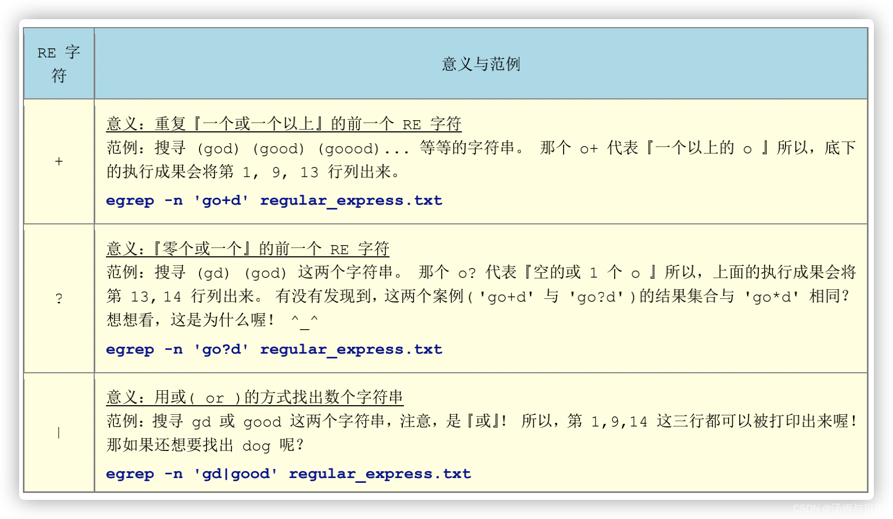  
  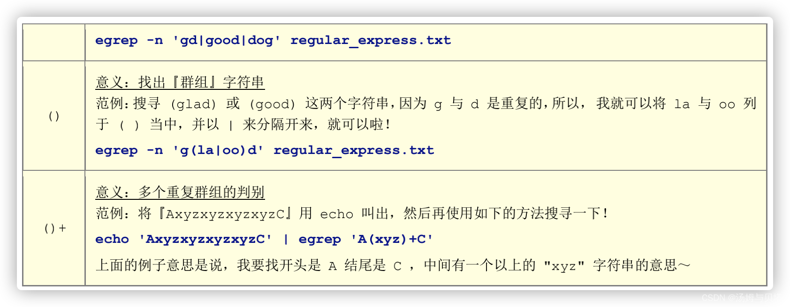

- awk：好用的数据处理工具。相较于 sed 常常作用于一整个行的处理， awk 则比较倾向于一行当中分成数个『字段』来处理。因此，awk 相当的适合处理小型的数据数据处理。

  - awk 主要是处理『每一行的字段内的数据』，而默认的『字段的分隔符为 “空格键” 或 “\[tab\]键” 』

        awk '条件类型 1{动作 1} 条件类型 2{动作 2} ...' filename
        
        # 在 awk 的括号内，每一行的每个字段都是有变量名称的，那就是 $1, $2... 等变量名称。
        last -n 5 | awk '{print $1 "\t" $7}' # 打印第一列 第七列

  - awk 后面接两个单引号并加上大括号 {} 来设定想要对数据进行的处理动作。

  - 整个 awk 的处理流程是：

    -   1.  读入第一行，并将第一行的资料填入 $0, $1, $2… 等变量当中；
    -   2.  依据 “条件类型” 的限制，判断是否需要进行后面的 “动作”；
    -   3.  做完所有的动作与条件类型；
    -   4.  若还有后续的『行』的数据，则重复上面 1~3 的步骤，直到所有的数据都读完为止。

  - awk 是『以行为一次处理的单位』， 而『以字段为最小的处理单位』  
    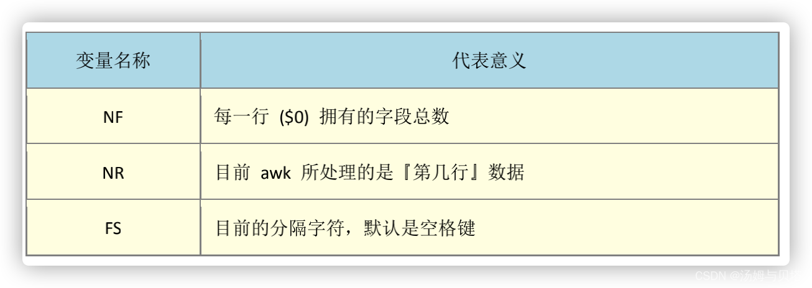

        # 以冒号为分隔符 FS，打印passwd文件中第三栏小于10 $3<10的数据，
        # 必须添加 BEGIN，否则文件处理从第二行开始。
        cat /etc/passwd | awk 'BEGIN {FS=":"} $3 < 10 {print $1 "\t " $3}'
        # 打印第一行 第一栏和第三栏
        cat t | awk 'NR==1 {print $1 "\t" $3}' 

    
    
    **值得注意的是那个『 == 』的符号。**

- diff 就是用在比对两个文件之间的差异的，并且是以行为单位来比对的。cmp 主要利用字节单位去比对。

### 第十二章、学习 Shell 脚本

- shell script 是利用 shell 的功能所写的一个『程序 (program)』，这个程序是使用纯文本文件，将一些 shell 的语法与指令(含外部指令)写在里面， 搭配正规表示法、管线命令与数据流重导向等功能，以达到我们所想要的处理目的。简单的说， shell script 就像是早期 DOS 年代的批处理文件 (.bat) ，最简单的功能就是将许多指令汇整写在一起， 让使用者很轻易的就能够 **one touch** 的方法去处理复杂的动作 (执行一个文件 “shell script” ，就能够一次执行多个指令)。

- 脚本执行方式差异（source、sh script、./script）

  -   利用直接执行的方式来执行脚本，该脚本会使用一个新的 bash 环境来执行脚本内的命令，也就是脚本是在子进程的 bash 内执行的。**当子进程完成后，在子进程内的各项变量或操作将会结束而不会传回父进程中。**
  -   利用 source 来执行脚本：**在父进程中执行**。

- 利用 test 命令测试功能  
  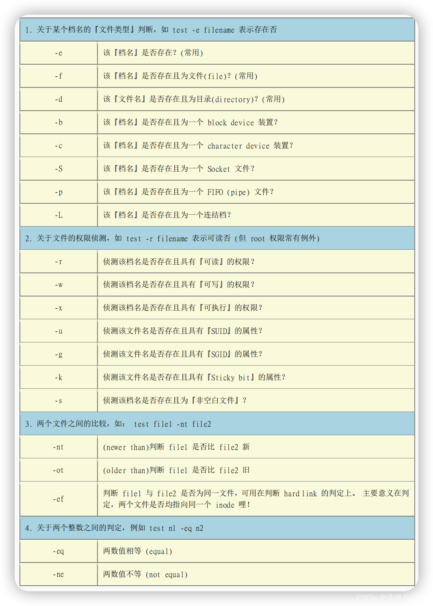  
  

- 利用判断符号 \[ \]

  -   在 bash 的语法当中使用中括号作为 shell 的判断式时，必须要注意中括号的两端需要有空格符来分隔。
  -   在中括号 \[\] 内的每个组件都需要有空格键来分隔；
  -   在中括号内的变量，最好都以双引号括号起来；
  -   在中括号内的常量，最好都以单或双引号括号起来。 `[ "${name}" == "VBird" ]`

- shell 脚本的默认变量（$0、$1…）

      ./test.sh opt1 opt2 opt3 opt4
      $0：表示执行的脚本文件 `test.sh`
      $1：脚本接的第一个参数 `opt1`
      $2：第二个参数 `opt2`
      
      **$#：代表后接的参数『个数』，以上表为例这里显示为『4』
      $@：代表『 "$1" "$2" "$3" "$4" 』之意，每个变量是独立的（用双引号括起来）**
      $*：代表『 "$1c$2c$3c$4" 』，其中 c 为分隔字符，默认为空格键， 所以本例中代表『 "$1 $2 $3 $4" 』之意。

- 条件判断 `if ... then`

      if [ 条件判断式 ]; then
          条件成立 --> 执行内容
      fi # 结束 if
      
      # && 代表 AND
      # || 代表 or
      
      if [ "${yn}" == "Y" ] || [ "${yn}" == "y" ]; then
          echo "Ok, continue"
          exit 0
      elif [ "${yn}" == "N" ] || [ "${yn}" == "n" ]; then
          echo "Oh, interrupt!"
      else
          echo "I don't know what your choice is"
      fi

- 函数 function

      function fname () {
          程序段
      }

- 循环

  - `while do done` 不定循环

        while [ condition ]
        do
            程序段落
        done

  - `for… do…done` 固定循环

        for var in con1 con2 con3...
        do
            程序段
        done
        
        # C/C++ 风格
        for (( 初始值; 限制值; 赋值运算 ))
        do
            程序段
        done

- shell 脚本的跟踪与 调试

      sh [-nvx] scripts.sh
      -n：不要执行脚本，仅查询语法问题
      -v：在执行脚本前，先将脚本文件的内容输出到屏幕上
      -x：将使用到的脚本内容显示到屏幕上

- shell 脚本用在系统管理上是很好的工具，但是用在处理大量数值运算上，就不友好了。因为 shell 脚本的速度较慢，且使用的 CPU 资源较多，会造成主机资源的分配不良。

### 第十三章、Linux 账号管理与 ACL 权限设置

- 每个登录的用户至少都会获取两个 ID ，一个是 用户 ID（UID），一个是用户组 ID （GID）；

- 用户/用户组信息查询 `id username`

- `/etc/passwd` 文件结构。每一行都代表一个账号，有几行就代表有几个账号在你的系统中。不过需要特别留意的是，里面很多账号本来就是系统正常运行所必须的，我们可以简称它为系统账号。每一行使用 `:` 分隔开，共有七个东西分别是： `robot:x:1000:1000::/home/robot:/bin/bash` `账号、密码、UID、GID、全名、家目录、shell`

  -   账号名称
  -   密码，实际密码数据放在 `/etc/shadow` 中，这里只能看到一个 `x`。
  -   UID。 0 代表这个账号是系统管理员； 1-999 代表是系统账号； 1000-60000 给一般用户；
  -   GID
  -   用户信息说明栏，没什么用途。
  -   家目录
  -   shell

- `/etc/shadow` 文件结构，shadow 同样以 `:` 作为分隔符，共有九个字段： `robot:$6$batX7luE$NTDTst4Y3M/EgpvVhIBDZFOC29epKHEdT3.NCvYhn1NRoUdu90UMqD9vD4zoSWN2usRh21vM6EXkr5VuyXU/u.:19422:0:99999:7:::`

  -   账号名称
  -   密码。这个字段内的数据才是真正的密码，而且是经过编码的密码。文件默认权限是 `-rw-------` 或 `----------` ，即只有 root 才可以读写。
  -   最近修改密码的日期。
  -   密码不可被修改的天数
  -   密码需要重新修改的天数。你必须要在这个天数内重新设置你的密码，否则这个账号的密码将会变为过期特性。如果像上面的 99999（计算为273年），那就表示密码的修改没有强制性之意。
  -   密码需要修改期限前的警告天数。
  -   密码过期后的账号宽限时间
  -   账号失效日期
  -   保留

- 添加用户 `useradd lyz`

      -u # 后面接的是 UID，是一组数字，直接指定一个特定的 UID 给这个账号
      -g # 后面接的是上面提到的初始用户组，该用户组的 GID 会被放到 /etc/passwd 的第四格栏位内
      -M # 强制，不要奖励使用者家目录。（系统账号默认值）
      -m # 强制，要建立使用者家目录（一般账号默认值）
      -d # 指定某个目录成为家目录，而不要使用默认值，务必使用绝对路经

- 设置密码 `passwd lyz`

- 添加用户 vbird2 所属于 users 组，uid 是1500 `useradd -u 1500 -g users vbird2`

- 删除用户 `userdel`。一般而言，如果该账号只是暂时不启用的话，那么将 /etc/shadow 里面的账号失效日期（第八字段）设置为 0 就可以让该账号无法使用，但是所有跟该账号相关的数据都会留下来。使用 userdel 的时机通常是 你真的确定不要让该用户在主机上面使用任何数据了。

- 连同家目录也一同删除 `userdel [-r] username`。

- `usermod` 修改用户数据

      -d # 后面接账号的家目录，即修改 /etc/passwd 第六栏 usermod -d /home/new_name old_name
      -g # 后面接初始用户组，修改 /etc/passwd 第四个栏位，即 GID 栏位 usermod -g 1000 user
      -l # 接账号名称，即修改账号名称 usermod -l old_name new_name
      -u # 接 UID 数字 usermod -u 1002 user
      
      usermod -g mojiao zwj

- `chsh` change shell 的简写。 `-s` 设置修改自己的 shell。 `chsh -s /bin/zsh`； `cat /etc/shells` 查看系统可用的 shell。

- 一般用户切换 root 的两种方式：

  -   通过 `su -` 直接将身份变成 root 即可，但是这个命令却需要 **root的密码**；
  -   通过 sudo 命令 执行 root 的命令，由于 sudo 需要事先设置妥当，且 sudo 需要输入用户自己的密码，因此多人共管同一台主机时，**sudo 要比 su 来的好，至少root密码不会流出。**

- `su` 身份切换命令。

  -   若要完整的切换到新用户的环境，必须使用 `su - username` 或 `su -l username` 才会连同 PATH、USER、MAIL 等变量都转成新用户的环境。
  -   如果仅想要执行一次 root 的命令，可以利用 `su - -c 命令`的方式来处理。
  -   使用 root 切换成为任何用户时，并不需要输入新用户的密码。

- `sudo`

  -   **当用户执行 sudo 时，系统于 `/etc/sudoers` 文件中查找该用户是否有执行 sudo 的权限；**
  -   若用户具有可执行 sudo 的权限后，便让用户 输入用户自己的密码 来确认；
  -   若密码输入成功，便开始进行 sudo 后续接的命令（但 root 执行 sudo 时，不需要输入密码）；
  -   若欲切换的身份与执行者身份相同，那也不需要输入密码。

- 查询用户 `w who last lastlog`

### 第十五章、计划任务（crontab）

- 计划任务的两种方式： `at cron`

  -   例行性的，就是每隔一定的周期要来办的事项。 `crontab` 这个命令所设置的任务将会循环地一直执行下去，可循环的时间为分钟、小时、每周、每月或每年等。crontab 除了可以使用命令执行外，亦可编辑 /etc/crontab 来支持，让 crontab 生效的服务为 crond。
  -   突发性的，就是这次做完以后就没有的那一种。 `at` 是个可以处理仅执行一次就结束的命令，不过要执行 at 时，必须要有 atd 这个服务的支持才行。有些新版的 Linux 发行版中，atd 可能默认没有启动。 `systemctl start atd`

- logrotate

- 因为安全的问题，并不是所有人都可以执行 at 计划任务的。我们可以利用 /etc/at.allow 与 /etc/at.deny 这两个文件来实现对 at 的使用限制：

  -   先找寻 /etc/at.allow 这个文件，写在这个文件中的用户才能使用 at，没有在这个文件中的用户则不能使用 at （即使没有写在 at.deny 当中）；
  -   如果 /etc/at.allow 不存在，就查找 /etc/at.deny 这个文件，写在这个 at.deny 中的用户则不能使用 at；
  -   如果两个文件都不存在，那么只有 root 可以使用 at 这个命令。

- `at`。执行at命令最重要的地方在于指定时间，可以使用 `now +` 的方式实现再过多长时间执行指令。 `at now + 5 minutes`。事实上，当我们使用 at 时会进入到一个 at shell 的环境来让用户执行任务命令。此时最好使用绝对路径来执行命令。

      -l # at -l 相当于 atq，列出目前系统所有该使用者的at计划
      -d # at -d 相当于 atrm，可以取消一个在at计划中的任务

  ​    

- `crontab` `/etc/cron.hourly` `/etc/cron.daily` `/etc/cron.monthly` `/etc/cron.weekly` `/etc/crontab`

      -e # 编辑crontab的任务内容
      -l # 查看crontab的任务内容
      -r # 删除所有的crontab的任务内容，若仅要删除一项，请用 -e 编辑

  - 格式 `* * * * * 执行的任务` `分、时、日、月、周、命令`六栏， `/etc/crontab` 七栏，多了执行者。

    `10 * * * * /root/sh/apache_check.sh` 每小时的第 10 分钟执行一次  
      
    `*/10 * * * * /root/sh/apache_check.sh` 每隔 10 分钟执行一次  
      
    

- `anacron` 是一个程序，并非服务。可以帮我们执行时间到了但却没有执行的计划任务，比如关机期间系统未执行的 crontab 任务。 `/etc/anacrontab`

  -   anacron 并不是用来替换 crontab 的，anacron 存在的目的就在于处理非 24 小时运行的 Linux 系统所执行的 crontab，以及因为某些原因导致的超过时间而没有被执行的任务。其实 anacron 也是每小时被 crond 执行一次，然后监测相关计划任务有无被执行。

### 第十六章、进程管理与 SELinux 初探

- 进程（process）：程序被触发后，执行者的权限与属性、程序的代码与所需数据等都会被加载到内存中，操作系统并给予这个内存中的单元一个标识符（PID），可以说，进程就是一个正在运行中的程序。

- 由于假设我们只有一个终端，因此可以出现提示字符让你操作的环境就称为前台（foreground），至于其他任务就可以放入后台（background）去暂停或运行。

- 与任务管理有关的按键和关键词： `&` 、 `ctrl+z`、 `jobs`、 `fg`、 `bg`、 `kill %n` 等；

  -   直接将命令丢到后台中【执行】的 `&`。这样最大的好处是：不怕被 `ctrl+c` 中断。
  -   将【目前】的任务丢到后台中【暂停】： `ctrl+z`
  -   查看目前的后台任务状态： `jobs`。 `jobs -l` 其中 + 代表最近被放到后台的任务号码，- 代表最近第二个被放置到后台的任务号码，而第三个以后的任务，就不会有 +、- 符号存在了。
  -   将后台任务拿到前台来处理： `fg` 。`fg %jobnumber` 或 `fg jobnumber` 将某个 job 拿到前台。
  -   让任务在后台的状态变成运行中： `bg`。
  -   管理后台当中的任务： `kill` 。 `kill -9 %jobnumber` 或 `kill -9 PID` 立刻强制删除一个任务。

- 在任务管理中提到的【后台】指的是在终端模式下可以避免 `ctrl+c` 终端的一个情境，可以说这个是 bash 的后台，并不是系统的后台。这种情况下，如果以远程连接方式连接到你的 Linux 主机，并且将任务以 `&` 的方式放到后台中，在任务尚未结束的情况下，关闭了终端，程序不会继续执行。基于此问题，可以使用 `nohup` 命令来处理，此命令可以在脱机或者注销系统后，还能够让任务继续执行。 `nohup [命令与参数]` 在终端前台中任务。 `nohup [命令与参数] &` 在终端后台中任务。 `nohup ./sleep500.sh &`

- 查看进程

  - `ps` 显示系统进程在瞬间的运行状态。常用 `ps aux` 和 `ps -ef`。ef 方式不如 aux 显示的多。（aux 是 BSD 操作系统格式，a — 前台进程 x — 后台进程 u — 用户； ef 是 Linux 操作系统格式，e — 显示所有进程 f — 全格式显示）

        # ps aux # 查看系统中所有进程
        	1、USER 该进程属于的用户
        	2、PID 该进程的进程号 
        	3、CPU 该进程使用掉的CPU资源百分比 
        	4、MEM 该进程所占用的物理内存百分比 
        	5、VSZ 该进程使用掉的虚拟内存量（单位为Kbytes）
        	6、RSS 该进程占用的固定的内存量（单位为Kbytes）
        	7、TTY: 进程是在哪个终端机上面运作的，若与终端机无关，则显示“?”，另外，tty1-tty6是本机上面的登入者进程，若为pts/0等，则表示为由网络连接进主机的进程 
        	**8、STAT 进程当前的状态
        	   ("S":中断 sleeping，进程处在睡眠状态，表明这些进程在等待某些事件发生--可能是用户输入或者系统资源的可用性;
        	    "D":不可中断 uninterruptible sleep; "R":运行 runnable; "T":停止 traced or stopped; "Z":僵死 a defunct zombie process)** 
        	9、START 该进程被触发启动的时间
        	10、TIME 该进程实际使用CPU运作的时间 
        	11、COMMAND 该进程的实际命令
        
        # ps -ef
        	1、UID 用户号 
        	2、PID 进程ID 
        	3、PPID 父进程号 
        	4、C CPU占用率 
        	5、TTY 终端的次要装置号码 (minor device number of tty) 
        	6、TIME 进程执行起到现在总的CPU暂用时间 
        	7、COMMAND 启动这个进程的命令

    

  - `top` 动态查看进程变化

        **-d：秒数，指定top命令每隔几秒更新**
        -b：使用批处理模式输出。一般和"-n"选项合用 `top -b -n 2` 将top信息执行2次
        -n次数：指定top命令执行的次数，一般和"-b"选项合用
        **-i：使top不显示任何闲置或者僵死的进程。**
        -p：通过指定监控进程ID来仅仅监控某个进程的状态

    **在 top 命令执行过程当中可以使用的按键命令：**
    
        ?或h：显示在top当中可以输入的按键命令，即帮助
        **P：以CPU使用率进行排序
        M：以内存使用率进行排序**
        N：以PID排序
        T：由该进程使用的 CPU 时间累积（TIME+）排序
        q：退出top

  - `pstree` 查看进程树 `ps -Aup`

        -A  各进程树之间的连接以 ASCII 字符来连接
        -U  各进程树之间的连接以 Unicode 的字符来连接，在某些终端界面下又可能会有错误。
        -p  显示进程的PID
        -u  显示进程的所属用户

- `free` 查看内存使用情况 `free -m` 以 MB 为单位显示内存使用情况

- `uname` 查看系统与内核相关信息

      **-a # 显示操作系统全部信息**
      -m # 显示系统硬件架构 CPU类型，是32位还是64位系统
      -n # 显示操作系统主机名
      -s # 显示操作系统类型
      **-r # 显示操作系统内核版本**

- `uptime` 查看系统启动时间与任务负载

- `netstat` 追踪网络或 socket 文件

      -a # 列出所有网络状态，包括监听端口、已建立连接和等待关闭的连接。 all
      -c 秒数 # 指定每隔几秒刷新一次网络状态 continuous
      -n # 使用IP地址和端口显示，不使用域名与服务名 numeric
      -p # 显示PID和程序名 programs
      -t # 显示使用tcp协议端口连接的状态 tcp 
      -u # 显示使用udp协议端口连接的状态 udp
      -l # 仅显示监听状态的连接  listening
      -r # 显示路由表 route
      -s # 显示网络接口的统计信息 statistice
      
      -an # 按照一定顺序排列输出
      
      netstat -anp  |  more # 查看本机所有的网络连接
      netstat -tunlp # 查看端口占用
      netstat -rn # 查看本机路由表
      
      tunl 和 an 选项的最大区别：tunl 只能查看监听 LISTEN，而 an 可以查看监听和正在连接 ESTABLISHED 的状态.

- `dmesg` 分析内核产生的信息 （查询 usb 或者串口号 `dmesg | grep ttyUSB`） `dmesg ｜ grep -i vda`

- 所谓的进程都是在内存中，而内存中的数据又都是写入到 `/proc/*` 这个目录下的，可以直接查看 `/proc` 中的文件 `cat /proc/uptime` `cat /proc/version` `cat /proc/meminfo` `cat /proc/cpuinfo` 查看 cpu 的相关信息，包括频率、类型等；

- lsof 查看进程打开的文件。lsof 全名为 list open files，也就是列举系统中已经被打开的文件。  
  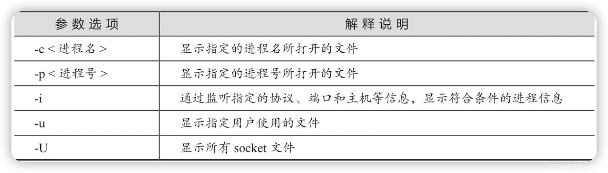

      lsof /var/log/messages # 显示使用文件的进程
      lsof -c rsyslog # 显示指定进程所打开的文件
      lsof -p 1277 # 显示指定进程号所打开的文件
      lsof -i # 查看所有进程
      **lsof -i :9001 # 查看端口9001信息
      lsof -i tcp:<port> # 显示所有使用指定 TCP 端口号的进程列表
      lsof -i udp:<port> # 显示所有使用指定 UDP 端口号的进程列表**

  

### 第十七章、认识系统服务（daemon）

- 常驻在内存中的进程且可以提供一些系统或网络功能，那就是服务（service）。daemon 与 service 的关系：简单说，系统为了某些功能必须要提供一些服务，这个服务称为 service。但service 的提供总是需要程序的运行，这个程序就称为 daemon。举例： 完成周期性计划任务服务（service）的程序为 crond 这个 daemon。事实上，可以将两者视为相同的东西，因为完成某个服务需要一个 daemon 在后台中运行。

- 早期服务管理：所有的服务启动脚本放置于 /etc/init.d/ 目录，基本上都是使用 bash shell 所写成的脚本程序，启动、关闭、重启、查看状态命令 `/etc/init.d/daemon start/stop/restart/status`

- 服务的运行级别分为 7 个等级，常用的级别 1、3、 5。

      0 -- 系统停机状态，系统默认运行级别不能设为0，否则不能正常启动
      **1 -- 但用户工作状态，root权限，用于系统维护，禁止远程登陆**
      2 -- 多用户状态（没有 NFS），不支持网络
      **3 -- 完全的多用户状态（有 NFS），登陆后进入控制台命令行模式**
      4 -- 系统未使用，保留
      **5 -- X11控制台，登陆后进入图形GUI模式**
      6 -- 系统正常关闭并重启，默认运行级别不能设为6，否则不能正常启动

- 现代服务管理：`systemctl` 。systemd 这个启动服务的机制，主要是通过一个名为 systemctl 的命令来完成。

      systemctl start/stop/restart/reload/status aaa.service
      
      systemctl enable/disable aaa.service # 设置服务开机自启/不自启
      systemctl is-enable aaa.service # 查看服务是否开机自启
      
      systemctl list-unit-files  # 查看系统上所有服务 --all， --type=service
      systemctl list-dependencies aaa.service # 查看各服务之间的依赖关系 --reverse 查看被依赖

  

### 第十八章、认识与分析日志文件

- 日志文件的权限通常是设置为仅有 root 能够读取。常用的日志文件名：

      /var/log/boot.log # 开机启动的时候系统内核会去检测与启动硬件
      /var/log/cron
      /var/log/dmesg
      /var/log/lastlog
      /var/log/secure
      /var/log/httpd/*

- 日志文件的产生基本上有两种方式：一种是由软件开发商自行定义写入的日志文件与相关格式；另一种是由 Linux 发行版提供的日志文件管理服务来统一管理。只要将信息丢给这个服务，它会自动分门别类地将各种信息放置到相关的日志文件中。

- `logrotate` （日志文件轮循）利用 crontab 来进行日志文件的轮循功能，自动将旧的文件更改名称，然后建立一个空的日志文件。 `/etc/logrotate.d/`

      # 实现日志一天一轮循 或者 超出20M进行轮循，log保留7天
      sudo vi /etc/logrotate.d/mylog
      
      /var/log/mylog.log {
          daily
          rotate 7
          missingok
          notifempty
          size 20M
          compress
          delaycompress
          create 0644 root root
      }
      daily: 给定日志应以多长时间间隔进行旋转。这里指定为每天。
      rotate: 日志文件历史保留的数量。这里指定保留七天。
      missingok: 如果日志文件丢失不要给出错误消息并继续处理下一个文件。
      notifempty: 如果日志文件为空则不进行轮换。
      size: 指定日志文件大小，超出后会轮换。
      compress: 轮询后压缩日志文件。
      delaycompress: 延迟压缩，将轮换的日志文件延迟一次再压缩。
      create: 设置新文件的权限和所有者。

  

### 第十九章、启动流程、模块管理与 Loader

-   系统启动流程：
    -   加载 BIOS 的硬件信息与进行自我检测，并根据设置取得第一个可启动的设备；
    -   读取并执行第一个启动设备内 MBR 的启动引导程序；
    -   根据启动引导程序的设置加载 Kernel，Kernel 会开始检测硬件与加载驱动程序；
    -   在硬件驱动成功后，Kernel 会主动调用 systemd 程序，并以 default.target 流程启动；
        -   systemd 执行 sysinit.target 初始化系统及 basic.target 准备操作系统；
        -   systemd 启动 multi-user.target 下的本机与服务器服务；
        -   systemd 执行 multi-user.target 下的 /etc/rc.d/rc.local 文件；
        -   systemd 执行 multi-user.target 下的 getty.target 及登录服务；
        -   systemd 执行 graphical 需要的服务。

### 第二十章、基础系统设置与备份策略

    nmcli general status # 显示NetworkManager的状态。
    **nmcli device status # 显示所有设备状态**
    nmcli connection # nmcli con show # nmcli con # 查看所有的网络连接 connection
    **nmcli connection show --active # 显示所有活动连接**
    nmcli connection show eth0
    nmcli connection up/down eth0 # 启用/停用指定网络连接
    nmcli connection delete eth0 # 删除一个网卡连接
    nmcli connection reload
    nmcli connection add type ethernet ifname eth0 # 添加一个以太网连接。
    nmcli connection modify eth0 ipv4.addresses 192.168.0.58 # 给eth0添加一个IP（IPADDR）
    
    **nmcli device wifi list  # nmcli d w l # 搜索可用 wifi 网络**
    # 首次连接Wifi
    **nmcli device wifi connect  SSID  password PASSWORD # nmcli dev wifi connect  SSID  password PASSWORD**
    nmcli device disconnect # 断开wifi
    **nmcli connect del SSID** # 删除连接
    nmcli c del UUID # 删除连接
    
    nmcli device set wlan0 managed no
    
    # 修改配置文件执行生效
    systemctl restart network
    systemctl status NetworkManager # 查看状态
    
    # 创建网桥
    nmcli connection add type bridge con-name br0 ifname br0 autoconnect yes
    #查卡br0的状态
    nmcli device status
     
    DEVICE             TYPE           STATE           CONNECTION     
    br0               bridge   连接中（正在获取 IP 配置）    br0
    # 将我们本地的有线网卡enp8s0连接到br0
    nmcli connection add type bridge-slave ifname enp8s0  master br0
    # 启动br0
    nmcli connection up br0
    
    2、nmcli device
    设备，是网络设备的接口，可理解为实际存在的网卡（包括物理网卡和虚拟网卡）。可以简写为nmcli d
    
    在NM里，有2个维度：连接（connection）和设备（device），这是多对一的关系。想给某个网卡配ip，首先NM要能纳管这个网卡。设备里存在的网卡（即 nmcli d可以看到的），就是NM纳管的。接着，可以为一个设备配置多个连接（即 nmcli c可以看到的），每个连接可以理解为一个ifcfg配置文件。同一时刻，一个设备只能有一个连接活跃。可以通过 nmcli c up切换连接。
    
    3、connection有2种状态：
    ▷ 活跃（带颜色字体）：表示当前该connection生效
    ▷ 非活跃（正常字体）：表示当前该connection不生效
    
    4、device有4种常见状态：
    ▷ connected：已被NM纳管，并且当前有活跃的connection
    ▷ disconnected：已被NM纳管，但是当前没有活跃的connection
    ▷ unmanaged：未被NM纳管
    ▷ unavailable：不可用，NM无法纳管，通常出现于网卡link为down的时候（比如ip link set ethX down）

### 第二十一章、软件安装：源代码与 Tarball

- 函数库根据被使用的类型分为两类：静态（Static）和动态（Dynamic）函数库。

  -   静态函数库特点：
      -   扩展名通常为 `libxxx.a`
      -   编译操作。这类函数库在编译时会直接整合到执行程序当中，所以利用静态函数库编译成的**文件会比较大一些**。
      -   独立执行的状态。编译成功的可执行文件**可以独立运行**，而不需要向外部要求读取函数库的内容。
      -   升级难易度。因为函数库直接整合到执行文件中，所以若函数库升级时，整个执行文件必须要重新编译才能将新版的函数库整合到程序当中。也就是说，在升级方面只要函数库升级了，所有使用此函数库的程序都需要重新编译。
  -   动态函数库特点：
      -   扩展名通常为 `libxxx.so`
      -   编译操作。动态函数库与静态函数库的编译操作差异挺大的。与静态函数库被整个整合到程序中不同的是，动态函数库在编译的时候，在程序里面只有一个【指针（Pointer）】的位置而已。也就是说，动态函数库的内容并没有被整合到执行文件当中，而是当执行文件要使用到函数库的功能时，程序才会去读取函数库来使用。由于执行文件当中仅具有指向动态函数库所在的指针而已，并不包含函数库的内容，所以它的文件会比较小一点。
      -   独立运行的状态。无法独立运行。
      -   升级难易度。具有指向功能，所以当函数库升级后，执行文件根本不需要进行重新编译的操作。

- `ldd` 程序的动态函数库解析。

      -v: 列出所有内容信息
      -d: 重新将数据有遗失的链接点显示出来
      -r: 将ELF有关的错误内容显示出来
      
      # ldd /usr/bin/passwd

- 目前有多种算法可以计算文件的校验值，较为广泛的 MD5、SHA-1、SHA-256 加密算法来处理。 `md5sum /usr/bin/passwd`

### 第二十二章、软件安装 RPM、SRPM 与 YUM

-   `RPM` 全名 RedHat Package Manager，是以一种数据库记录的方式来将你所需要的软件安装到你的 Linux 系统的一套软件管理机制。 `***.rpm`。RPM最大的问题为软件之间的依赖性问题。
-   `SRPM` 是 Source RPM 的意思，也就是这个 RPM 文件里面含有源代码，SRPM 所提供的软件内容【并没有经过编译】，提供的是源码。扩展名 `***.src.rpm`。 SRPM 最大的优点是可以让用户自行修改设置参数，以符合用户自己的 Linux 环境。

### 第二十四章、Linux 内核编译与管理

-   内核是系统上的一个文件而已，包含了驱动主机各项硬件的检测程序与驱动模块。内核文件通常被命名为 `/boot/vmlinuz-xxx`。内核模块的放置位置 `/lib/modules/$(uname -r)/kernel/`。
-   『核心（kernel）』是整个操作系统的最底层，他负责了整个硬件的驱动，以及提供各种系统所需的核心功能，包括防火墙机制、是否支持 LVM 或 Quota 等文件系统等等。
-   DNS Domain Name System 域名系统。DNS 服务的作用：将域名解析为 IP 地址。
-   网关作用：通俗的认为，具有路由功能的一种物理设备，可以是路由器或者由服务器搭建的能实现路由功能的设备；  
    局域网内：通过交换机进行数据交换。交换机是低级设备，不认识 IP 只识别 mac，数据链路层设备；  
    网间或者不同网段：通过路由器（网关）进行数据交换。外网转内网，内网转外网；  
    网关实现网络的层次，网关之后还有网关；  
    内网不能直接访问内网；  
    网关作用：  
    1）网关在所有内网计算机访问的不是本网段的数据包时使用，只要不是局域网内交换数据就一定要经过网关，即网关分开内网和外网。  
    2）把内网 IP 转公网 IP，公网 IP 转内网 IP。
-   telnet IP：（明文传递，很不安全，现基本上已被 ssh 代替）做端口探测和 windows 一样。

 

文章知识点与官方知识档案匹配，可进一步学习相关知识

[云原生入门技能树](https://edu.csdn.net/skill/cloud_native/?utm_source=csdn_ai_skill_tree_blog)[首页](https://edu.csdn.net/skill/cloud_native/?utm_source=csdn_ai_skill_tree_blog)[概览](https://edu.csdn.net/skill/cloud_native/?utm_source=csdn_ai_skill_tree_blog)19240 人正在系统学习中

$(function() { setTimeout(function () { var mathcodeList = document.querySelectorAll('.htmledit\_views img.mathcode'); if (mathcodeList.length > 0) { for (let i = 0; i < mathcodeList.length; i++) { if (mathcodeList\[i\].naturalWidth === 0 || mathcodeList\[i\].naturalHeight === 0) { var alt = mathcodeList\[i\].alt; alt = '\\\\(' + alt + '\\\\)'; var curSpan = $(''); curSpan.text(alt); $(mathcodeList\[i\]).before(curSpan); $(mathcodeList\[i\]).remove(); } } MathJax.Hub.Queue(\["Typeset",MathJax.Hub\]); } }, 1000) });

参考

https://wizardforcel.gitbooks.io/vbird-linux-basic-4e/content/4.html

https://blog.csdn.net/CharlesJhonson?type=blog

https://blog.csdn.net/Csdn_Darry/article/details/131259658?ops_request_misc=%257B%2522request%255Fid%2522%253A%2522172105151416800213043590%2522%252C%2522scm%2522%253A%252220140713.130102334.pc%255Fall.%2522%257D&request_id=172105151416800213043590&biz_id=0&utm_medium=distribute.pc_search_result.none-task-blog-2~all~first_rank_ecpm_v1~hot_rank-3-131259658-null-null.142^v100^pc_search_result_base1&utm_term=linux%E9%B8%9F%E5%93%A5%E7%AC%94%E8%AE%B0&spm=1018.2226.3001.4187